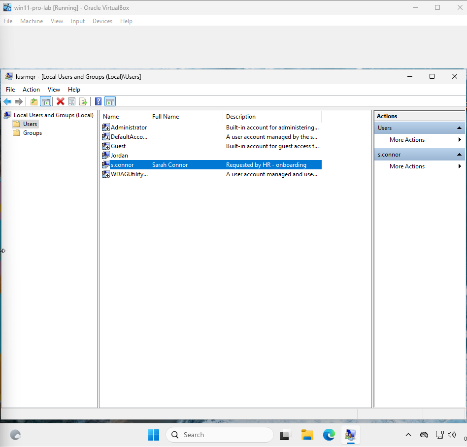

# Ticket 01 – User Access Request

## Objective
Simulate a real-world scenario where you're asked to create or modify a user account. The first step is to **verify the authenticity of the request**.

---

## Investigation & Action Plan

### Step 1: Verify the request
- Confirmed user request came from a verified HR contact.
- Request details were found in a simulated HR request file: `mock-request.txt`.

📸 **Screenshot of request verification (simulated):**  

---

### Step 2: Open Local Users and Groups

- Opened `lusrmgr.msc` using the Run dialog.
- Navigated to **Users**.
- Verified that user `s.connor` did not exist — expected for a simulated environment.
- Proceeded to create the user manually using **New User…** with a placeholder password and default options.

📸 **Screenshot after creating user `s.connor`:**  

---

### Step 4: Add User to Correct Group

- Opened **lusrmgr.msc**
- Navigated to **Groups**
- Checked if the **Marketing** group exists
- If not present, created it via **Action > New Group...**
  - **Group name:** Marketing
  - **Description:** Departmental access group for Marketing users
- Double-clicked the **Marketing** group
- Clicked **Add…**, entered `s.connor`, and confirmed
- Verified `s.connor` is now listed as a member

📸 **Screenshot of group membership confirmation:**  

---

### Step 5: Check Folder Permissions

- Created a mock folder: `C:\Shared\Marketing\assets`
- Right-clicked the **assets** folder > **Properties > Security** tab
- Clicked **Edit… > Add…**
- Entered `Marketing` group and verified with **Check Names**
- Granted **Modify** (includes Read & Write) permissions
- Clicked **Apply** and **OK** to confirm

📸 **Screenshot of permissions panel with group added:**  

---

### Step 6: Test Access (Optional)

- Used **Run as different user** to simulate logging in as `s.connor`.
- Navigated to: `C:\Shared\Marketing\assets`.
- Created a test file: `access_test.txt`.
- Verified the file could be saved and opened.

📸 **Screenshot:**  

---