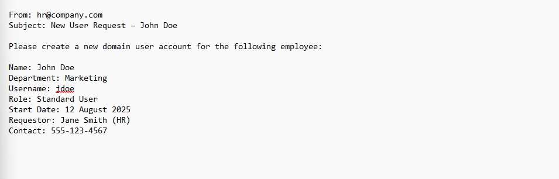
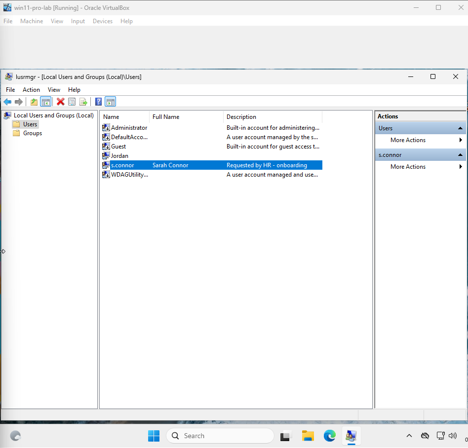
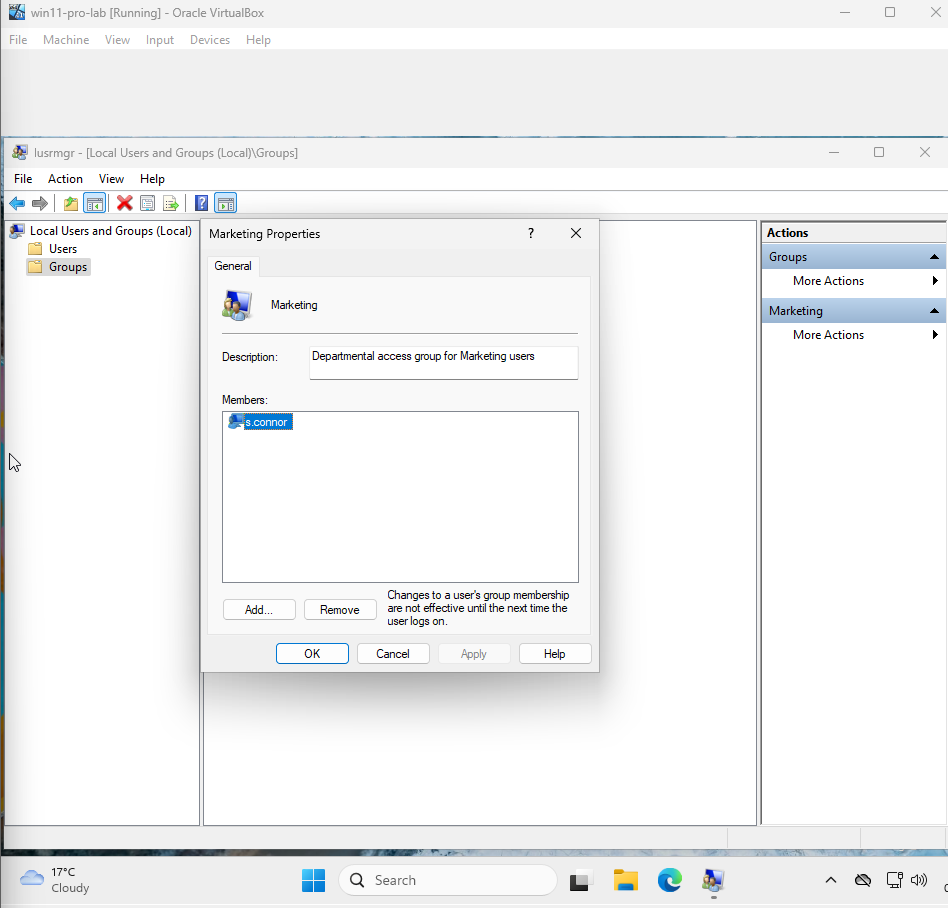
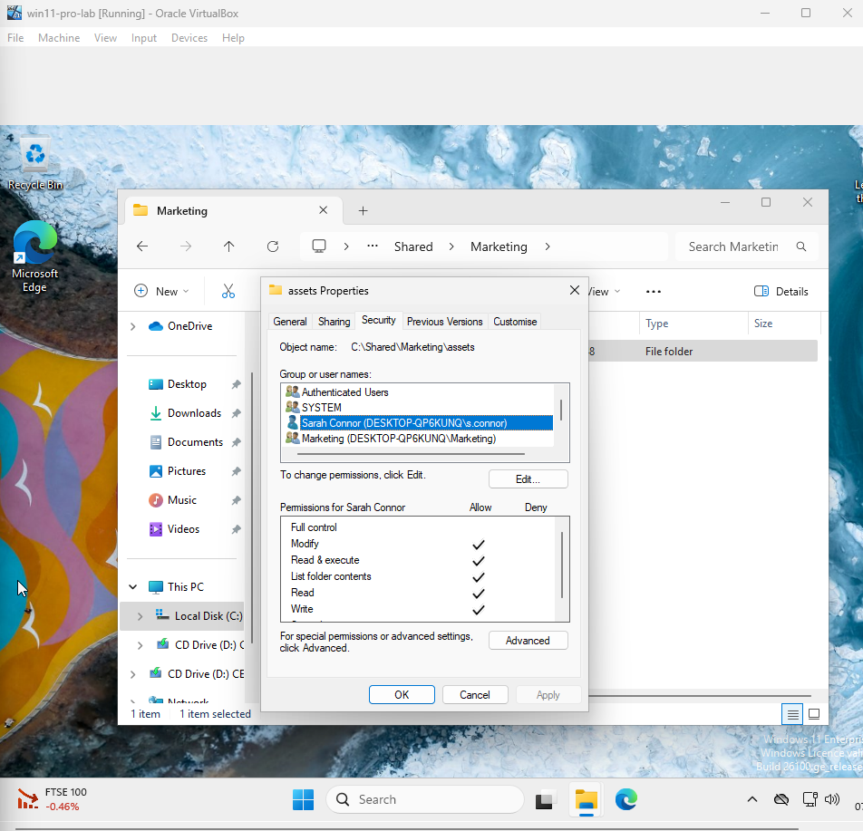
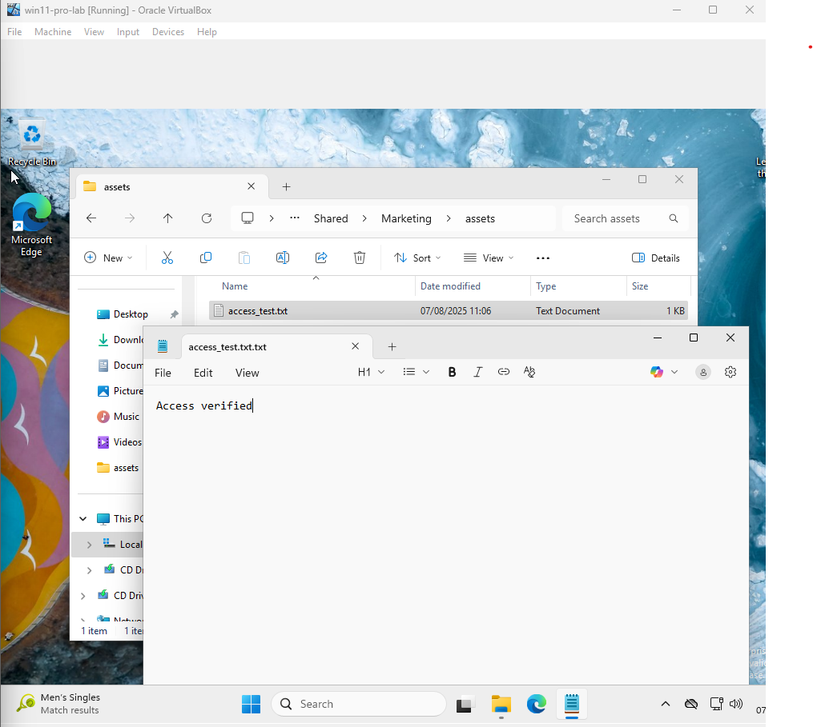

# Ticket 01 – User Access Request

## Objective
Simulate a typical service desk request where you're asked to create or modify a user account. The first step is to **verify the authenticity of the request**.

---

## Incident Details

- **Priority:** P3 – Medium  
- **Impact:** Single user requiring access to shared resources for normal work tasks  
- **Urgency:** Medium  

(See SLA: [SLA & Priority Matrix](../docs/sla-priority-matrix.md))

---

## Investigation & Action Plan

### Step 1: Verify the request
- Confirmed user request came from a verified HR contact.
- Request details were found in a simulated HR request file: `mock-request.txt`.

📸 **Screenshot of request verification (simulated):**  

---

### Step 2: Open Local Users and Groups

- Opened `lusrmgr.msc` using the Run dialog.
- Navigated to **Users**.
- Verified that user `s.connor` did not exist — expected for a simulated environment.
- Proceeded to create the user manually using **New User…** with a placeholder password and default options.

📸 **Screenshot after creating user `s.connor`:**  

---

### Step 3: Add User to Correct Group

- Opened **lusrmgr.msc**
- Navigated to **Groups**
- Checked if the **Marketing** group exists
- If not present, created it via **Action > New Group...**
  - **Group name:** Marketing
  - **Description:** Departmental access group for Marketing users
- Double-clicked the **Marketing** group
- Clicked **Add…**, entered `s.connor`, and confirmed
- Verified `s.connor` is now listed as a member

📸 **Screenshot of group membership confirmation:**  

---

### Step 4: Check Folder Permissions

- Created a mock folder: `C:\Shared\Marketing\assets`
- Right-clicked the **assets** folder > **Properties > Security** tab
- Clicked **Edit… > Add…**
- Entered `Marketing` group and verified with **Check Names**
- Granted **Modify** (includes Read & Write) permissions
- Clicked **Apply** and **OK** to confirm

📸 **Screenshot of permissions panel with group added:**  

---

### Step 5: Test Access 

- Used **Run as different user** to simulate logging in as `s.connor`.
- Navigated to: `C:\Shared\Marketing\assets`.
- Created a test file: `access_test.txt`.
- Verified the file could be saved and opened.

📸 **Screenshot:**  

---

### ✅ Step 6: Resolution Summary – Document & Close Ticket

**Summary:**  
Granted access to the network share `\\marketing-shared\assets` for user `s.connor` by:
- Creating a new local user account
- Adding them to the **Marketing** group
- Assigning the group the necessary folder-level Modify permissions
- Confirming access with a test login and file creation

---

### Tools Used

- `lusrmgr.msc`  
- `File Explorer`  
- `Folder Security tab`

---

### Follow-Up Tasks

- [ ] Email user to confirm access  
- [ ] Recommend user change temporary password on first login  
- [ ] Mark ticket as resolved in the helpdesk system

---

### Notes & Reflections

Before starting this ticket, I created a detailed step-by-step plan to keep the workflow organised and ensure all required actions were covered clearly in the markdown. This approach helped me maintain focus and structure throughout the process.

During the exercise, I had to reinstall my Windows VM with the Enterprise edition to access `lusrmgr.msc`, which is necessary for managing local users and groups. This highlighted the importance of verifying the environment setup before beginning practical tasks.

Overall, simulating the entire user access request from verification through permission assignment was a valuable hands-on experience that reinforced both technical skills and documentation practices.

---

### Attachments

- [request-verification.png](../images/request-verification.png)  
- [user-created-confirmation.png](../images/user-created-confirmation.png)  
- [user-group-membership.png](../images/user-group-membership.png)  
- [folder-permissions-assigned.png](../images/folder-permissions-assigned.png)  
- [access-success.png](../images/access-success.png)

---

## Related Knowledge Base Article

See: [User Account Creation & Access Assignment](../knowledge-base/user-account-creation.md)

