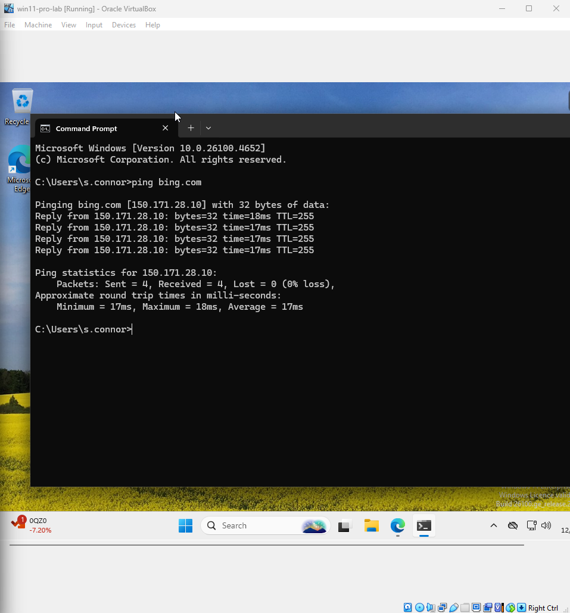
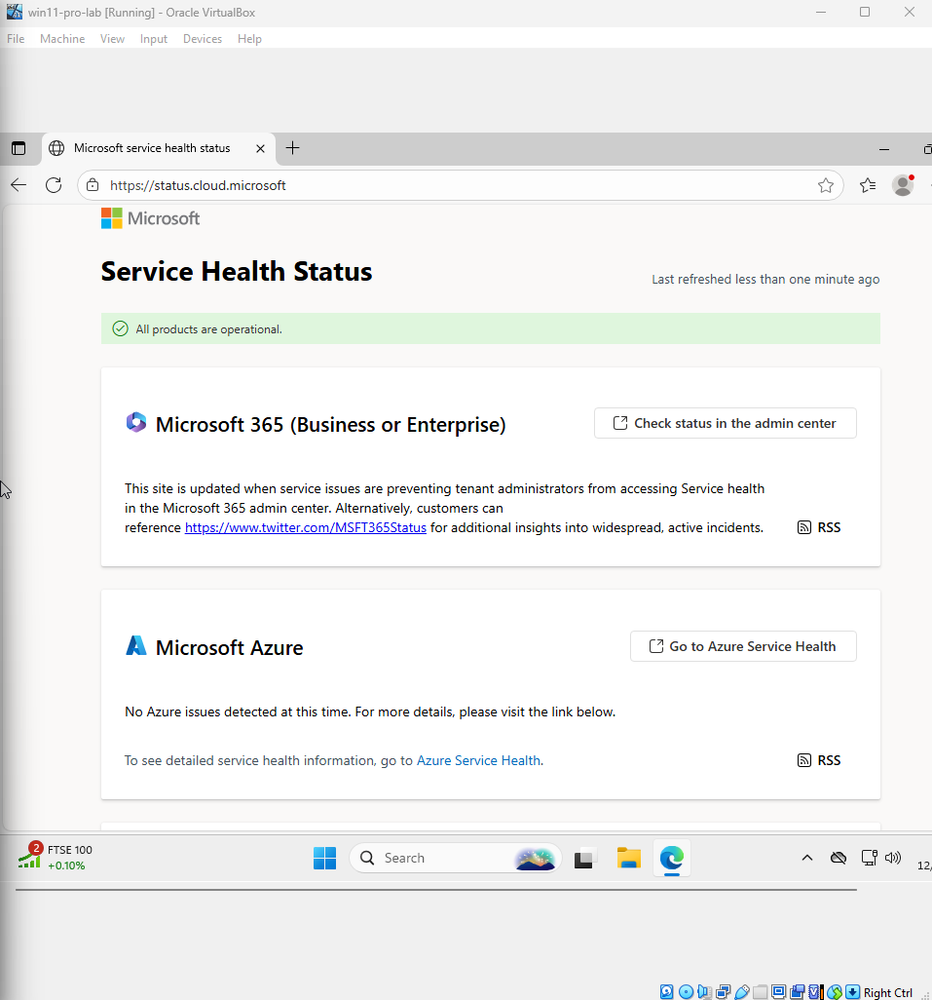
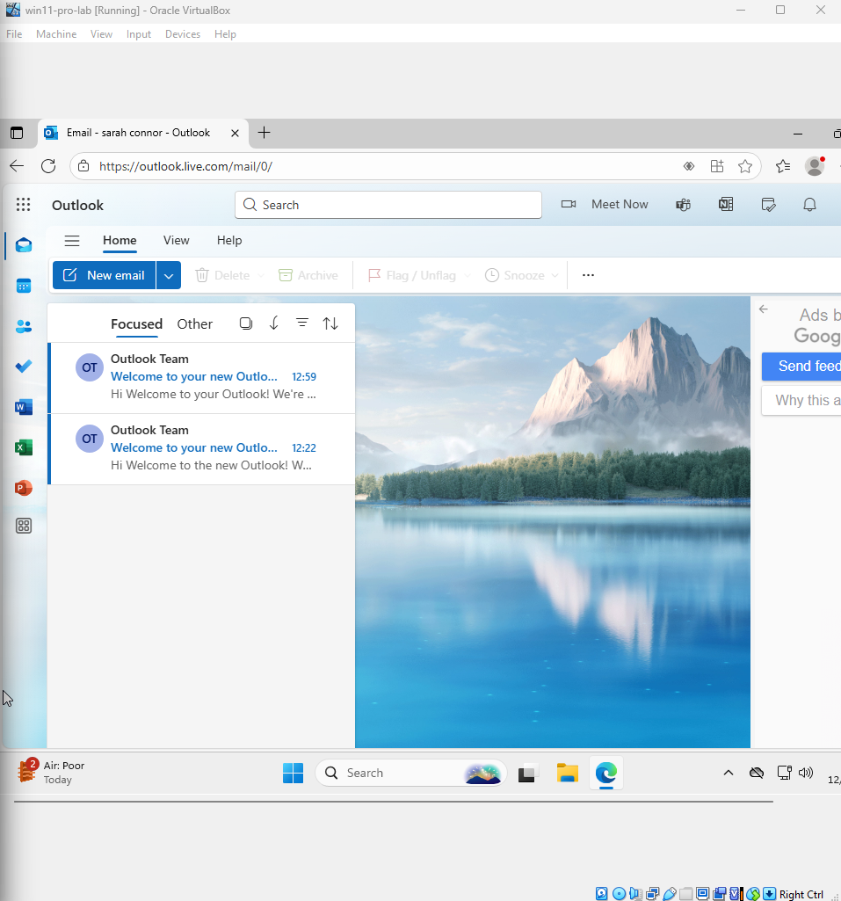
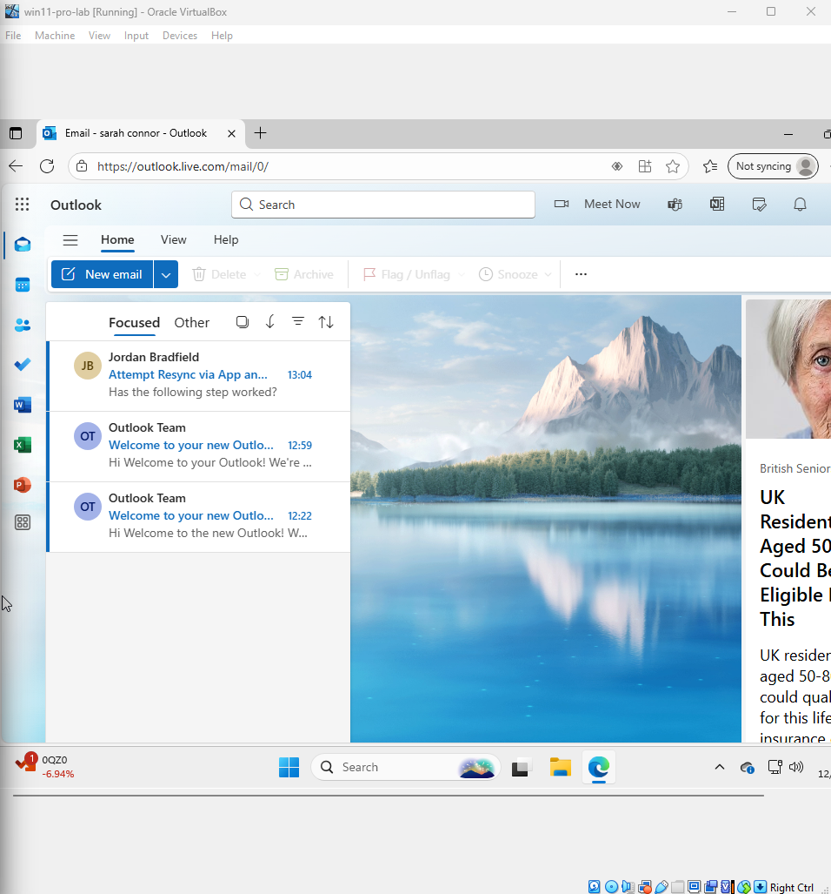
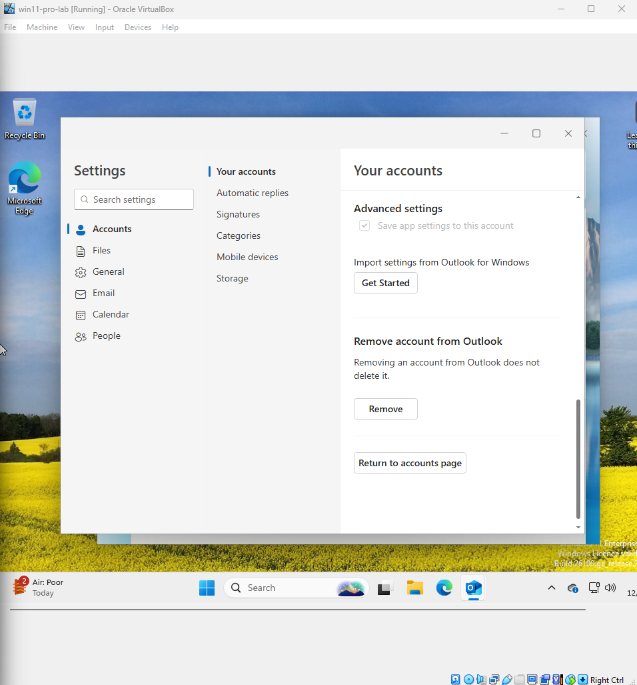
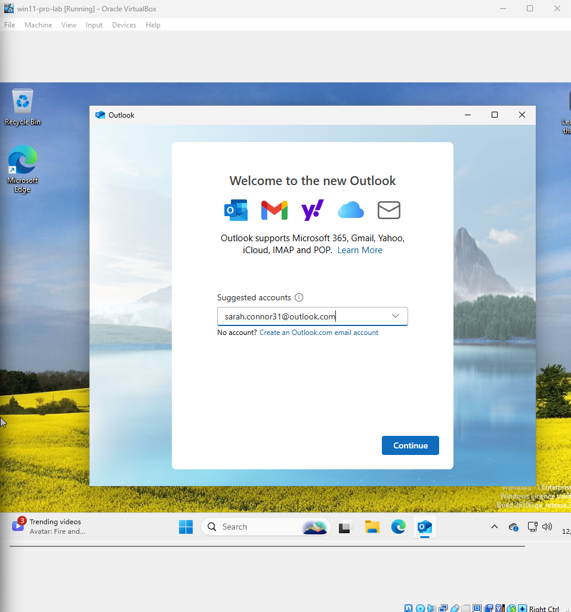
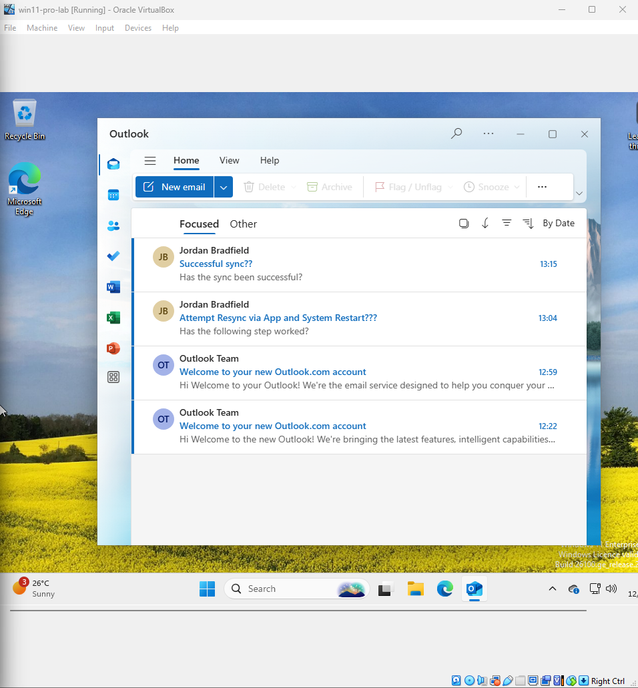
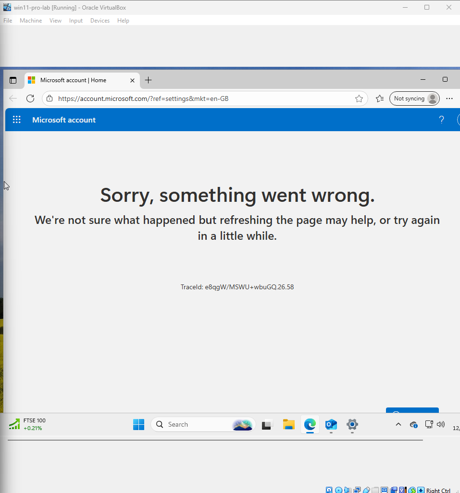
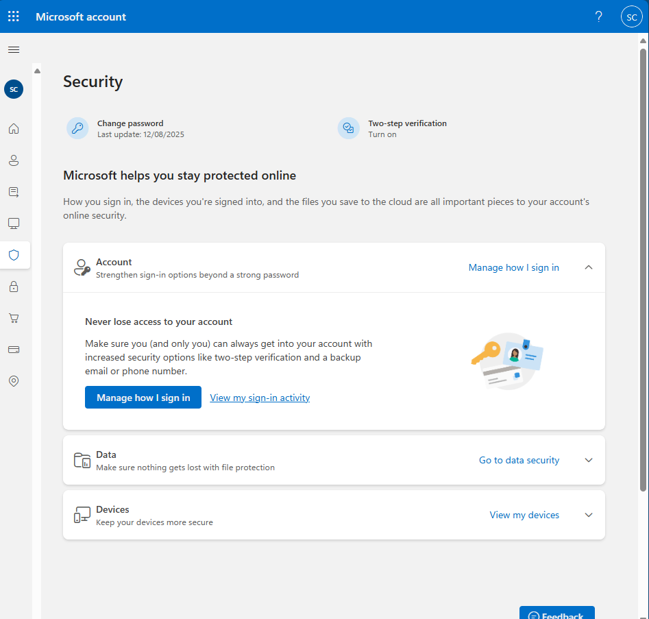
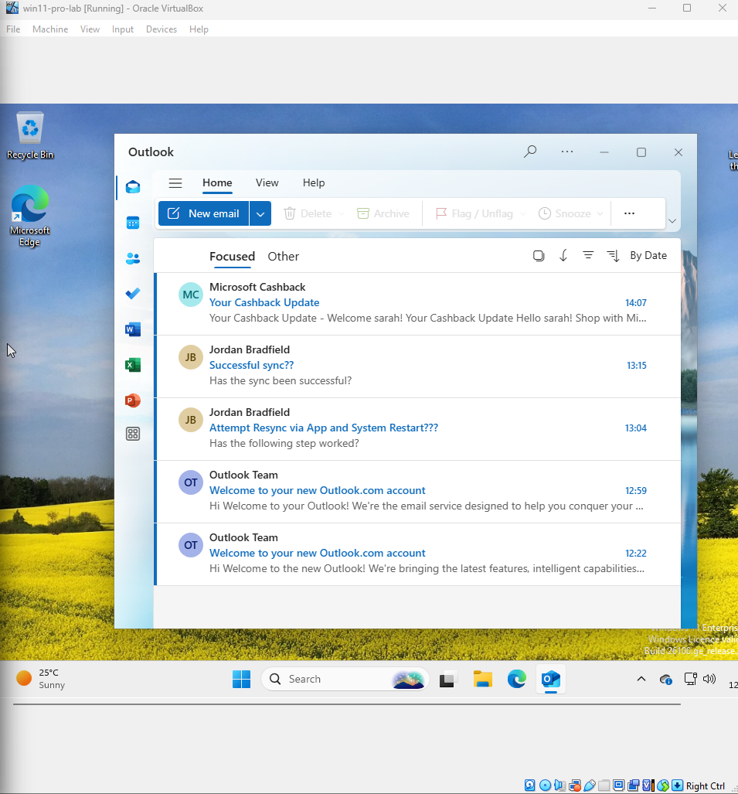

# Ticket 02 – Outlook Sync Issue (Adapted Scenario)

## Objective

The original goal was to simulate and troubleshoot a common Outlook synchronization issue preventing emails from sending or receiving correctly. The aim was to reproduce the problem, walk through diagnostic steps, and restore normal mail flow.

During testing, limitations were encountered due to Microsoft’s updated account settings interface, which restricts direct access to mailbox configuration options without removing and re-adding the account. This prevented fully reproducing the original scenario without risking disruption to live email service.

As a result, this ticket has been adapted to focus on:  
- Documenting the intended troubleshooting process.  
- Highlighting obstacles due to UI and policy changes.  
- Providing alternative remote-support methods when full local access is unavailable.

---

## Possible Causes

- **Restricted UI access in current Outlook versions** (recently identified limitation)  
- Incorrect login credentials or expired password  
- Server outage or maintenance on Microsoft 365 / Exchange server  
- Corrupted offline Outlook cache (`.OST` file)  
- Network connectivity issues or firewall blocking ports  
- Large mailbox size causing sync delays or failures  
- Misconfigured account settings (IMAP/SMTP or Exchange)  
- Antivirus or security software interfering with Outlook  
- Outdated Outlook client or missing updates  
- Corrupt Outlook profile  

---

## 1. Problem Simulation

This step simulates a common issue faced by Tier 1 support staff:

Modern Microsoft Mail/Outlook apps on Windows 10/11 no longer provide access to mailbox sync settings or advanced account management options, limiting direct troubleshooting capabilities within the client.

---

### Steps Taken

- Used a free Microsoft Outlook.com test account in the Windows 11 Mail app.  
- Noted the absence of a **File** tab in the app UI.  
- Navigated to **Windows Settings → Email & accounts → selected the account → Manage**.  
- Observed only limited options available:  
  - Account description  
  - Buy Microsoft 365 subscription  
  - Import settings  
  - Remove account  
- No option to change mailbox sync settings or server details was present.

---

### Screenshots

-   
-   
-   
-   

---

## Implications for Support

Due to these UI limitations, Tier 1 support staff cannot resolve sync issues by modifying server or sync settings locally in the app or Windows settings. Alternative troubleshooting methods or escalation to higher tiers are necessary.

---

## 2. Tier 1 Troubleshooting Path

This section outlines user-facing fixes that do not require admin privileges or advanced Outlook access.

1. **Confirm Internet Connectivity**  
   Verify an active internet connection by opening a website or running a ping test.  

2. **Check Microsoft 365 Service Status**  
   Visit [Microsoft 365 Service Health](https://status.office.com) to confirm no current outages affecting Outlook.  

3. **Verify Account vs. App Issue Using Outlook Web Access (OWA)**  
   Log into [Outlook Web Access](https://outlook.office.com) with user credentials. If mail works here, the issue likely lies in the desktop app.  

4. **Restart App and Device**  
   Close the Mail or Outlook app, restart Windows, then reopen the app and check syncing.  

5. **Remove and Re-add Email Account**  
   In the Mail app, navigate to **Settings → Manage Accounts → Select Account → Remove Account**, then add the account back using the appropriate account type (Microsoft 365/Outlook.com for Exchange or IMAP for basic setups).  

> **Note:** Modern Microsoft Mail/Outlook apps configure Microsoft 365/Outlook.com accounts automatically without exposing manual server settings.

6. **Confirm Email Flow Restoration**  
   Send and receive test emails to ensure syncing has resumed.

---

### Supporting Screenshots

-   
-   
-   
-   
-   
-   
-   

---

## Tier 2 Troubleshooting: Account-Level Checks and Alternative Access

This section explores backend and account-level verification steps, as well as alternative access methods, to address Outlook sync issues when local app troubleshooting is limited by UI or policy restrictions.

---

### Step 1: Verify Account Security and Sync Status via Microsoft Account Portal

Attempted to access https://account.microsoft.com/security within the Windows 11 VM to review security alerts and recent activity.

Encountered the error:

> "Sorry, something went wrong."  
> TraceID: e8qgw/mswu+wbuGQ.26.58

After troubleshooting, the issue appears related to browser compatibility or security restrictions within the virtual machine environment.

As a workaround, the Microsoft Account portal was accessed from the host machine’s browser, bypassing VM limitations, to review security settings and recent activity.

---

### Screenshots

- 
- 
- 

---

### Step 2: Use Outlook Web Access (OWA) as an Alternative

If local Outlook app issues persist or mailbox settings remain inaccessible, recommend users access their email through [Outlook Web Access](https://outlook.office.com).

This web-based interface provides full mailbox functionality without requiring local app configuration.

---

**Note:** Using the host system’s browser to access OWA or the Microsoft Account portal can circumvent VM-related restrictions and ensure uninterrupted access to email and security settings.

---

### Summary

These Tier 2 troubleshooting measures help maintain email access and security monitoring when direct modification of Outlook settings is blocked by modern UI limitations or device policies. Escalation or further backend access may be required for deeper configuration changes.

