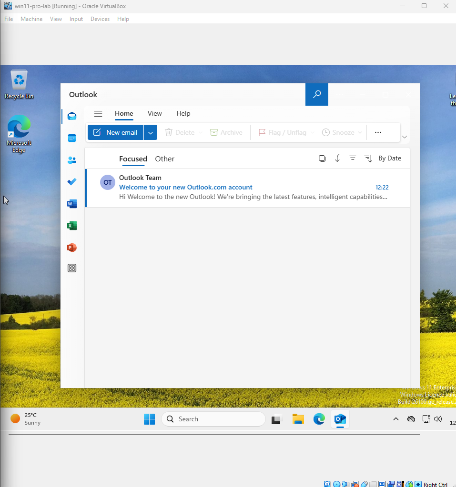
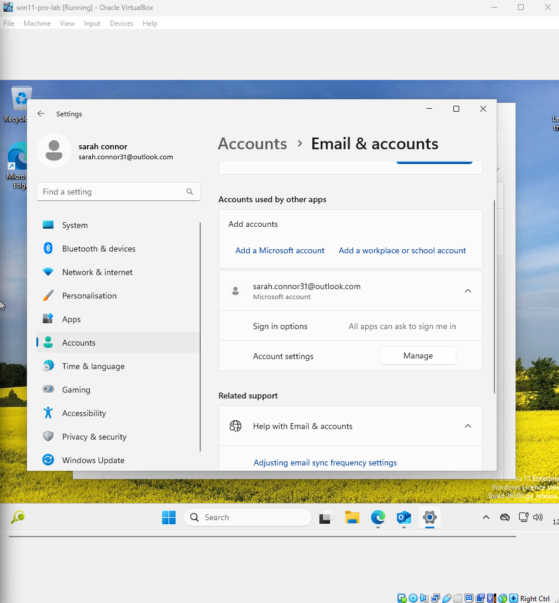
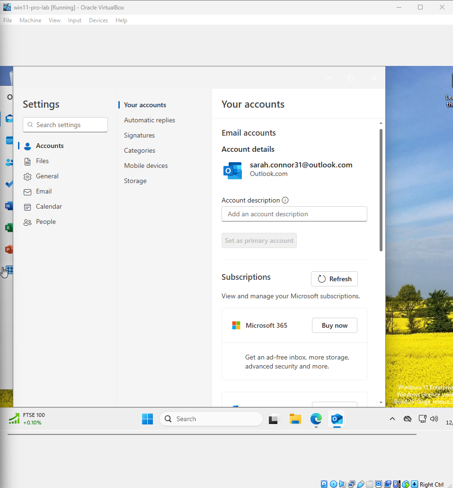
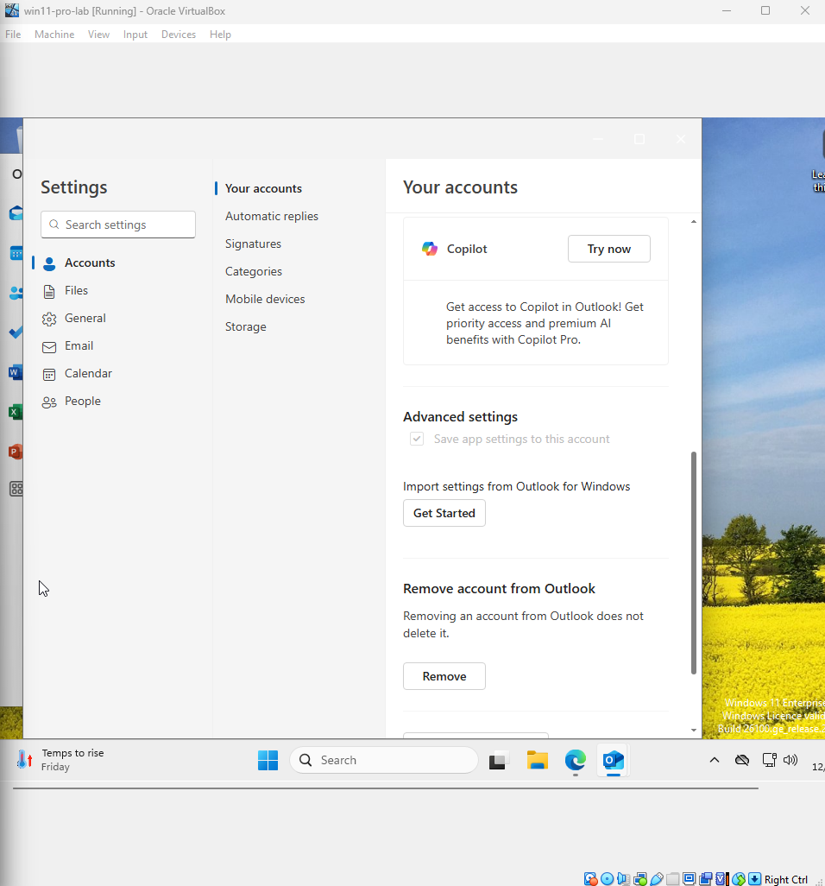

# Ticket 02 – Outlook Sync Issue (Updated Scenario)

## Objective
Originally, the goal was to simulate and troubleshoot a common Outlook synchronisation problem that prevents emails from sending or receiving correctly. The intention was to reproduce the issue, walk through common diagnostic steps, and restore normal mail flow.

During testing, limitations were encountered due to Microsoft’s newer account settings interface, which restricts direct access to certain mailbox configuration options without removing and re-adding the account. This made it impractical to fully reproduce the original scenario without disrupting live email service.

As a result, this ticket has been adapted to focus on:
- Documenting the intended troubleshooting process.
- Highlighting the obstacles faced due to UI and policy changes.
- Providing alternative remote-support methods that can be used when full local access is unavailable.

---

## Possible Causes
- Incorrect login credentials or expired password  
- Server outage or maintenance on Microsoft 365 / Exchange server  
- Corrupted offline Outlook cache (`.OST` file)  
- Network connectivity issues or firewall blocking ports  
- Large mailbox size causing sync delays or failures  
- Misconfigured account settings (IMAP/SMTP or Exchange)  
- Antivirus or security software interfering with Outlook  
- Outdated Outlook client or missing updates  
- Corrupt Outlook profile  
- **Restricted UI access in current Outlook versions** (newly added cause)

---

## 1. Problem Simulation

In this step, I simulate a common problem faced by Tier 1 support staff:

Modern Microsoft Mail/Outlook apps on Windows 10/11 no longer provide access to mailbox sync settings or advanced account management options, which limits the ability to troubleshoot sync issues directly in the client.

---

### What I Did

- Used a free test Microsoft Outlook.com account in the Windows 11 Mail app.
- Observed that there is **no File tab** in the app UI.
- Checked **Windows Settings → Email & accounts → selected the account → Manage**.
- Found only limited options:  
  - Account description  
  - Buy Microsoft 365 subscription  
  - Import settings  
  - Remove account  
- Noticed **no option to change mailbox sync settings or server details**.

---

### Screenshots

- 
- 
- 
- 

---

### What This Means

This UI limitation means Tier 1 support cannot fix sync issues by editing server or sync settings in the app or Windows settings. This requires alternative troubleshooting approaches or escalation.
