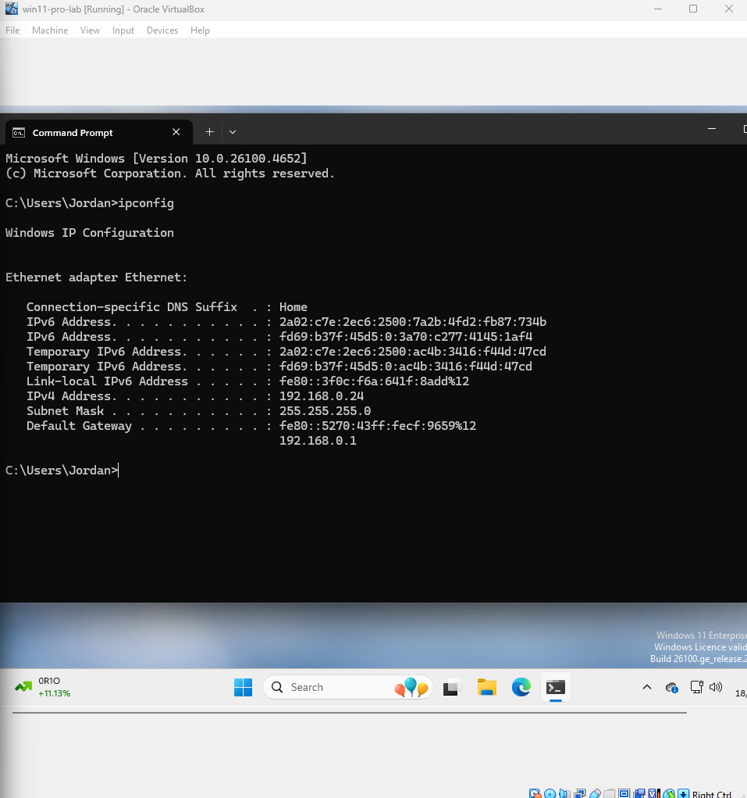
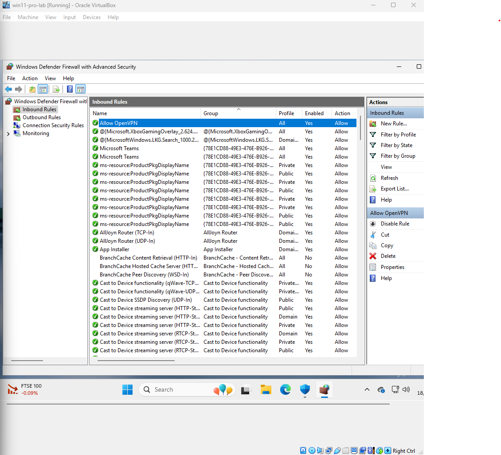
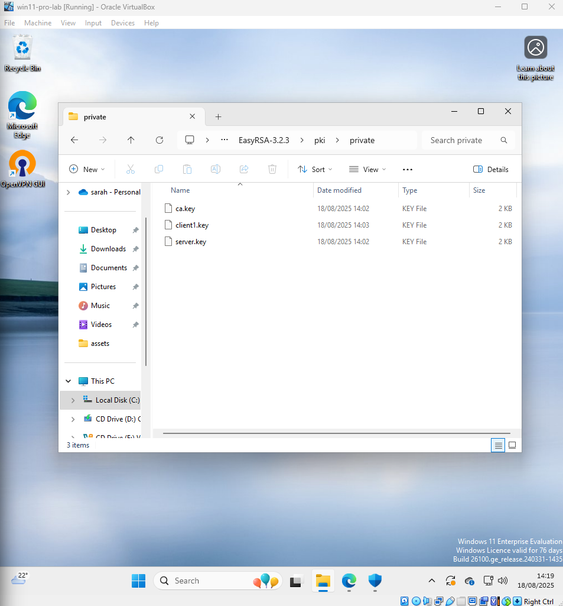
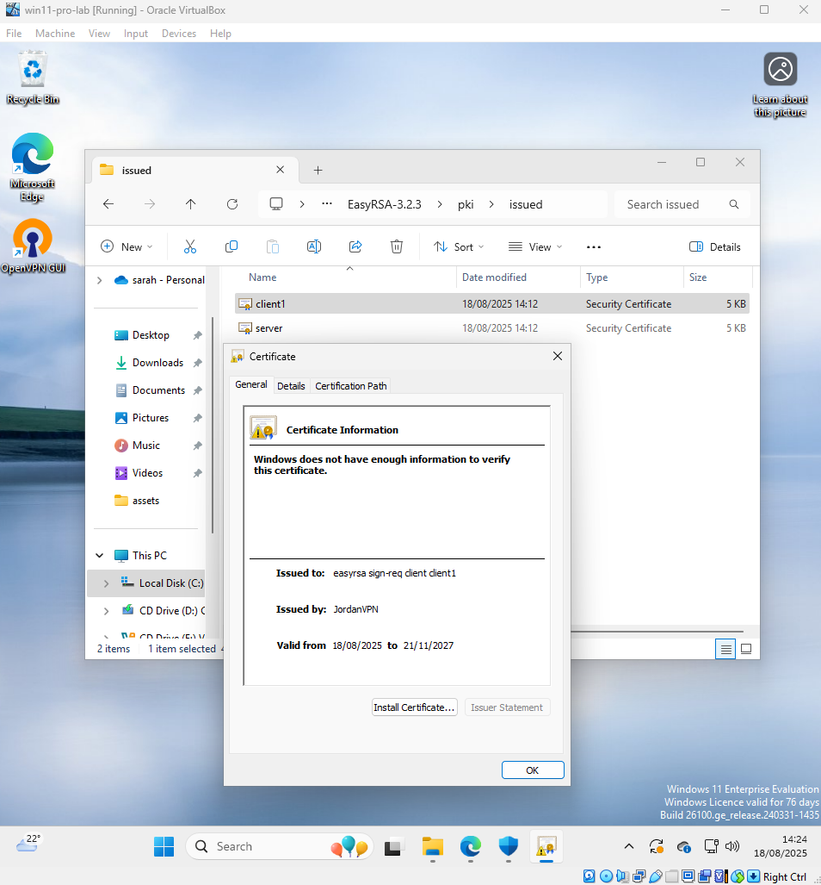
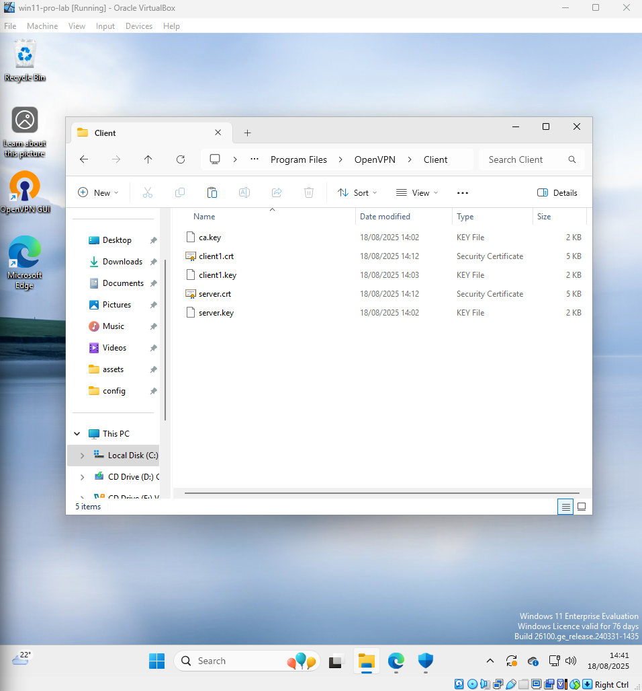

# Ticket 03 – VPN Setup Simulation

## Objective

Simulate a real-world scenario where a user requests secure remote access via VPN. The goal is to configure OpenVPN in a controlled environment while ensuring all prerequisites are validated before proceeding.

Before beginning, several pre-checks were performed to ensure a smooth setup and avoid common issues:

- VM network adapter set to **Bridged** mode and temporary VPN traffic allowed in Windows Firewall.  
  - Bridged mode means the VM pulls an IP address from the same LAN as the host machine.  
  - You can confirm it’s bridged by checking the VM’s IP (via `ipconfig`) and seeing it fall in the same subnet as the host.  
- Verified that the VPN port intended for use is not blocked.  
- Generated fresh test certificates for secure authentication.  
- Double-checked user authentication information and exported `.ovpn` configuration file before testing.  

---

## Pre-Check Screenshots

-   
-   
-   
-   
- 

---

## Next Steps

With the environment verified and pre-checks completed, the next step is installing OpenVPN on the Windows 11 VM and importing the configuration file for testing.
