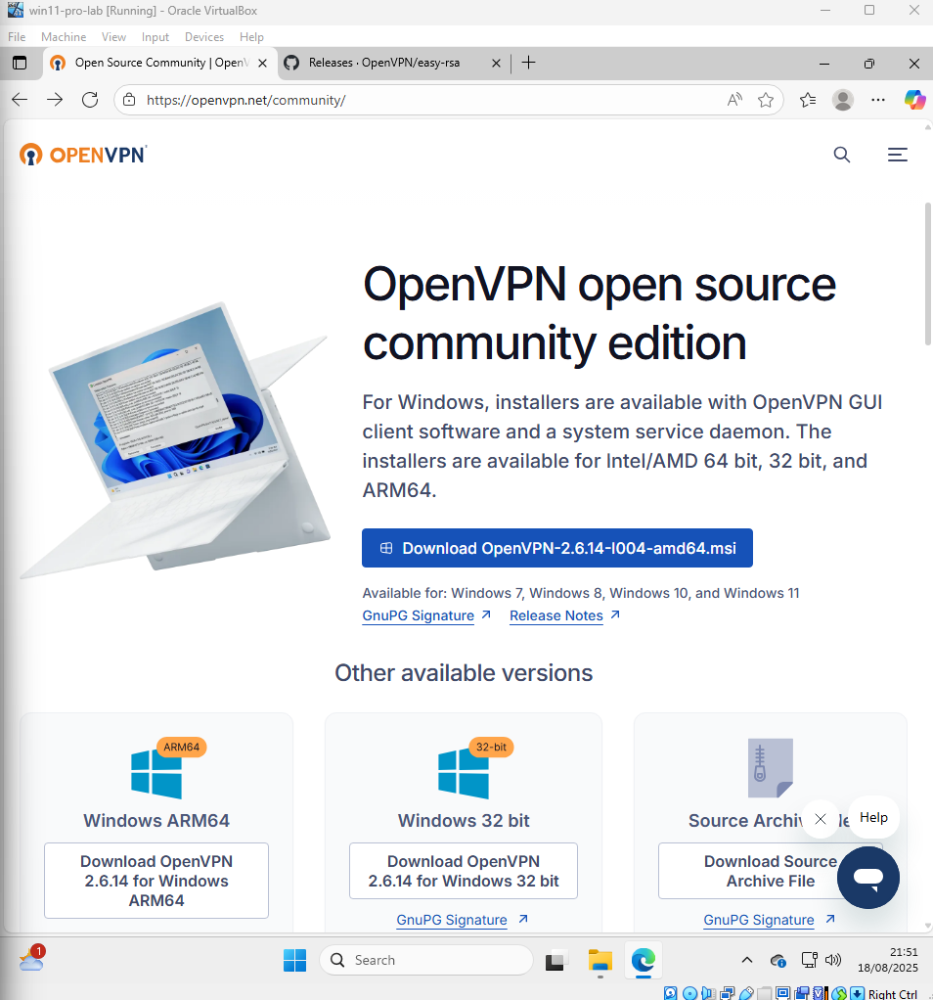
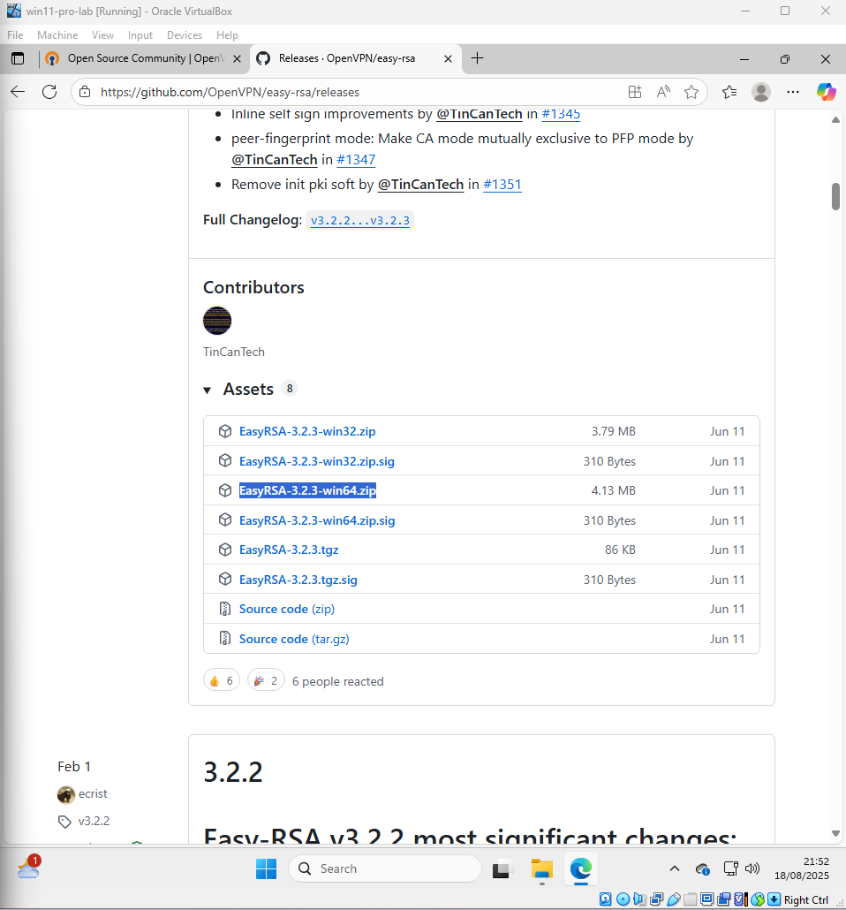
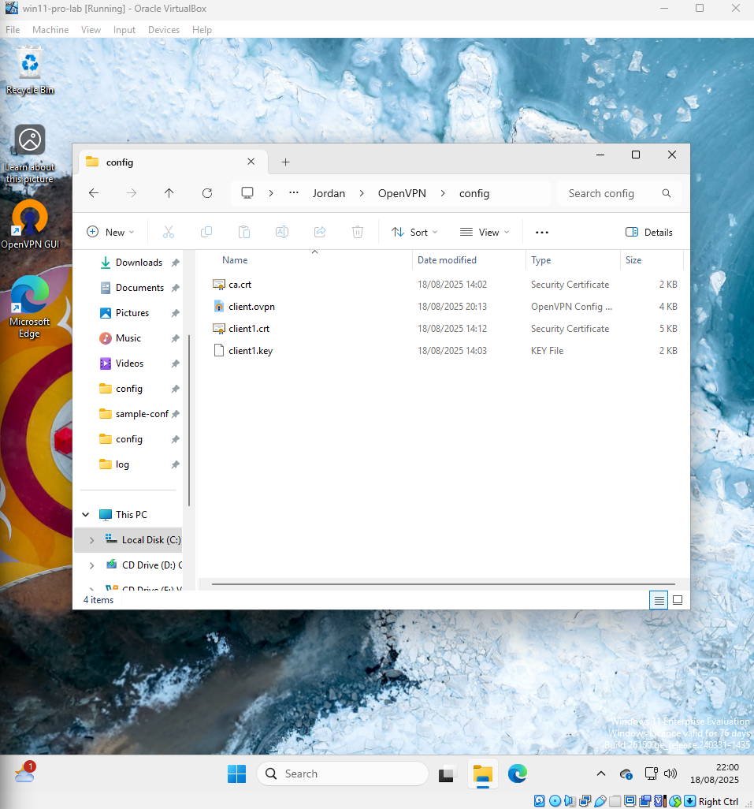
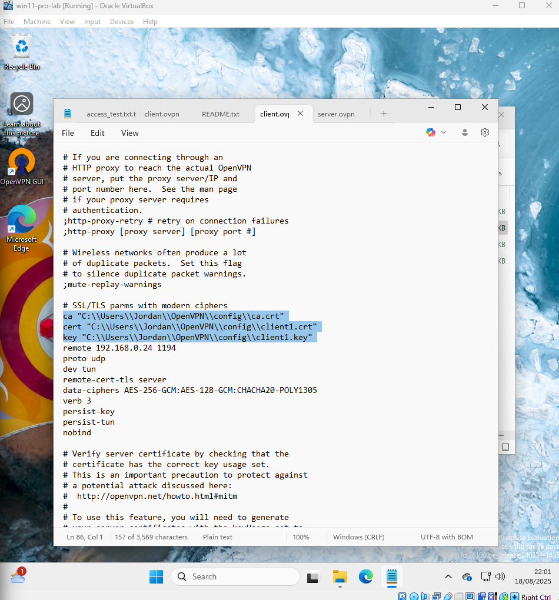
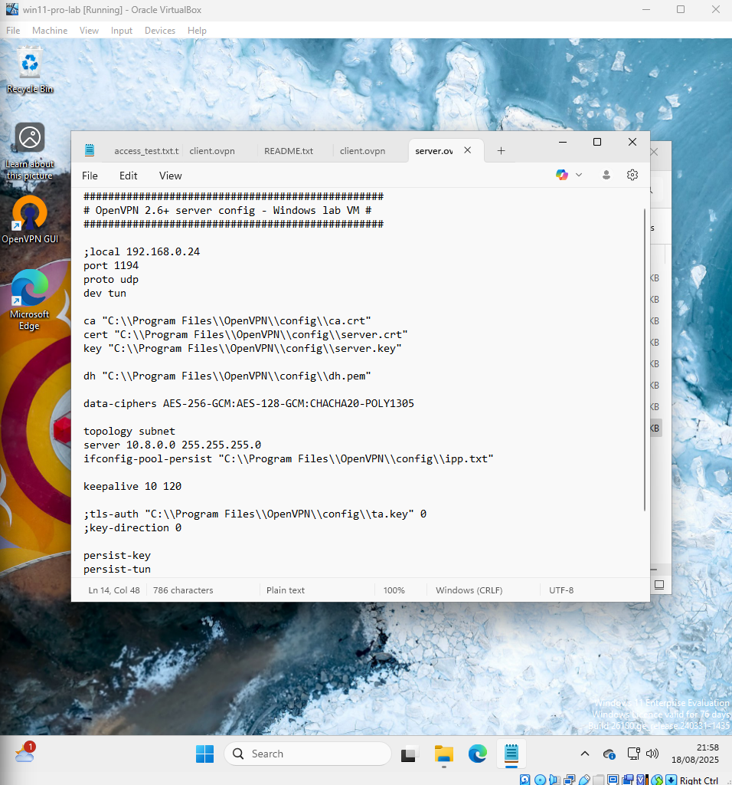
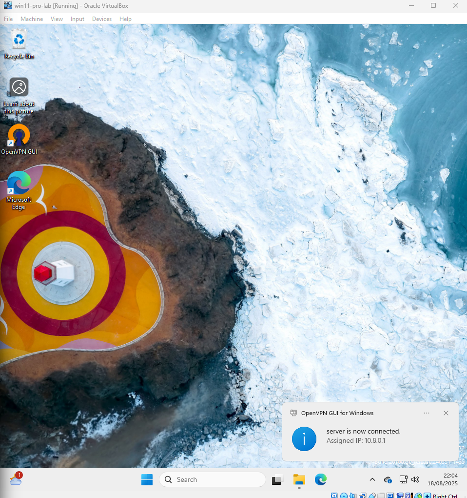

# Ticket 03 – VPN Setup Simulation

## Objective

Simulate a real-world scenario where a user requests secure remote access via VPN. The goal is to configure OpenVPN in a controlled environment while ensuring all prerequisites are validated before proceeding.

Before beginning, several pre-checks were performed to ensure a smooth setup and avoid common issues:

- VM network adapter set to **Bridged** mode and temporary VPN traffic allowed in Windows Firewall.  
  - Bridged mode means the VM pulls an IP address from the same LAN as the host machine.  
  - You can confirm it’s bridged by checking the VM’s IP (via `ipconfig`) and seeing it fall in the same subnet as the host.  
- Verified that the VPN port intended for use is not blocked.  
- Generated fresh test certificates for secure authentication.  
- Double-checked user authentication information and exported `.ovpn` configuration file before testing.  

---

## Pre-Check Screenshots

-  – Shows the VM network adapter configured in Bridged mode, confirming the VM is on the same LAN as the host.  
-  – Demonstrates the temporary rule allowing OpenVPN traffic for testing purposes.  
-  – Displays the `pki/issued` and `pki/private` folders containing server and client certificates/keys.  
-  – Provides a visual confirmation that certificates and keys have been successfully generated.  
-  – Shows the `.ovpn` client configuration alongside the required certificates for import into OpenVPN.  

---

## Next Steps

With the environment verified and pre-checks completed, the next step is installing OpenVPN on the Windows 11 VM and importing the configuration file for testing.

---

# Stage 2: Set Up a VPN Server in Your Lab

This step documents the setup of an OpenVPN server in the lab environment, including certificate configuration, client setup, and verification.

---

## 1. Download and Install OpenVPN

Downloaded the OpenVPN installer from the official site:

Installed OpenVPN to the default location (`C:\Program Files\OpenVPN`).

---

## 2. Download and Prepare EasyRSA

Downloaded EasyRSA (64-bit Windows version) for certificate management:

Extracted EasyRSA and prepared it for generating server and client certificates.

---

## 3. OpenVPN Config Folder

Moved the server and client `.ovpn` configuration files into the appropriate directories.

### Global Config Location

### User Config Location

---

## 4. Edit Configuration Files

### Client Configuration

Opened `client.ovpn` in Notepad to verify paths and settings:

### Server Configuration

Opened `server.ovpn` in Notepad to verify paths, keys, and certificates:

---

## 5. Start the OpenVPN Server

Started the OpenVPN GUI as administrator and connected the server instance:

---

## 6. Verify VPN IP

Used `ipconfig` to check the VPN IP assigned to the TAP adapter:

.png)

- The server’s VPN IP: `10.8.0.1`
- Confirms the VPN is active and ready for client connections.

---

### Notes

- All certificate files (`server.crt`, `server.key`, `ca.crt`, `dh.pem`) must be present in `C:\Program Files\OpenVPN\config`.
- Ensure the OpenVPN GUI is run as administrator to allow server connections.
- Client machines should use the exported `client.ovpn` for testing connectivity.

