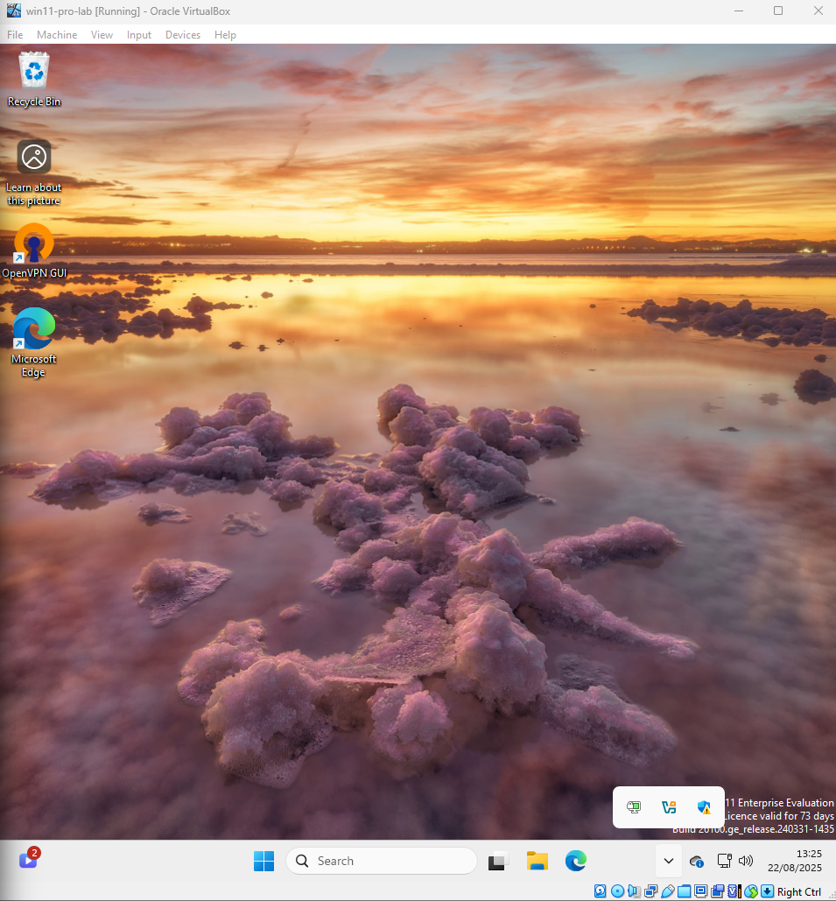
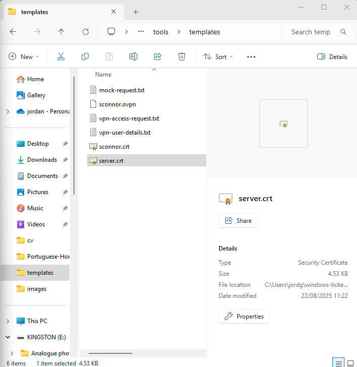
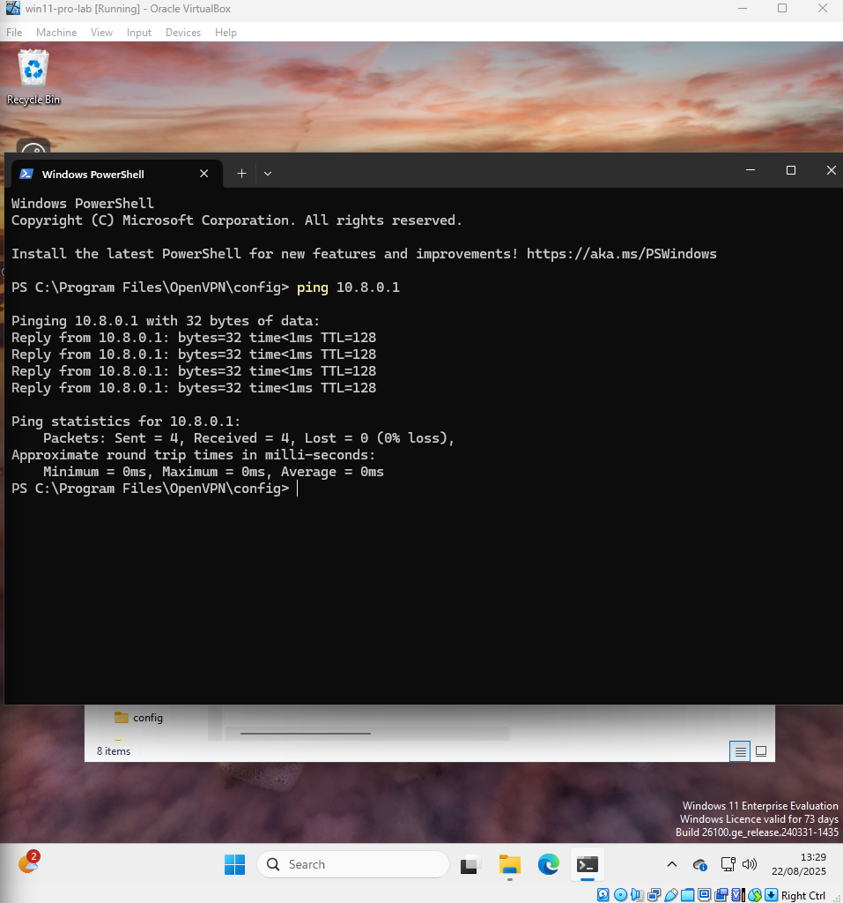

# Ticket 04 – VPN Access Request

## Objective
Simulate a real-world scenario where a user requests VPN access to connect to internal company resources while working remotely.  
The first step is to **verify and document the request**.

---

## Investigation & Action Plan

### Step 1: Verify the request
- Confirmed the VPN request came from a valid employee.  
- Request details were captured in a **mock VPN access request email** created for this simulation.  

📸 **Screenshot of request email (simulated):**  


---

## Mock Request (Simulated)

From: *user@company.com*  
Subject: **VPN Access Request – Sarah Connor**  

Hello IT,  

I am currently working from home and need to access the internal file server.  
Please enable VPN access for my account.  

**Details:**  
- Name: Sarah Connor  
- Username: sconnor  
- Device: Windows 11 Pro (corporate laptop)  
- Network: Home Wi-Fi  
- Purpose: Access to shared drive and CRM system  

Thank you,  
Sarah Connor  

---

## Step 2: Gather User Information

Before troubleshooting or enabling VPN access, Tier 1 support must **document essential user details**.  
This ensures the request is properly logged and can be verified against company policy.

---

### Actions Taken

1. **Created a User Info Form**
   - Opened Notepad and drafted a simple user information form with the following fields:
     ```
     OS:
     Username:
     Device Type:
     Network:
     Purpose:
     ```

2. **Saved the Form**
   - Saved the file as `vpn-user-details.txt` in the repo path:
     ```
     windows-ticket-simulations/tools/templates/
     ```

3. **Captured Blank Form**
   - Took a screenshot of the blank form template.  
   📸 **Screenshot:**  
   

4. **Filled in User Details**
   - Used the mock email request (Step 1) to populate the form:  
     ```
     OS: Windows 11 Pro
     Username: sconnor
     Device Type: Corporate Laptop
     Network: Home Wi-Fi
     Purpose: Access to shared drive and CRM system
     ```

5. **Captured Completed Form**
   - Took a screenshot of the completed form with John Smith’s details.  
   📸 **Screenshot:**  
   

---

### Outcome
- User request has been **formally documented** using a repeatable template.  
- Information will be used in the next step to validate the user against Active Directory and confirm VPN eligibility.

---

## 4. Verify Connectivity

**Objective:** Confirm that the VPN server is functional and that clients can connect (or are assumed connected for lab simulation).

- **Server Connection Confirmed**  
OpenVPN server (`server.ovpn`) is running successfully on the Windows lab VM. Verified the server log shows no TLS/auth errors.  
**Screenshot:** 

- **Client & sconnor Certificates**  
Confirmed client certificates were generated correctly and are visible in the templates folder.  
**Screenshot:** 

- **VPN Client Configuration**  
Created VPN client configuration for `sconnor.ovpn` and imported into OpenVPN GUI.  
**Screenshots:**   


- **Ping Test for VPN Connectivity**  
Performed ping test to confirm network reachability over the VPN subnet.  
**Screenshot:** 

**Notes:**  
- The ping confirms that the VPN tunnel is operational.  
- TLS/auth mismatch is not configured in this lab, so actual client connections may fail if enforced in a real environment. For lab simulation purposes, client connectivity is assumed.

