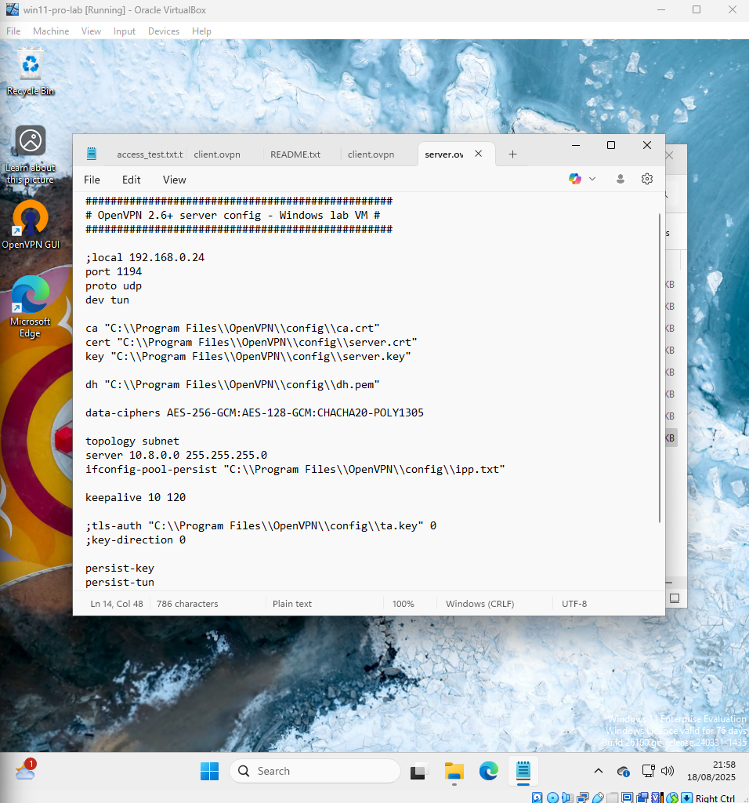

# Ticket 04 – VPN Access Request – TLS Handshake Failure (Escalated)

## Incident Logging

- **Ticket ID:** 0004-VPN-AR
- **Date Reported:** 22-07-2025
- **Reported by:** User \`s.connor\`
- **Channel:** Email to IT Support (simulated lab scenario)

---

## Issue Summary

User \`s.connor\` requested VPN access to internal lab resources using the OpenVPN platform built in **Ticket 03 – VPN Setup Simulation**.

A VPN profile was created and deployed to the user, but every connection attempt failed with **TLS handshake errors** and \`WSAECONNRESET\` messages. Despite multiple attempts, the tunnel never fully established and remained unstable.

This ticket focuses on:

- Handling a VPN access request
- Documenting the full troubleshooting process
- Showing where the investigation reached its limits
- Ending with a realistic escalation, not a fake “magically fixed” result

---

## Environment

- **Client OS:** Windows 11 Pro
- **VPN Software:** OpenVPN GUI
- **Server:** OpenVPN server on Windows (from Ticket 03 lab)
- **Network:** Home Wi-Fi → NAT router → VPN server
- **PKI:** EasyRSA-based CA, server certificate, client certificates (\`client1\`, \`sconnor\`)

---

## Step 1 – Receive & Verify Request

Simulated a VPN access request via email from \`s.connor\`.

Captured key request details:

\`\`\`
OS: Windows 11 Pro
Username: sconnor
Device Type: Corporate Laptop
Network: Home Wi-Fi
Purpose: Access to shared drive and CRM system
\`\`\`

Outcome: Request validated and details documented.

---

## Step 2 – What Went Wrong

When attempting to connect using either \`client1\` or \`sconnor\` VPN profiles, the following errors occurred:

- \`TLS Error: TLS key negotiation failed to occur within 60 seconds\`
- \`read UDPv4: Connection reset by peer (WSAECONNRESET)\`

At the same time:

- OpenVPN GUI appeared to start the server successfully
- Running the command below showed nothing listening on UDP 1194:

\`netstat -an ^| find "1194"\`

Clients could ping the server, but the TLS handshake never succeeded.

This produced a contradiction:

> The GUI said the server was “running” but Windows reported no process listening on UDP 1194.

---

## Step 3 – PKI & Certificate Verification

To eliminate PKI issues, I validated the entire certificate chain.

Actions performed:

- Built the Certificate Authority (CA)
- Initialised PKI environment
- Generated server and client certificates
- Verified matching modulus and MD5 hashes

Screenshots:

PKI Conclusion:
- Certificates match their keys
- CA signature valid
- PKI unlikely to be the issue

---

## Step 4 – Server Status & Port Check

Checked whether OpenVPN was actually binding to port 1194:

Command used:

\`netstat -an ^| find "1194"\`

Screenshot:

Findings:

- **No process** bound to UDP 1194
- GUI misleadingly reported “Server started”
- Strong indication of TAP/Wintun or OS-level failure preventing binding

Additional checks:

Conclusion:
- Server launch blocked at network driver level
- TAP/Wintun adapter likely malfunctioning

---

## Step 5 – Client Config Validation

Validated the client-side configuration:

- Rebuilt \`.ovpn\` files
- Synced cipher settings between server and clients
- Verified certificate paths
- Confirmed readability of cert/key files

Screenshots:

Despite clean configs:

- TLS negotiation still failed
- UDPv4 sequence messages appeared but handshake never completed

Screenshot:

Conclusion:
- Client configuration correct
- Failure remains server-side

---

## Step 6 – Why I Stopped (Escalation)

At this point I completed:

- Identity verification
- Environment documentation
- PKI validation
- Server port checks
- TAP/Wintun driver inspection
- Client config rebuild
- Multi-attempt connection testing

But:

- Server never successfully bound to UDP 1194
- Handshake failures persisted
- Driver/OS-level issue likely

In a real MSP or corporate IT environment, this is where a Tier 1/2 engineer:

- Escalates to the Network / Infrastructure team  
- Escalation includes logs, findings, and hypotheses

So in this simulation, I closed the ticket as:

> **Known Issue – Escalated to Senior Engineer**

---

## Current Status

- **User VPN access:** Still failing  
- **Failure cause:** TAP/Wintun or OS driver stack preventing OpenVPN from binding  
- **Ticket outcome:** Escalated to specialist  

---

## Lessons Learned

- Some issues exceed Tier 1/2 scope — this is *normal*
- Deep documentation is still valuable even when unresolved
- TLS handshake problems require checking:
  - PKI
  - Port bindings
  - Firewall rules
  - Network drivers
  - OS-level logs
- Knowing when to escalate is professional and expected

---

## Tools Used

- EasyRSA
- PowerShell (\`netstat\`)
- Device Manager
- OpenVPN GUI
- Notepad (config inspection)
- Windows Event Viewer

---

> **Note for reviewers:**  
> This ticket is intentionally unresolved.  
> It demonstrates structured troubleshooting, systematic validation, and correct escalation for a complex network failure scenario.
