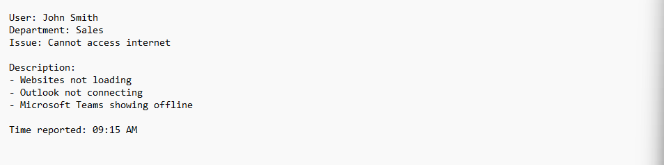
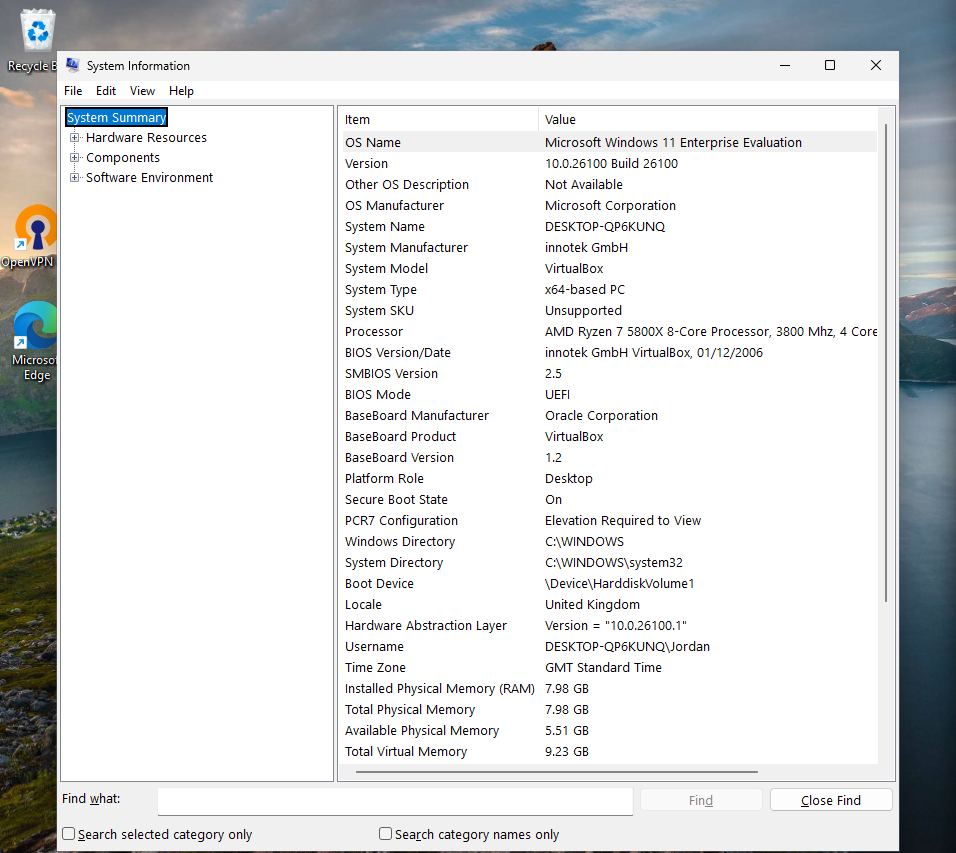
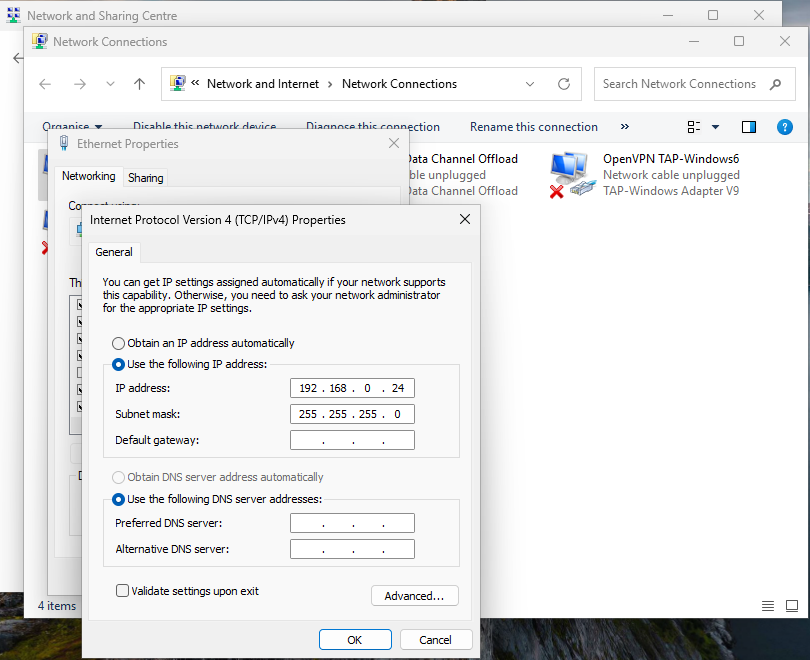
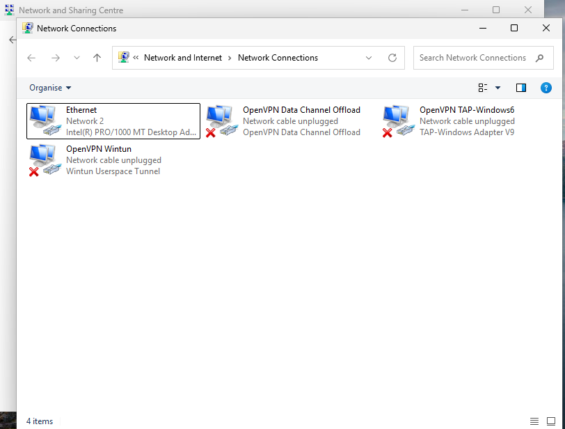
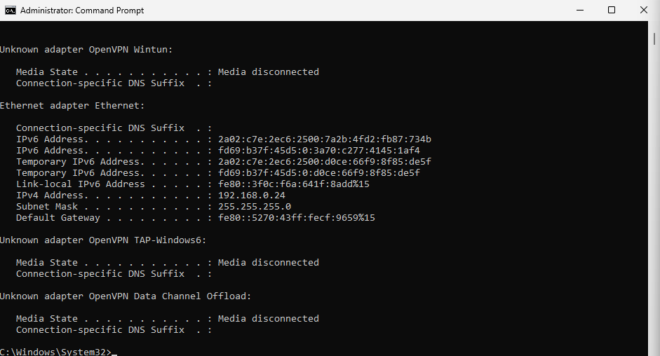
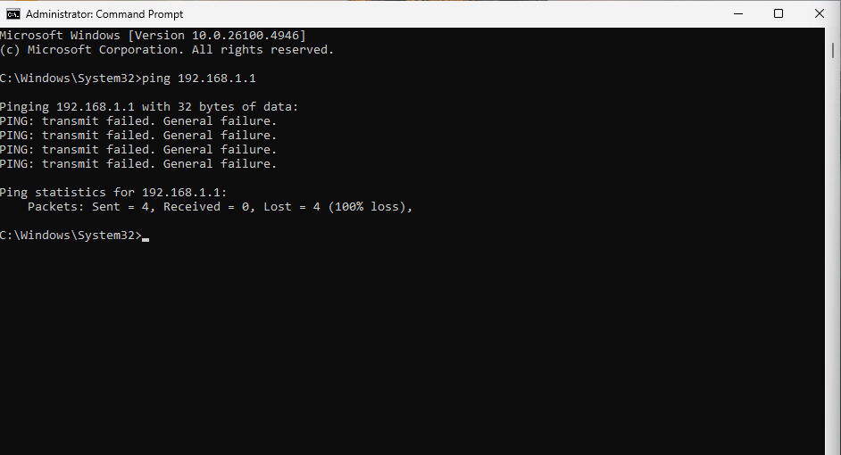
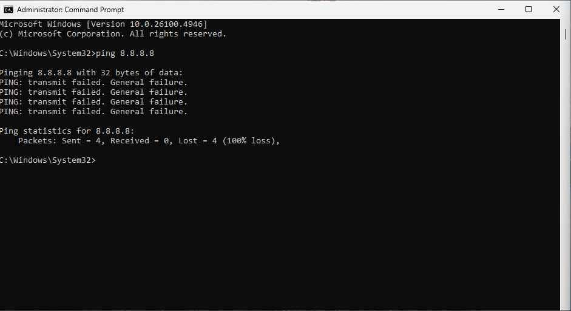
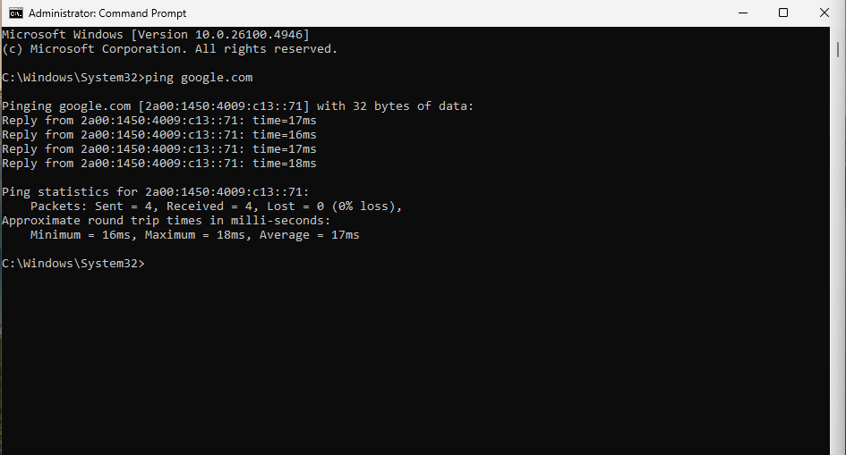

# Ticket 05 – No Internet Connectivity

## Objective
Simulate a real-world scenario where a user reports no internet connectivity on a Windows 11 workstation. 

The goal is to investigate the issue using standard troubleshooting steps, identify the root cause, and restore connectivity.

---

## Ticket Simulation

A user reported an issue with internet connectivity affecting multiple business applications.

**User:** John Smith  
**Department:** Sales  

**Reported Issues:**
- Websites not loading
- Outlook unable to connect
- Microsoft Teams showing offline

📸 **Screenshot of simulated ticket request:**  

---

## Environment

The issue was reproduced in a controlled lab environment to simulate a real-world workstation setup.

- Operating System: Windows 11
- Environment Type: Virtual Machine
- Virtualisation Platform: Oracle VirtualBox
- Network Configuration: NAT

📸 **System information (Windows 11):**  

---

## Issue Recreation

To simulate the issue, the system's network configuration was manually modified.

The IPv4 settings were changed from automatic (DHCP) to a static configuration, and the default gateway was intentionally removed.

This results in the system retaining a valid IP address while being unable to route traffic outside of the local network.

📸 **IPv4 configuration with missing default gateway:**  

📸 **Network adapter status (enabled):**  

---

## Investigation & Action Plan

### Step 1: Check IP Configuration

The system's network configuration was reviewed using the `ipconfig` command.

The output showed that the system had a valid IP address but no default gateway configured.

📸 **ipconfig output showing missing gateway:**  

---

### Step 2: Test Connectivity to Gateway

A ping test was performed to the local gateway to verify network communication.

The request failed, confirming the system could not reach the gateway.

📸 **Ping failure to gateway:**  

---

### Step 3: Test External Connectivity

A ping test to an external IP address (8.8.8.8) was performed.

The request failed, confirming no internet access beyond the local network.

📸 **Ping failure to external IP:**  

---

### Step 4: Test DNS Resolution

A DNS test was performed by attempting to ping a domain name.

The request failed, confirming that name resolution was not functioning due to lack of connectivity.

📸 **DNS resolution failure:**  
