## Ticket Simulation

A user reported issues accessing internet-based services despite appearing to be connected to the network.

**User:** Sarah Williams  
**Department:** Marketing  

**Reported Issues:**
- Websites not loading
- Outlook unable to connect
- Microsoft Teams showing disconnected
- Network status shows connected

📸 **Screenshot of simulated ticket request:**  

---

## Environment

The issue was reproduced in a controlled lab environment to simulate a real-world workstation setup.

- Operating System: Windows 11
- Environment Type: Virtual Machine
- Virtualisation Platform: Oracle VirtualBox
- Network Configuration: NAT

📸 **System information (Windows 11):**  

---

## Issue Recreation

To simulate the issue, the system's DNS configuration was manually modified.

The IPv4 settings were changed from automatic (DHCP) to a static DNS configuration using an invalid DNS server address.

This results in the system being able to connect to the network, but unable to resolve domain names.

📸 **IPv4 configuration with incorrect DNS server:**  
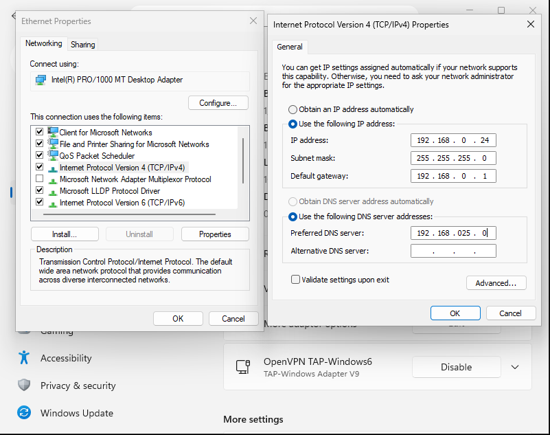

📸 **Network adapter status (connected):**  
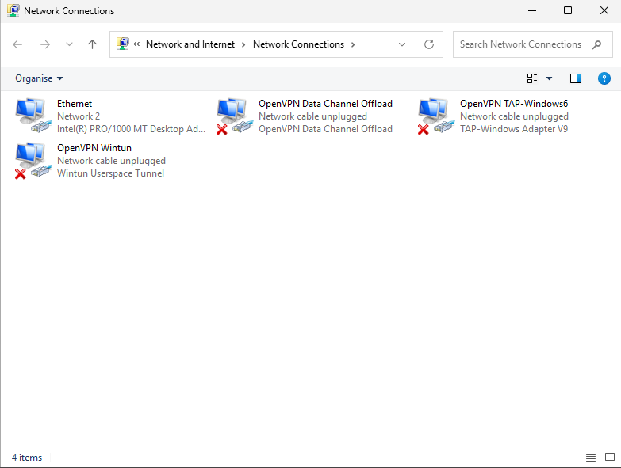

---

## Investigation & Action Plan

### Step 1: Check IP Configuration

The system's network configuration was reviewed using the `ipconfig /all` command.

The output showed that the system had a valid IP address and default gateway, confirming that the system was connected to the network.

However, further inspection was required to validate the DNS configuration.

📸 **ipconfig output showing incorrect DNS server:**  
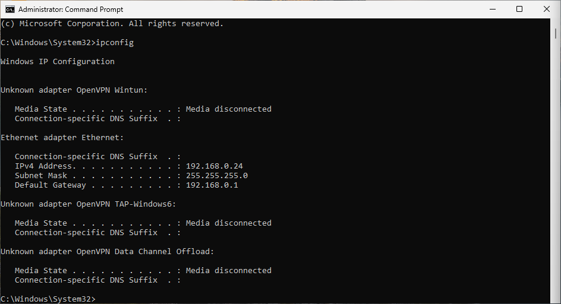

---

### Step 2: Test Network Connectivity

A ping test was performed to an external IP address (8.8.8.8).

The request was successful, confirming that the system had internet connectivity.

This confirmed that the issue was not related to general network connectivity.

This indicated that the issue was not related to network access, but likely related to name resolution.

📸 **Successful ping to external IP address:**  
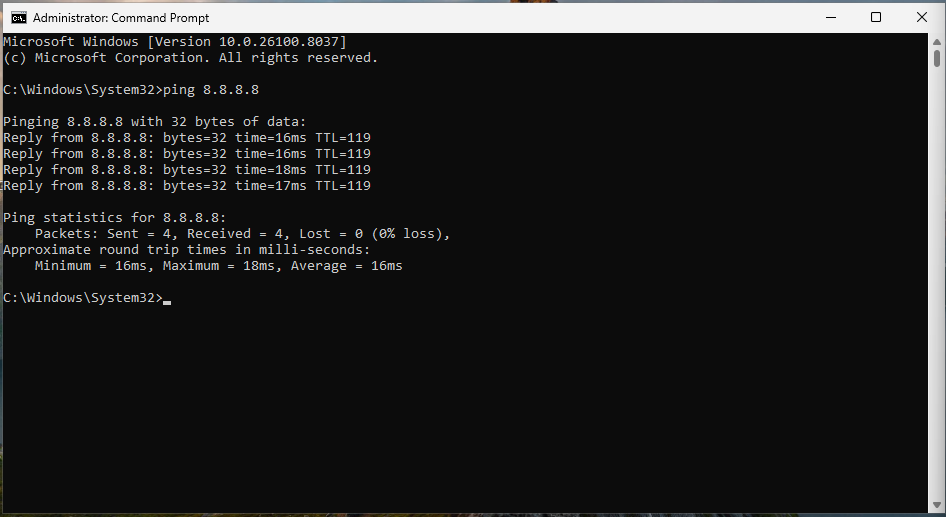

---

### Step 3: Test DNS Resolution

A ping test was performed using a domain name.

The request failed, indicating that the system was unable to resolve the domain to an IP address.

This suggested a DNS-related issue.

📸 **Ping failure when using domain name:**  
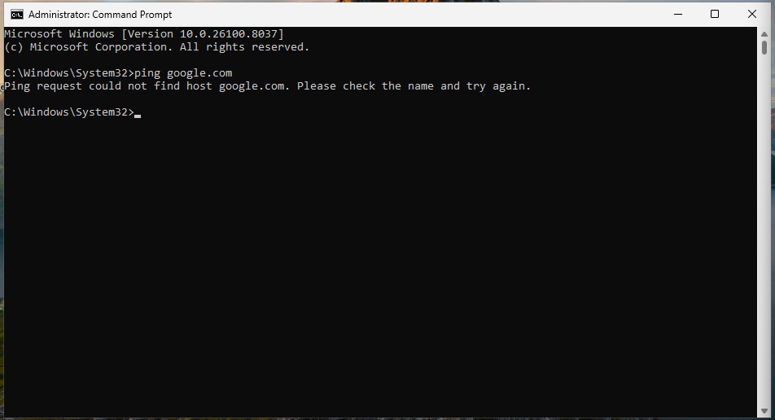

---

### Step 4: Confirm DNS Failure

The `nslookup` command was used to test DNS resolution directly.

The request failed, confirming that the system was unable to communicate with the configured DNS server.

This verified that the issue was specifically related to DNS configuration.

📸 **nslookup failure:**  
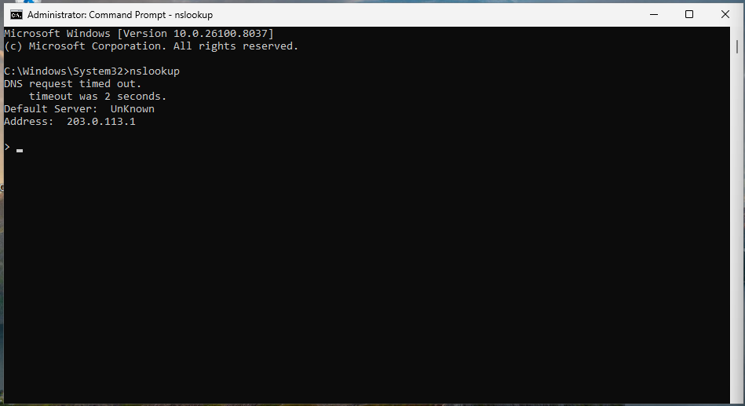

---

### Additional Investigation: DNS Still Resolving Despite Incorrect Configuration

During testing, the system continued to successfully resolve domain names despite being configured with an invalid DNS server.

This behaviour was unexpected and required further investigation.

📸 **Initial DNS configuration with invalid server:**  
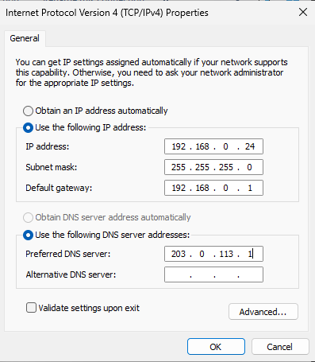

---

### Step 5: Verify DNS Cache

The DNS cache was cleared to ensure no previously resolved domain entries were being used.

    ipconfig /flushdns

📸 **DNS cache successfully flushed:**  
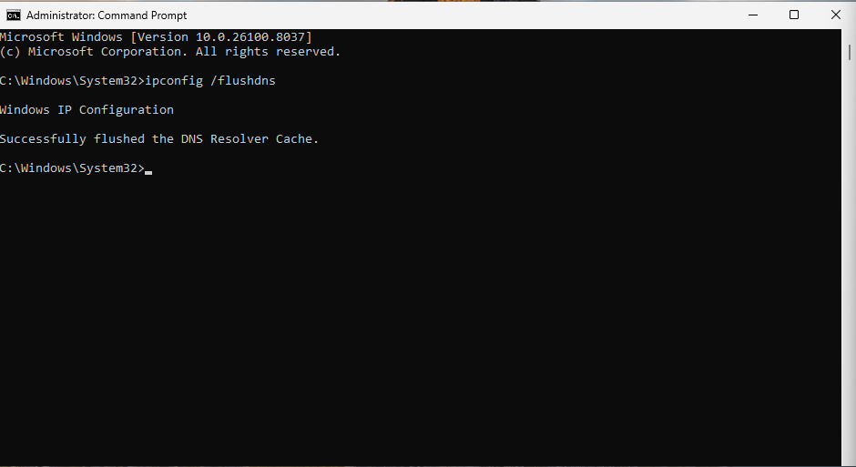

---

### Step 6: Re-test DNS Resolution

After clearing the cache, domain resolution was tested again.

Despite the incorrect DNS configuration, domain names were still resolving successfully.

📸 **DNS still resolving unexpectedly:**  
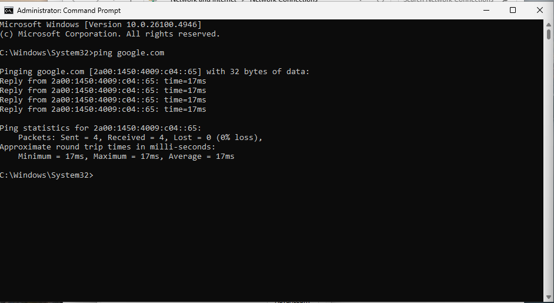

---

### Step 7: Identify Possible Cause (IPv6 Fallback)

Further investigation identified that IPv6 was still enabled on the network adapter.

This can allow the system to bypass the configured IPv4 DNS server and use IPv6 DNS resolution instead.

---

### Step 8: Disable IPv6

IPv6 was disabled on the network adapter to ensure all DNS queries were forced through the IPv4 configuration.

📸 **IPv6 disabled on network adapter:**  
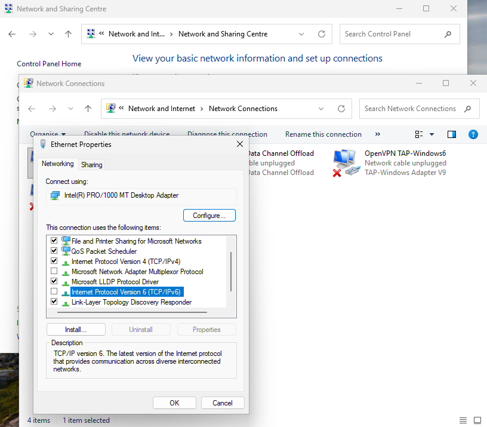

---

### Step 9: Re-test DNS Resolution After Disabling IPv6

After disabling IPv6, DNS resolution was tested again.

The system was now unable to resolve domain names, confirming that the issue was correctly reproduced.

📸 **Ping failure to domain (DNS not resolving):**  
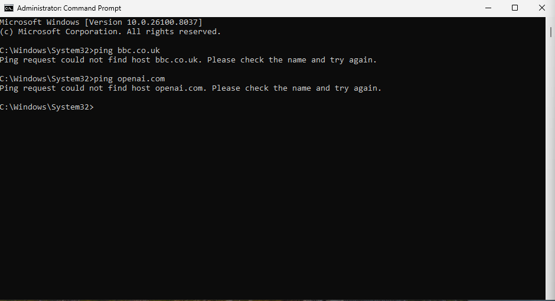

📸 **nslookup confirming DNS failure:**  
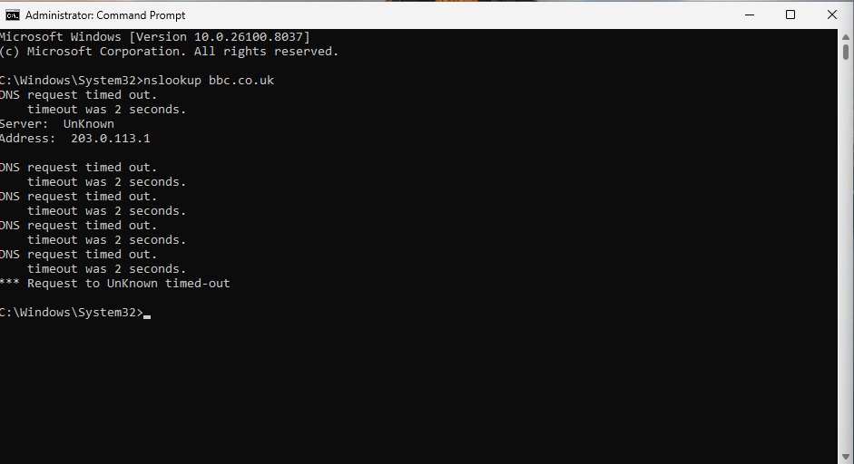

---

## Root Cause

The issue was caused by an incorrect DNS server configuration.

Although the system maintained valid network connectivity, it was unable to resolve domain names due to the invalid DNS server.

Additionally, IPv6 remained enabled and allowed DNS resolution to continue via an alternate protocol. This masked the issue and delayed accurate identification of the root cause.

Once IPv6 was disabled, the DNS failure was correctly isolated and confirmed.

---

## Resolution

The issue was resolved by correcting the DNS server configuration in the IPv4 settings.

The DNS server was updated to valid public DNS services.

- Preferred DNS server: 8.8.8.8  
- Alternate DNS server: 1.1.1.1  

📸 **Updated IPv4 configuration with correct DNS server:**  
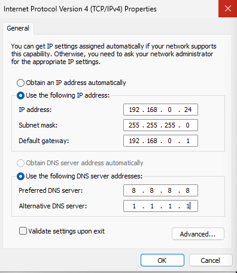

---

Additionally, IPv6 was re-enabled to restore normal network functionality and ensure compatibility with modern network environments.

📸 **IPv6 re-enabled on network adapter:**  
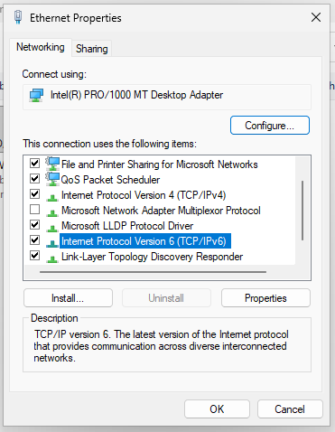

---

## Verification

After applying the fix, DNS resolution was successfully restored.

The system was able to:
- Resolve domain names
- Access websites
- Connect to online services such as email and collaboration tools

No further issues were observed after resolution.

📸 **Successful ping to domain name:**  
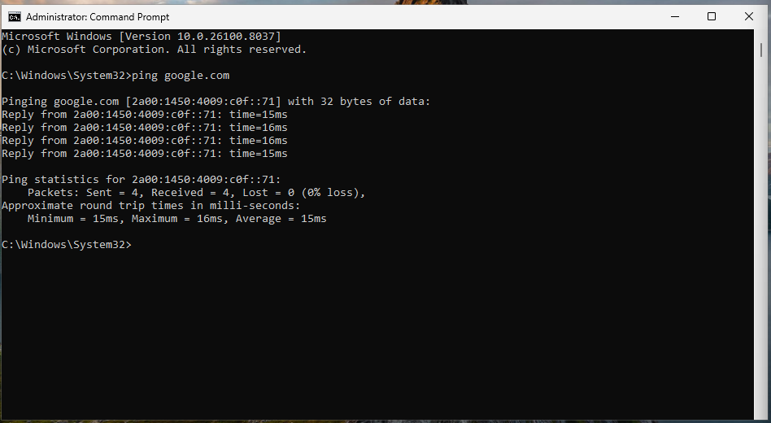

📸 **Browser connectivity restored:**  
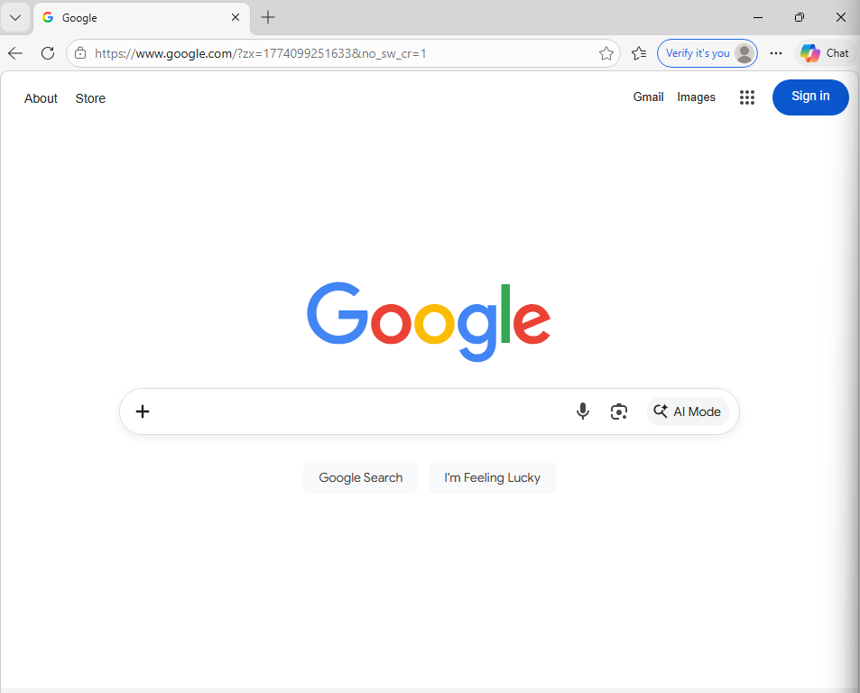

---

## Key Takeaways

- DNS issues can occur even when network connectivity is functioning correctly
- Successful IP-based communication does not guarantee DNS resolution
- IPv6 can provide fallback DNS resolution and mask underlying configuration issues
- Layered troubleshooting is essential for accurate diagnosis

---

## Related Knowledge Base Article

See: [Windows DNS Resolution Failure](../knowledge-base/windows-dns-resolution-failure.md)