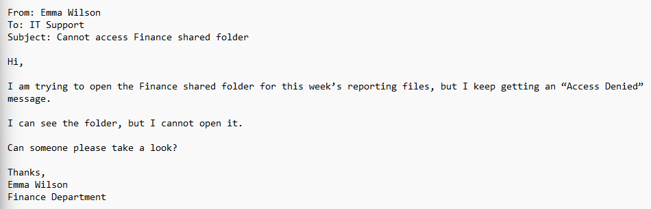
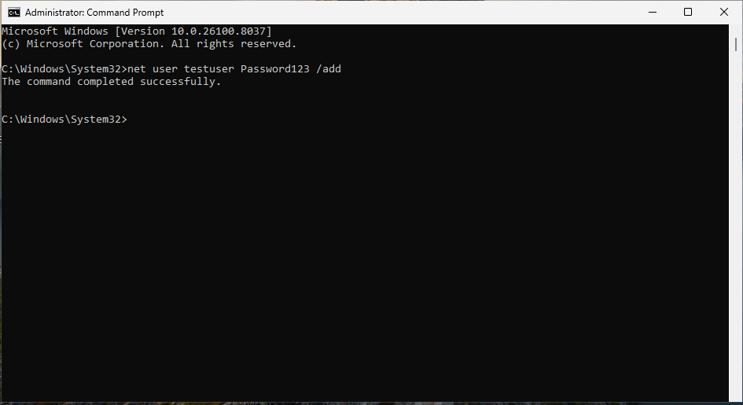
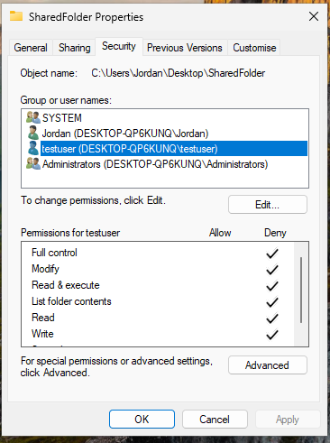

## Ticket Simulation

A user reported being unable to access a shared folder required for their daily work.

**User:** Emma Wilson  
**Department:** Finance  

**Reported Issues:**
- Unable to open shared folder
- Receiving "Access Denied" error
- Folder visible but not accessible

📸 **Screenshot of simulated ticket request:**  

---

## Environment

The issue was reproduced in a controlled lab environment to simulate a real-world workstation setup.

- Operating System: Windows 11
- Environment Type: Virtual Machine
- Virtualisation Platform: Oracle VirtualBox
- User Configuration: Local user accounts
- File Access Method: Local shared folder simulation

📸 **System information (Windows 11):**  

---

## Issue Recreation

To simulate the issue, a shared folder was created and a test user account was configured.

📸 **Shared folder created for testing:**  

Access to the folder was then restricted by applying explicit deny permissions to the test user.

This resulted in the user being able to see the folder but not open it.

📸 **Test user account created for simulation:**  

📸 **Folder permissions showing denied access:**  

---

