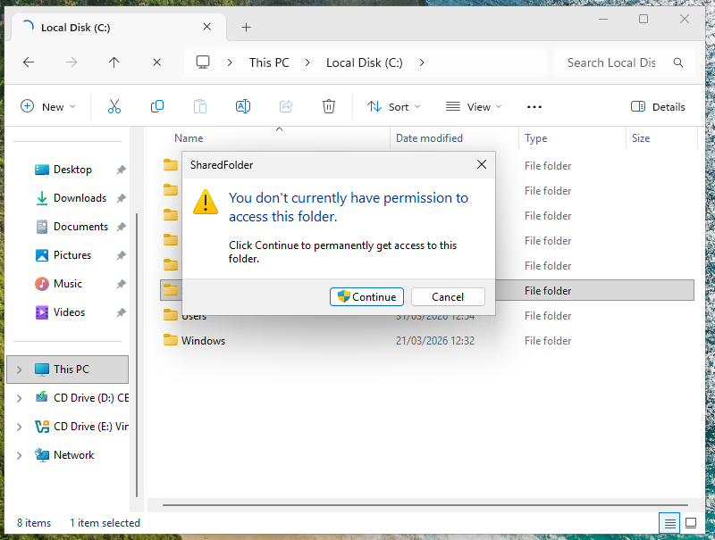
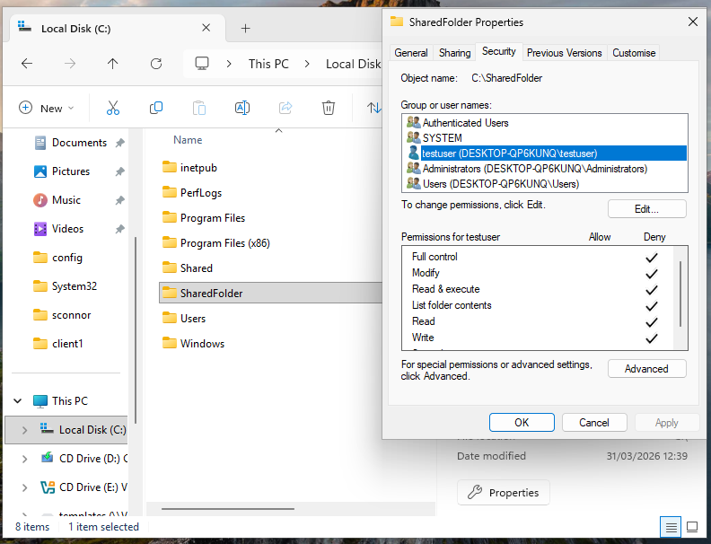
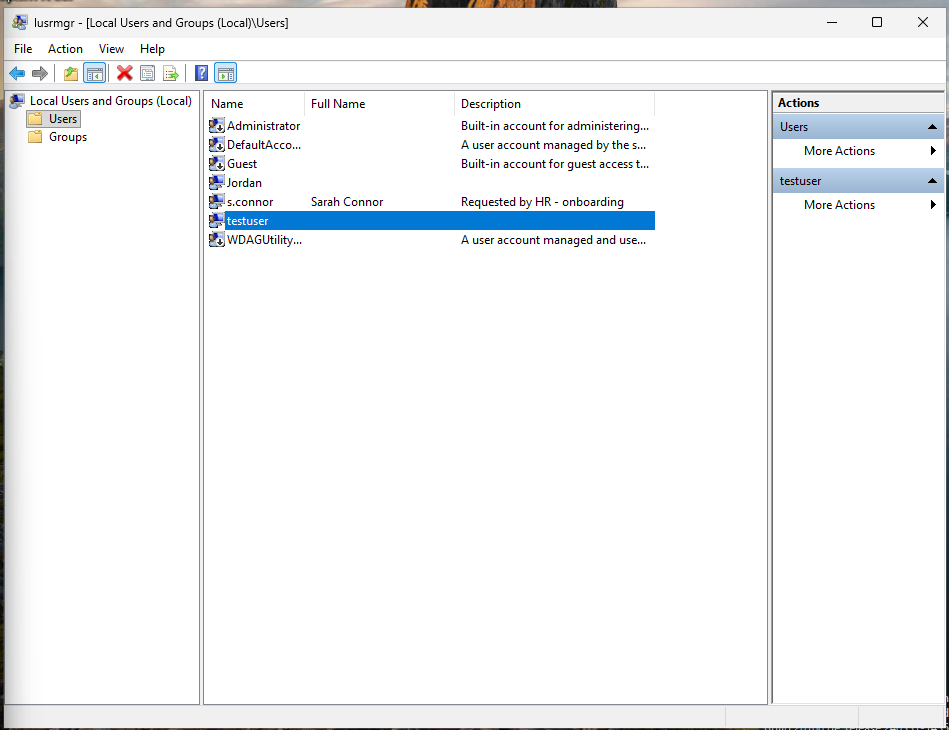
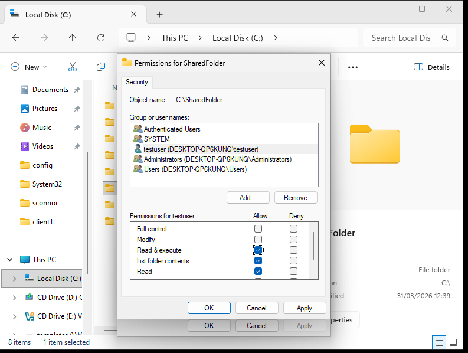
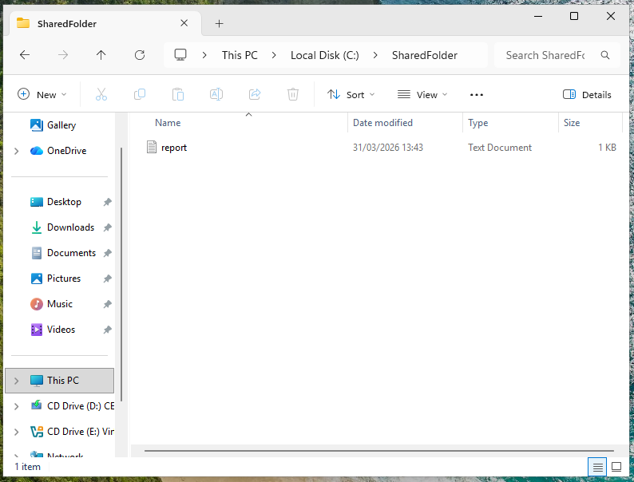
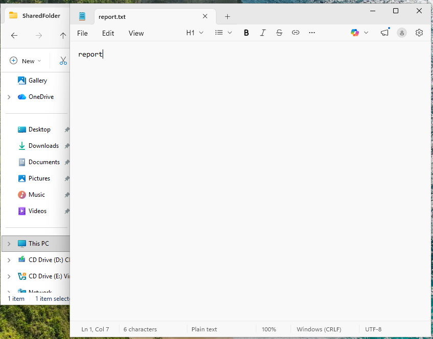

## Ticket Simulation

A user reported being unable to access a shared folder required for their daily work.

**User:** Emma Wilson  
**Department:** Finance  

**Reported Issues:**
- Unable to open shared folder
- Receiving "Access Denied" error
- Folder visible but not accessible

📸 **Screenshot of simulated ticket request:**  

---

## Environment

The issue was reproduced in a controlled lab environment to simulate a real-world workstation setup.

- Operating System: Windows 11
- Environment Type: Virtual Machine
- Virtualisation Platform: Oracle VirtualBox
- User Configuration: Local user accounts
- File Access Method: Local shared folder simulation

📸 **System information (Windows 11):**  

---

## Issue Recreation

To simulate the issue, a shared folder was created in a common directory to represent a shared resource environment.

📸 **Shared folder created for testing:**  

A test user account was then configured for access testing.

Access to the folder was restricted by applying explicit deny permissions to the test user.

This resulted in the user being able to see the folder but not open it.

📸 **Test user account created for simulation:**  

📸 **Folder permissions showing denied access:**  

---

## Investigation & Action Plan

### Step 1: Reproduce the Reported Issue

The issue was reproduced by signing in as the affected user and attempting to open the shared folder.

The folder was visible, but access was denied when the user attempted to open it.

This confirmed that the issue was related to permissions rather than folder visibility.

📸 **Access denied message when opening shared folder:**  

---

### Step 2: Review Folder Security Permissions

The folder's security settings were reviewed to identify whether the affected user had the appropriate permissions.

The security tab showed that the test user had explicit deny permissions applied to the folder.

This indicated that access was being blocked by NTFS permissions.

📸 **Security settings showing denied permissions:**  

---

### Step 3: Validate Affected User Account

The affected user account was reviewed to confirm that the correct account was being tested.

The Local Users and Groups management console was used to verify that the test user existed on the system.

This ensured the issue was not caused by an incorrect or missing user account.

📸 **Local user account confirmed in system:**  

---

### Step 4: Identify the Cause of Access Failure

The investigation confirmed that the folder itself was present and visible to the user, and that the affected account was valid.

However, an explicit deny permission had been applied to the user account on the folder.

This was identified as the direct cause of the "Access Denied" error.

---

## Root Cause

The issue was caused by an explicit NTFS deny permission applied to the affected user account on the shared folder.

An explicit deny permission had been applied to the affected user account, preventing access to the folder even though it was visible in File Explorer.

Because deny permissions take precedence over allow permissions, the user was unable to open the folder until the incorrect entry was removed.

---

## Resolution

The issue was resolved by correcting the folder's NTFS permissions.

The explicit deny entry applied to the affected user account was removed, and appropriate access permissions were restored.

This allowed the user to open the shared folder successfully.

The explicit deny entry was removed from the user permissions, and standard read access was confirmed.

📸 **Updated folder permissions after removing denied access:**  

---

## Verification

After correcting the folder permissions, access was successfully restored.

The affected user was able to:
- Open the shared folder
- View its contents
- Open and read files within the shared folder without receiving an error

No further issues were observed after resolution.

📸 **Shared folder accessible after permissions fix:**  

📸 **File contents visible inside shared folder:**  

---

## Key Takeaways

- A folder can be visible to a user but still inaccessible due to NTFS permissions
- Explicit deny permissions override allow permissions
- Reproducing the issue as the affected user helps confirm the true access experience
- Reviewing security settings is essential when diagnosing access-related issues
- Correcting permissions should always be followed by verification using the affected account
- Effective troubleshooting requires validating both visibility and access permissions separately

---

## Related Knowledge Base Article

See: [Windows Shared Folder Access Denied – NTFS Permissions](../knowledge-base/windows-shared-folder-access-denied-ntfs-permissions.md)