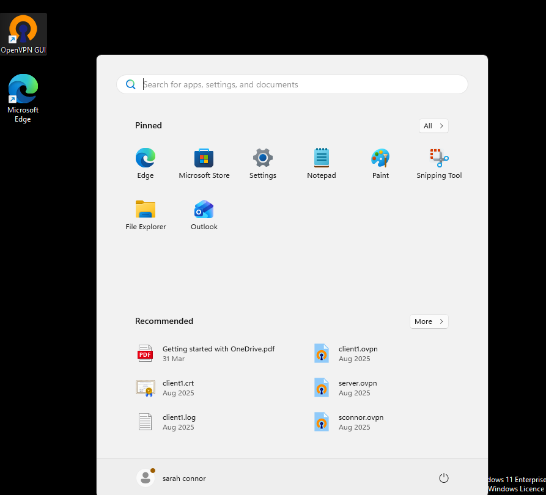
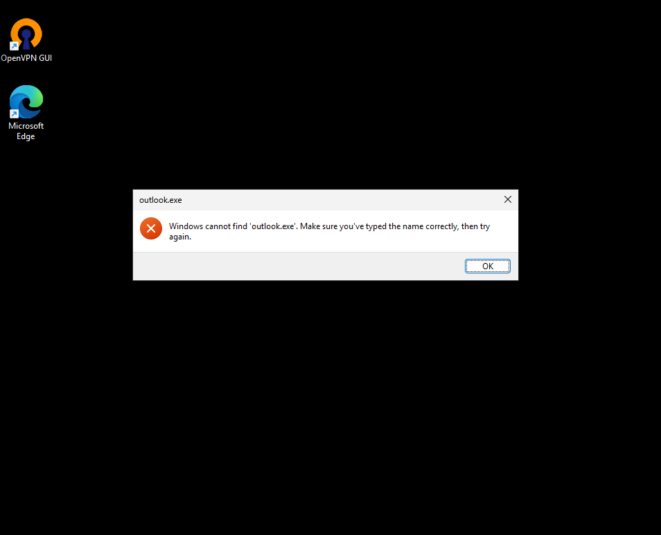

# Ticket 08 – Outlook Won’t Open (Startup Failure)

## Objective
Simulate a real-world scenario where Microsoft Outlook fails to open due to a problematic add-in.

The goal is to investigate the issue using standard troubleshooting steps, identify the root cause, and restore normal functionality.

---

## Ticket Simulation

A user reported issues accessing email through Microsoft Outlook.

**User:** Sarah Williams  
**Department:** Marketing  

**Reported Issues:**
- Outlook not opening
- Application briefly appears then closes
- Unable to access emails

📸 **Screenshot of simulated ticket request:**  

---

## Environment

The issue was reproduced in a controlled lab environment to simulate a real-world workstation setup.

- Operating System: Windows 11
- Environment Type: Virtual Machine
- Virtualisation Platform: Oracle VirtualBox
- Application: Microsoft Outlook (Desktop)

📸 **System information (Windows 11):**  

---

---

## Issue Recreation (Adapted Scenario)

The original objective was to simulate an Outlook startup failure caused by a problematic add-in.

In a typical enterprise environment, this would involve enabling or isolating Outlook add-ins through the application settings to reproduce a startup issue.

During testing, it was observed that the installed Outlook version uses the newer interface, which does not expose the same add-in management options as the classic desktop version.

This prevented full recreation of the add-in failure scenario using the standard method.

📸 **Outlook settings interface (add-in options not available):**  

As a result, the scenario was adapted to focus on the expected troubleshooting workflow used when Outlook fails to open.

---

---

## Investigation & Action Plan

### Step 1: Reproduce the Issue

The issue was reproduced by attempting to open Microsoft Outlook from the Start menu.

Outlook did not launch as expected, confirming the user’s reported issue (simulated scenario).

📸 **Outlook not opening from Start menu:**  

---

---

### Step 2: Attempt to Launch Outlook in Safe Mode

An attempt was made to launch Outlook in Safe Mode using the Run command:

    outlook.exe /safe

The system returned an error indicating that the application could not be found.

This confirmed that the installed Outlook version is the newer Microsoft Store application, which does not support traditional Safe Mode or executable-based troubleshooting methods.

📸 **Run command error when attempting Safe Mode:**  

---

---

### Step 3: Identify Platform Limitation

Further investigation confirmed that the installed Outlook version is the newer Outlook for Windows application.

This version uses a modern interface and does not provide access to traditional add-in management or Safe Mode startup options.

📸 **Outlook settings interface (limited options):**  
