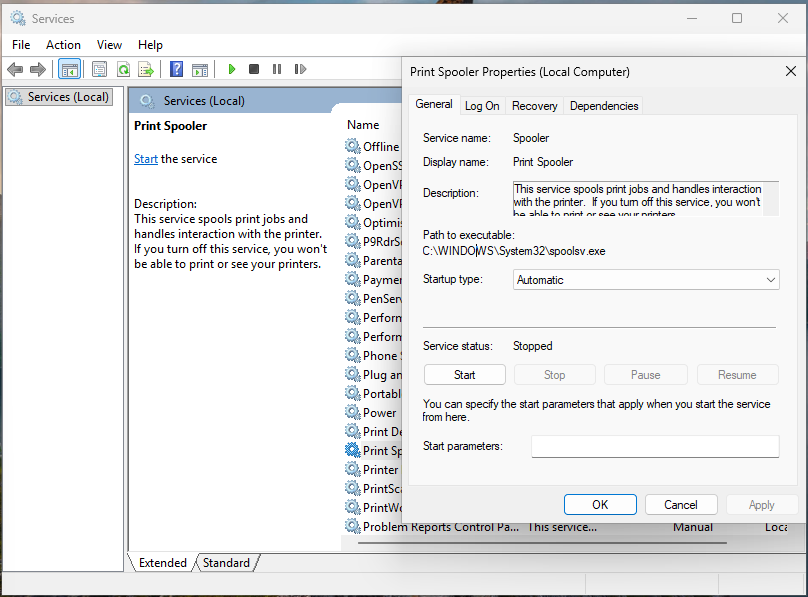
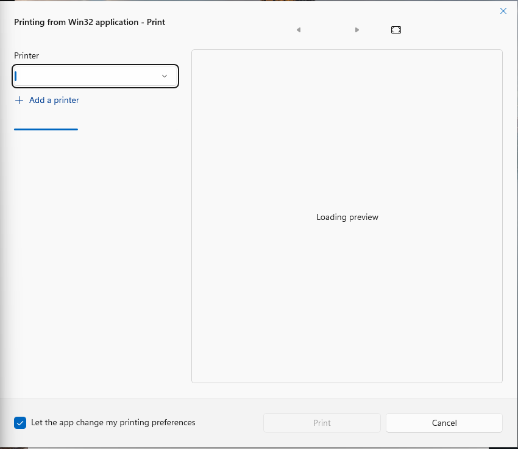
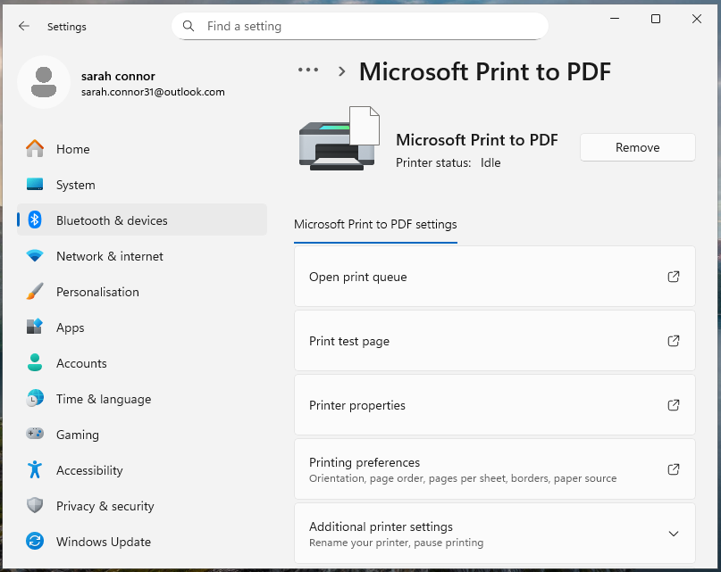
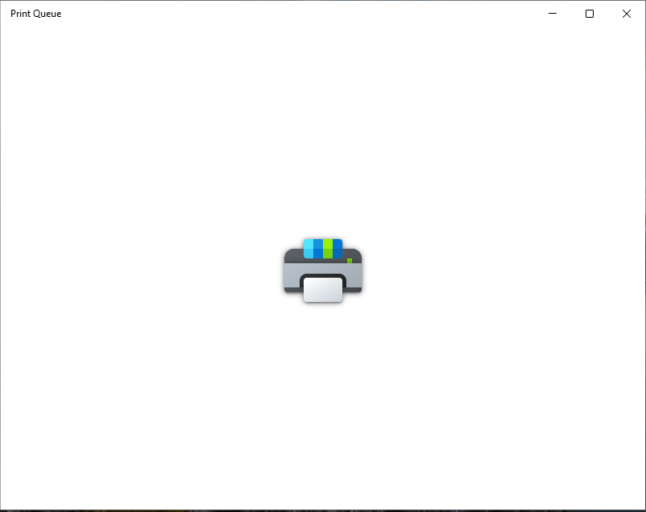
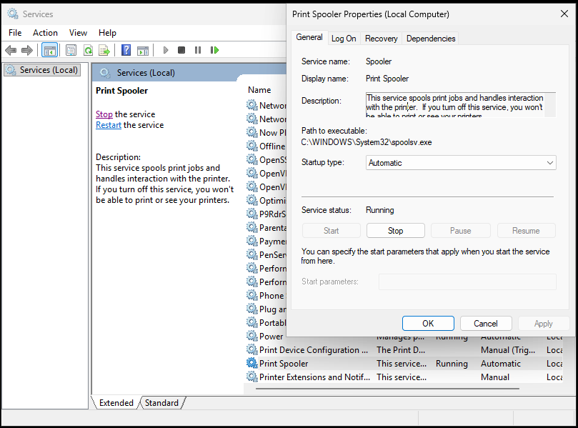
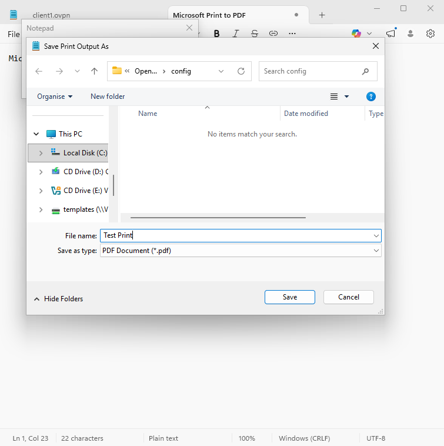
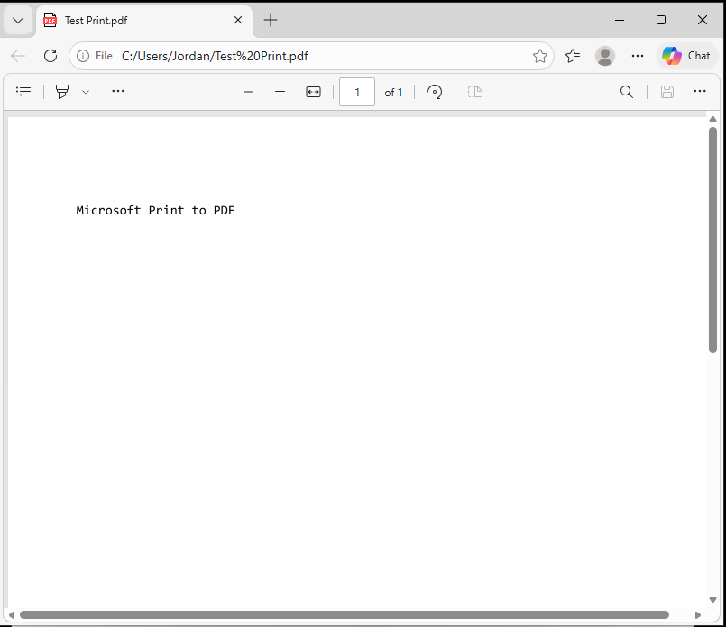

# Ticket 09 – Printer Showing Offline

## Objective
Simulate an operational IT support scenario where a user is unable to print due to a printer appearing offline.

The goal is to investigate the issue using standard troubleshooting steps, identify the root cause, and restore printing functionality.

---

## Incident Logging

- **Ticket ID:** 0009-PRN-INC  
- **Date Reported:** 22-07-2025  
- **Reported by:** David Brown  
- **Department:** Finance  
- **Channel:** Email to IT Support (simulated)  

---

## SLA & Priority

- **Priority Level:** P3 – Medium  
- **Impact:** Low (single user affected, workaround potentially available)  
- **Urgency:** Medium (affects task completion but not full system outage)  

- **Response Time Target:** 1 hour  
- **Resolution Time Target:** 1 business day  

(Reference: [SLA & Priority Matrix](../docs/sla-priority-matrix.md))

---

## Initial Assessment

The issue appeared to be isolated to a printing device, with the system and applications otherwise functioning normally.

This suggested a service or device-related issue rather than a broader system or network failure.

---

## Ticket Simulation

A user reported an issue when attempting to print documents required for daily work tasks.

---

### 📧 User Request

**From:** david.brown@company.com  
**To:** it.support@company.com  
**Subject:** Unable to Print – Printer Showing Offline  

Hi IT Support,

I am currently unable to print documents from my Windows 11 workstation. The printer appears to be offline, and any print jobs I send do not process.

This is preventing me from completing my daily tasks.

Please could you investigate this issue?

Kind regards,  
David Brown  
Finance Department  

---

### 🧾 Ticket Summary

**User:** David Brown  
**Department:** Finance  

**Reported Issues:**
- Unable to print documents  
- Printer showing as offline  
- Print jobs not processing  

---

📸 **Screenshot of simulated ticket request:**  

---

## Environment

The issue was reproduced in a controlled lab environment to simulate a typical workstation setup.

- Operating System: Windows 11  
- Environment Type: Virtual Machine  
- Virtualisation Platform: Oracle VirtualBox  
- Printer Type: Microsoft Print to PDF  

📸 **System information (Windows 11):**  

---

## Issue Recreation

To simulate the issue, the Windows Print Spooler service was manually stopped.

The Print Spooler service is responsible for managing print jobs and handling communication between applications and printing devices.

Stopping this service prevents print jobs from being processed, causing the printer to appear offline or unresponsive.

📸 **Print Spooler service stopped (service status: stopped):**  

---

## Investigation & Action Plan

### Step 1: Reproduce the Issue

The issue was reproduced by attempting to print a document using the Microsoft Print to PDF printer.

The print request remained unresponsive and did not complete, confirming the user’s reported issue.

📸 **Print job not processing (unresponsive):**  

---

### Step 2: Check Printer Status

The printer was reviewed within Windows settings to confirm it was installed and available.

The printer appeared correctly configured but was not processing any print jobs.

📸 **Printer visible in settings:**  

---

### Step 3: Review Print Queue

The print queue was checked to determine if print jobs were being received and processed.

The queue showed no active processing, indicating a potential issue preventing print jobs from being handled.

📸 **Print queue showing no processing:**  

---

### Step 4: Check Print Spooler Service

The Windows Services console was opened to review the status of the Print Spooler service.

The service was found to be stopped, preventing print jobs from being processed.

📸 **Print Spooler service stopped:**  

---

## Root Cause

The issue was caused by the Print Spooler service being stopped.

The Print Spooler service is responsible for managing print jobs and handling communication between applications and printing devices.

With the service stopped, print jobs could not be processed, resulting in the printer appearing unresponsive and preventing documents from being printed.

This demonstrates how Windows services directly impact user-facing functionality.

---

## Resolution

The issue was resolved by restarting the Print Spooler service.

Once the service was running, the system was able to process print jobs normally.

This restored communication between applications and the printing service.

📸 **Print Spooler service running:**  

---

## Verification

After restarting the Print Spooler service, printing was tested again.

The system successfully processed the print job, confirming that the issue was resolved.

The user was able to:
- Print documents successfully  
- Save output using Microsoft Print to PDF  
- Resume normal work tasks without further issues  

📸 **Successful print job:**  

📸 **PDF file successfully generated:**  

No further issues were observed after resolution.

---

## Related Knowledge Base Article

See: [Windows Printer Showing Offline – Print Spooler Service](../knowledge-base/windows-printer-offline-print-spooler-service.md)

