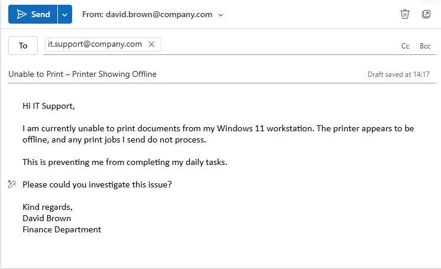

# Ticket 09 – Printer Showing Offline

## Objective
Simulate an operational IT support scenario where a user is unable to print due to a printer appearing offline.

The goal is to investigate the issue using standard troubleshooting steps, identify the root cause, and restore printing functionality.

---

## Ticket Simulation

A user reported an issue when attempting to print documents required for daily work tasks.

---

### 📧 User Request

**From:** david.brown@company.com  
**To:** it.support@company.com  
**Subject:** Unable to Print – Printer Showing Offline  

Hi IT Support,

I am currently unable to print documents from my Windows 11 workstation. The printer appears to be offline, and any print jobs I send do not process.

This is preventing me from completing my daily tasks.

Please could you investigate this issue?

Kind regards,  
David Brown  
Finance Department  

---

### 🧾 Ticket Summary

**User:** David Brown  
**Department:** Finance  

**Reported Issues:**
- Unable to print documents  
- Printer showing as offline  
- Print jobs not processing  

---

📸 **Screenshot of simulated ticket request:**  
