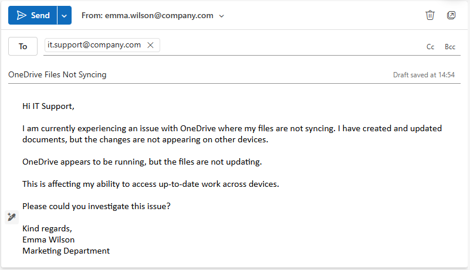
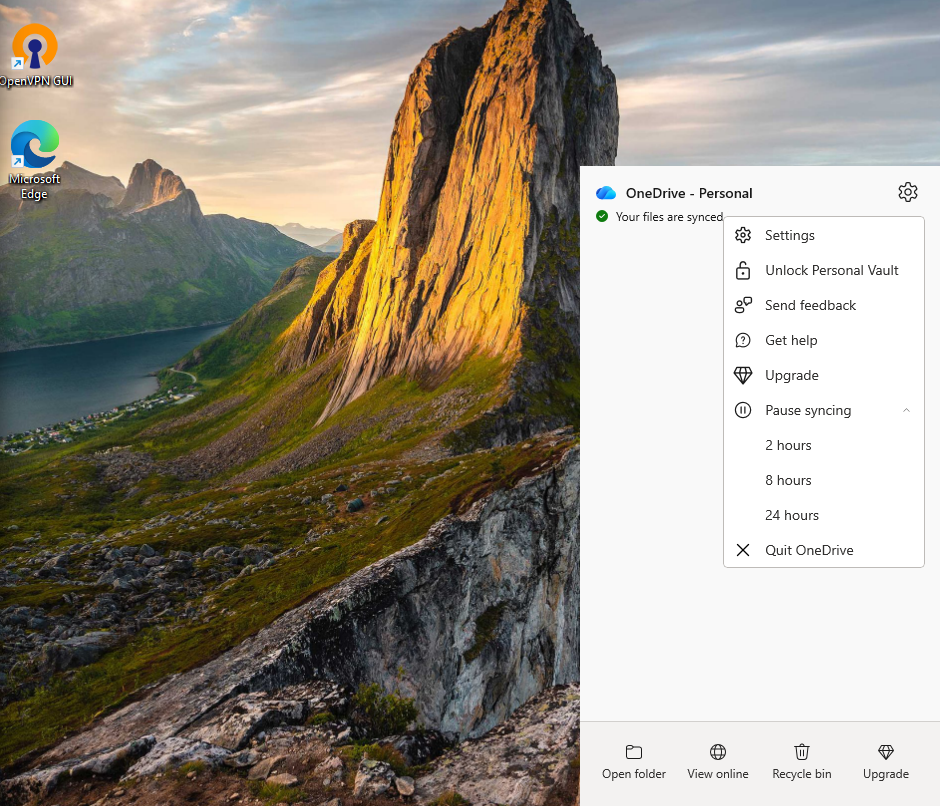
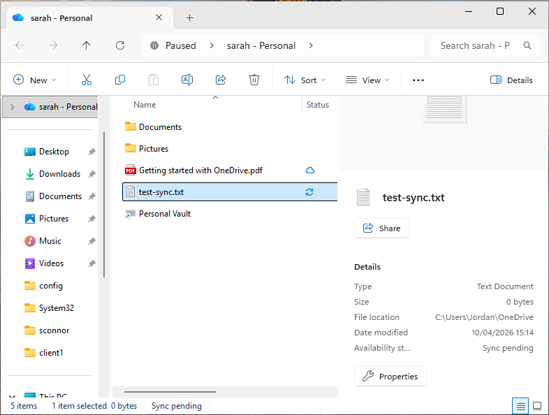
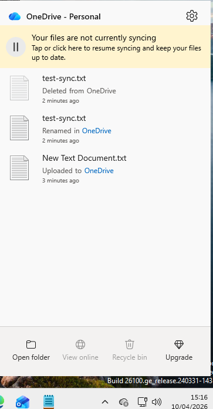
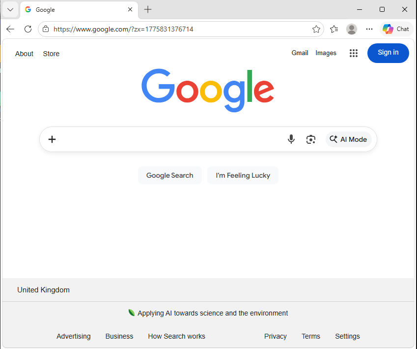

# Ticket 10 – OneDrive Not Syncing

## Objective
Simulate an operational IT support scenario where a user reports files not syncing in Microsoft OneDrive.

The goal is to investigate the issue using standard troubleshooting steps, identify the root cause, and restore normal sync functionality.

---

## Ticket Simulation

A user reported issues with files not syncing in Microsoft OneDrive, preventing access across devices.

---

### 📧 User Request

**From:** emma.wilson@company.com  
**To:** it.support@company.com  
**Subject:** OneDrive Files Not Syncing  

Hi IT Support,

I am currently experiencing an issue with OneDrive where my files are not syncing. I have created and updated documents, but the changes are not appearing on other devices.

OneDrive appears to be running, but the files are not updating.

This is affecting my ability to access up-to-date work across devices.

Please could you investigate this issue?

Kind regards,  
Emma Wilson  
Marketing Department  

---

### 🧾 Ticket Summary

**User:** Emma Wilson  
**Department:** Marketing  

**Reported Issues:**
- Files not syncing  
- Changes not updating across devices  
- OneDrive appears active but not syncing  

---

📸 **Screenshot of simulated ticket request:**  

---

## Environment

The issue was reproduced in a controlled lab environment to simulate a typical workstation setup.

- Operating System: Windows 11  
- Environment Type: Virtual Machine  
- Virtualisation Platform: Oracle VirtualBox  
- Application: Microsoft OneDrive  

📸 **System information (Windows 11):**  

---

## Issue Recreation

To simulate the issue, OneDrive syncing was manually paused from the system tray.

This prevented files from syncing to the cloud while still appearing locally available on the system.

📸 **OneDrive sync paused from system tray:**  

---

A test file was then created within the OneDrive directory to confirm that syncing was not occurring.

The file remained in a pending state and did not receive a sync confirmation indicator (green tick).

📸 **File not syncing (pending status):**  

---

The OneDrive status was reviewed via the system tray, confirming that syncing was paused and no files were being processed.

📸 **OneDrive showing sync paused status:**  

---

## Investigation & Action Plan

### Step 1: Reproduce the Issue

A test file was created within the OneDrive directory to confirm the reported issue.

The file did not sync and remained in a pending state, confirming that OneDrive was not processing changes.

📸 **File not syncing (pending status):**  

---

### Step 2: Check OneDrive Status

The OneDrive application was reviewed via the system tray to assess its current status.

The application indicated that syncing was paused.

📸 **OneDrive showing sync paused status:**  

---

### Step 3: Verify Network Connectivity

Network connectivity was tested by accessing web-based services to confirm that the system had an active internet connection.

This confirmed that the issue was not related to network connectivity and helped eliminate external factors.

📸 **Internet connectivity confirmed via browser:**  

---

### Step 4: Identify the Cause

Based on the investigation, OneDrive syncing had been manually paused.

This prevented files from being uploaded or synchronised with the cloud, resulting in the observed issue.

---

## Root Cause

The issue was caused by OneDrive syncing being manually paused via the system tray.

This prevented files from being uploaded and synchronised with the cloud, resulting in pending files and a lack of updates across devices.

---

