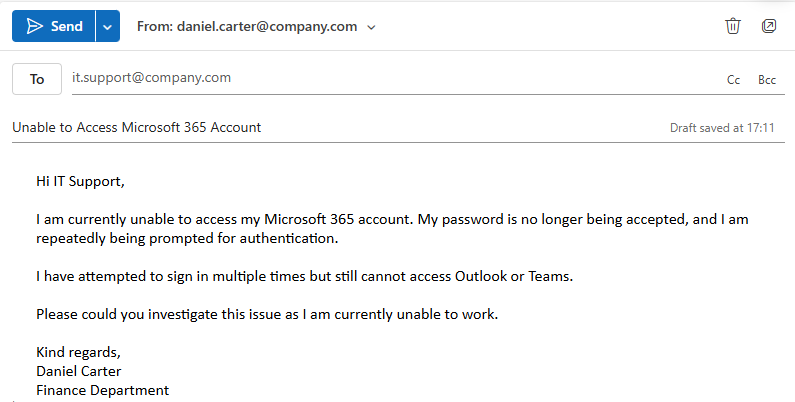

# Ticket 11 – Password Reset & MFA Lockout

## Objective

Simulate an operational IT support scenario where a user is unable to access Microsoft 365 due to password and authentication issues.

The goal is to investigate the issue using structured troubleshooting steps, restore secure account access, and demonstrate escalation awareness where suspicious authentication behaviour is identified.

---

## Incident Logging

- **Ticket ID:** 0011-IDENTITY-AUTH  
- **Date Reported:** 24-07-2025  
- **Reported by:** Daniel Carter  
- **Department:** Finance  
- **Channel:** Email to IT Support (simulated)  

---

## SLA & Priority

- **Priority Level:** P2 – High  
- **Impact:** Medium (single user unable to access business services)  
- **Urgency:** High (authentication failure preventing work activity)  

- **Response Time Target:** 30 minutes  
- **Resolution Time Target:** 4 business hours  

(Reference: [SLA & Priority Matrix](../docs/sla-priority-matrix.md))

---

## Initial Assessment

The issue appeared to be related to user authentication and account access rather than a system-wide outage or connectivity problem.

The user reported password rejection and repeated authentication failures when attempting to access Microsoft 365 services.

This suggested a potential account lockout, credential issue, or authentication state problem requiring identity verification and access investigation.

---

## Ticket Simulation

A user reported being unable to access Microsoft 365 applications due to repeated password and authentication failures.

---

### 📧 User Request

**From:** daniel.carter@company.com  
**To:** it.support@company.com  
**Subject:** Unable to Access Microsoft 365 Account  

Hi IT Support,

I am currently unable to access my Microsoft 365 account. My password is no longer being accepted, and I am repeatedly being prompted for authentication.

I have attempted to sign in multiple times but still cannot access Outlook or Teams.

Please could you investigate this issue as I am currently unable to work.

Kind regards,  
Daniel Carter  
Finance Department  

---

### 🧾 Ticket Summary

**User:** Daniel Carter  
**Department:** Finance  

**Reported Issues:**
- Password rejected  
- Unable to access Microsoft 365  
- Repeated authentication prompts  
- Unable to access Outlook and Teams  

---

📸 **Screenshot of simulated ticket request:**  
