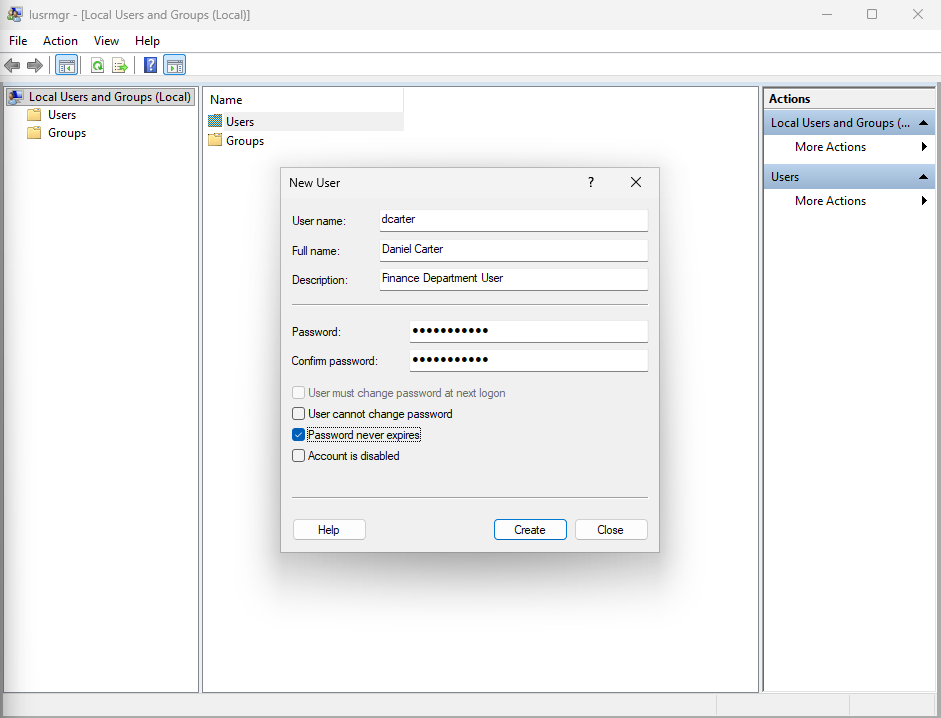
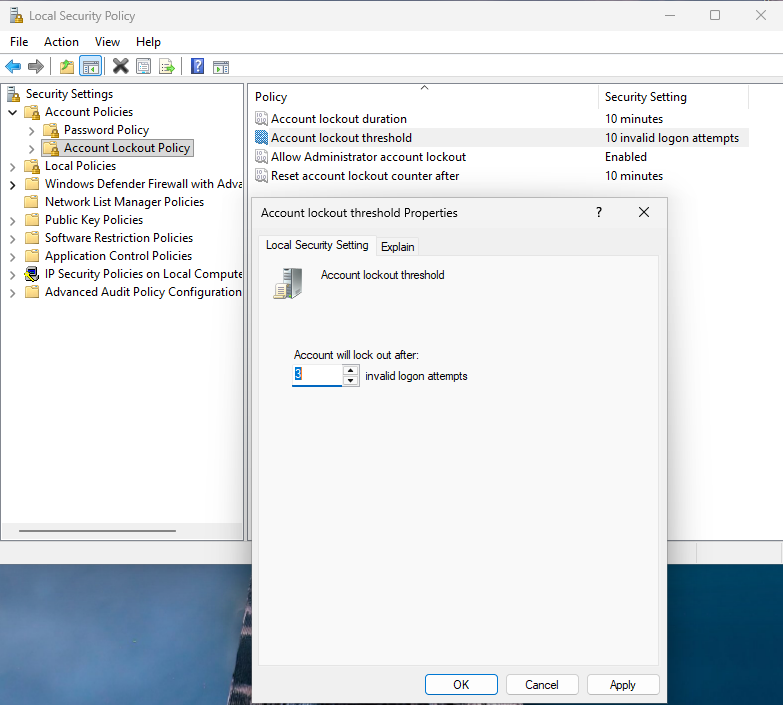
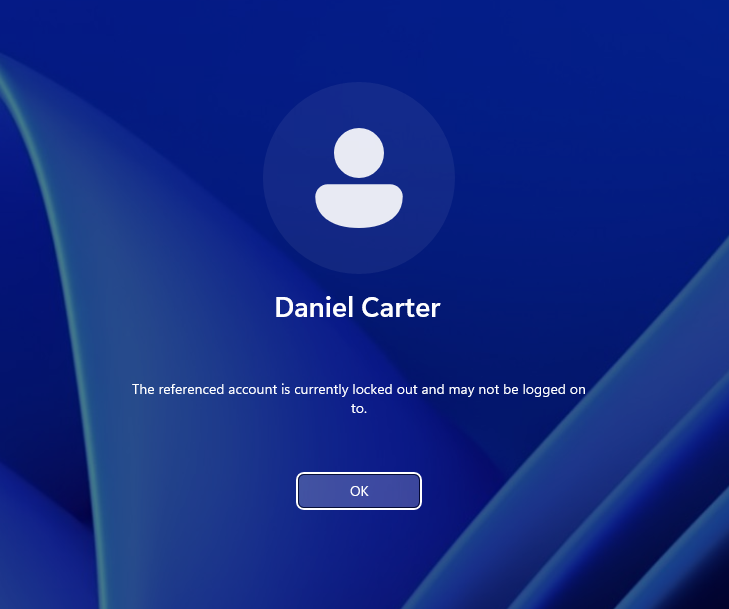
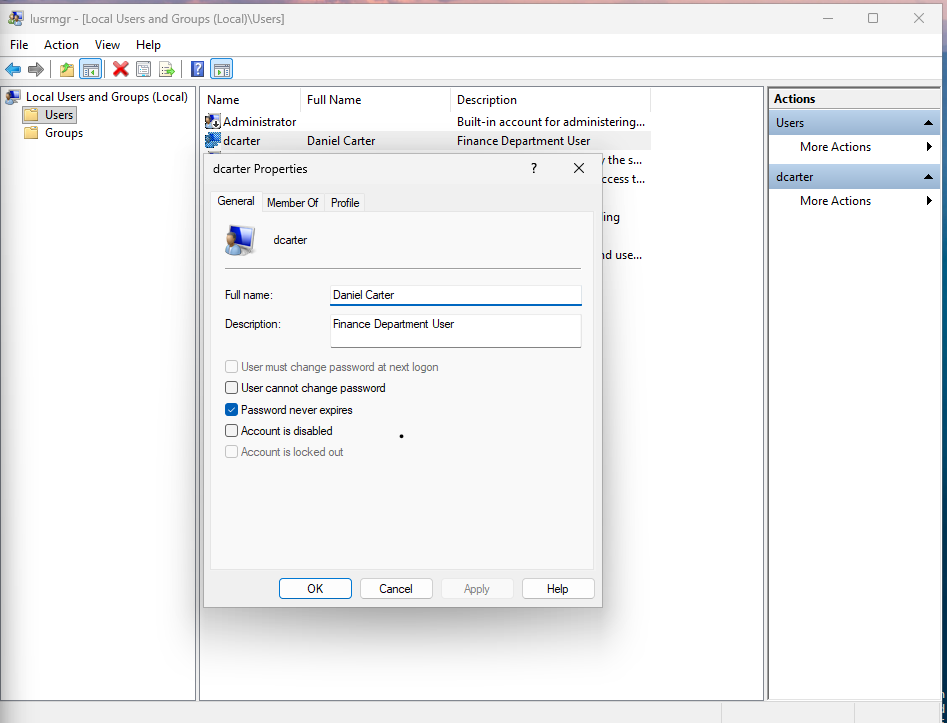
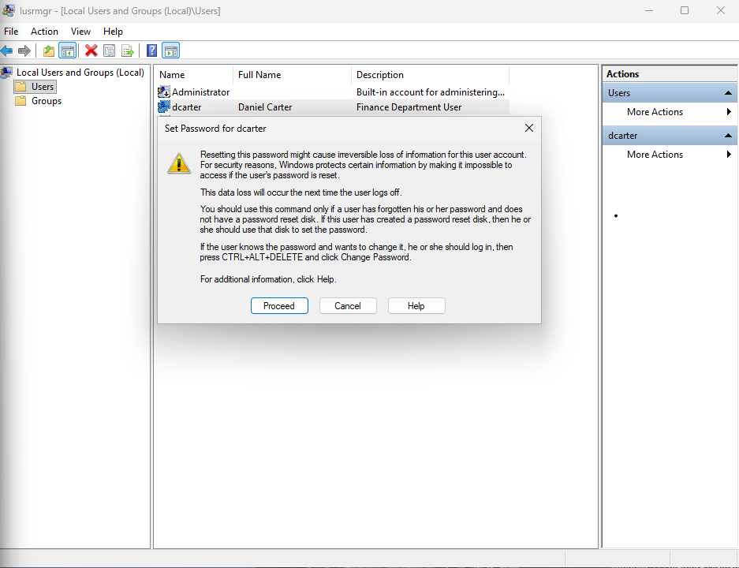
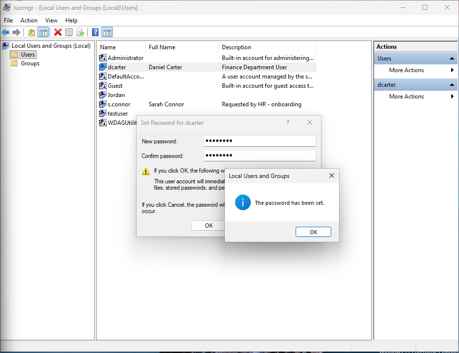

# Ticket 11 – Password Reset & MFA Lockout

## Objective

Simulate an operational IT support scenario where a user is unable to access Microsoft 365 due to password and authentication issues.

The goal is to investigate the issue using structured troubleshooting steps, restore secure account access, and demonstrate escalation awareness where suspicious authentication behaviour is identified.

---

## Incident Logging

- **Ticket ID:** 0011-IDENTITY-AUTH  
- **Date Reported:** 24-07-2025  
- **Reported by:** Daniel Carter  
- **Department:** Finance  
- **Channel:** Email to IT Support (simulated)  

---

## SLA & Priority

- **Priority Level:** P2 – High  
- **Impact:** Medium (single user unable to access business services)  
- **Urgency:** High (authentication failure preventing work activity)  

- **Response Time Target:** 30 minutes  
- **Resolution Time Target:** 4 business hours  

(Reference: [SLA & Priority Matrix](../docs/sla-priority-matrix.md))

---

## Initial Assessment

The issue appeared to be related to user authentication and account access rather than a system-wide outage or connectivity problem.

The user reported password rejection and repeated authentication failures when attempting to access Microsoft 365 services.

This suggested a potential account lockout, credential issue, or authentication state problem requiring identity verification and access investigation.

---

## Ticket Simulation

A user reported being unable to access Microsoft 365 applications due to repeated password and authentication failures.

---

### 📧 User Request

**From:** daniel.carter@company.com  
**To:** it.support@company.com  
**Subject:** Unable to Access Microsoft 365 Account  

Hi IT Support,

I am currently unable to access my Microsoft 365 account. My password is no longer being accepted, and I am repeatedly being prompted for authentication.

I have attempted to sign in multiple times but still cannot access Outlook or Teams.

Please could you investigate this issue as I am currently unable to work.

Kind regards,  
Daniel Carter  
Finance Department  

---

### 🧾 Ticket Summary

**User:** Daniel Carter  
**Department:** Finance  

**Reported Issues:**
- Password rejected  
- Unable to access Microsoft 365  
- Repeated authentication prompts  
- Unable to access Outlook and Teams  

---

📸 **Screenshot of simulated ticket request:**  

---

## Environment

The issue was reproduced in a controlled lab environment to simulate a typical authentication and account access support scenario.

- Operating System: Windows 11  
- Environment Type: Virtual Machine  
- Virtualisation Platform: Oracle VirtualBox  
- User Management Tool: Local Users and Groups (`lusrmgr.msc`)  
- Authentication Type: Local user account simulation  

📸 **System information (Windows 11):**  

---

## Issue Recreation

To simulate the issue, a local user account was created to represent the affected employee within the Finance department.

📸 **Local user account created for testing:**  

---

To reproduce realistic account lockout behaviour, an account lockout policy was configured using Local Security Policy (`secpol.msc`).

The system was configured to temporarily lock user accounts after three failed sign-in attempts.

📸 **Account lockout policy configured:**  

---

Multiple failed sign-in attempts were then performed using incorrect passwords.

After exceeding the configured threshold, the account became locked and inaccessible.

📸 **Account locked after repeated failed authentication attempts:**  

---

## Investigation & Action Plan

### Step 1: Verify User Identity

Before making any account changes, the user's identity and request authenticity were verified in accordance with standard support and security procedures.

This helps prevent unauthorised password resets and reduces the risk of social engineering or account compromise.

---

### Step 2: Review Account Status

The affected user account was reviewed using Local Users and Groups (`lusrmgr.msc`).

The account existed and was found to be inaccessible following repeated failed authentication attempts triggered by the configured account lockout policy.

📸 **User account properties reviewed during investigation:**  

---

### Step 3: Reset Password

The account password was reset using Local Users and Groups account management tools.

During the password reset process, Windows displayed a security warning indicating that resetting passwords through administrative tools may affect access to certain protected user data.

📸 **Windows security warning displayed during password reset:**  

---

The password reset process was then completed successfully, returning the account to an accessible state for authentication testing.

📸 **Password successfully updated for affected user account:**  

---

### Step 4: Review Password Security Settings

Following the password reset process, account password settings were reviewed to confirm the account remained appropriately configured for continued access and security management.

This included reviewing local password policies and authentication-related account settings within Local Users and Groups.

---

### Step 5: MFA & Authentication Review

Additional authentication checks were considered to reflect a typical Microsoft 365 support workflow.

In operational environments, repeated authentication prompts or MFA failures may occur due to:
- Expired authentication sessions  
- Device registration issues  
- Microsoft Authenticator mismatch  
- Incomplete MFA re-authentication after password reset  

If MFA issues persist after password reset, users may require re-authentication or MFA re-registration to restore access successfully.