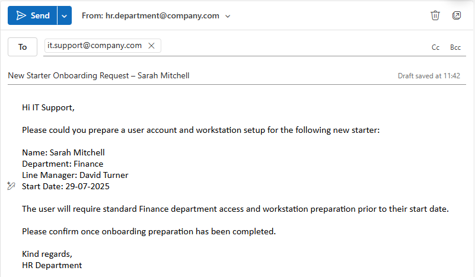
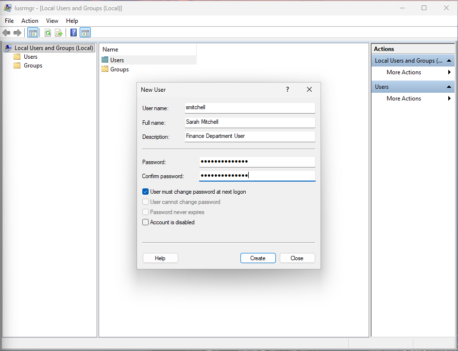
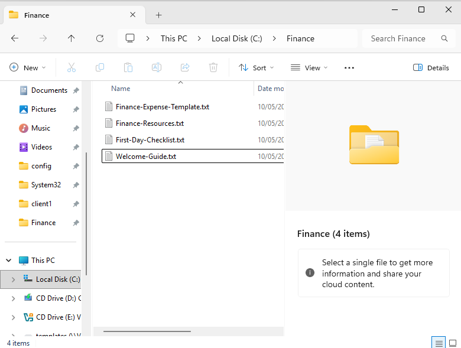
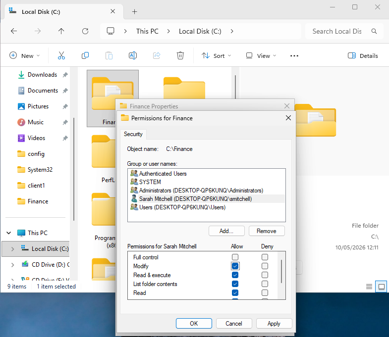
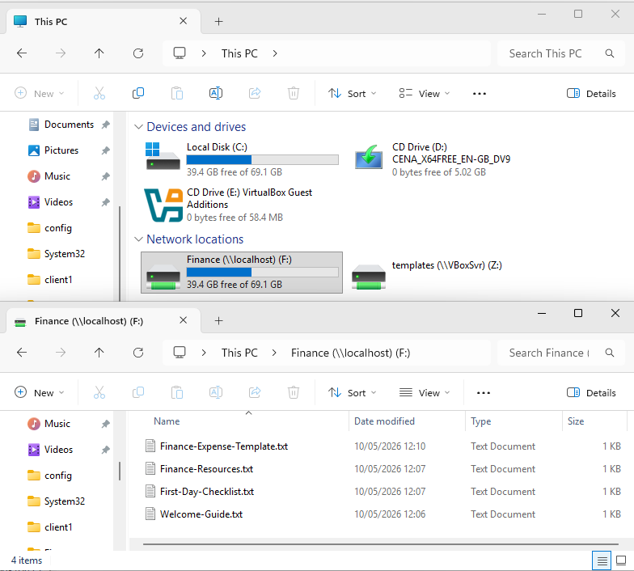
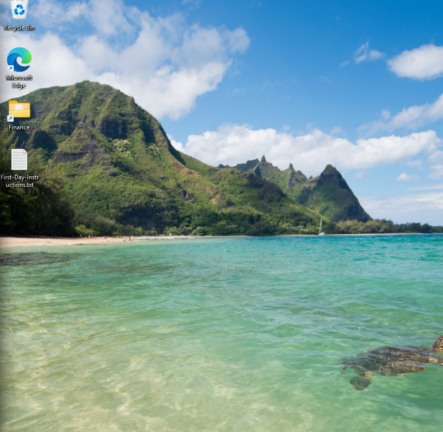

# Ticket 12 – New User Account & Device Onboarding

## Objective

Simulate an operational IT support onboarding scenario where a new employee requires account creation, workstation preparation, and initial access provisioning.

The goal is to demonstrate structured onboarding workflow, user provisioning, permissions management, documentation, and service desk operational practices within a Windows support environment.

---

## Incident Logging

- **Ticket ID:** 0012-USER-ONBOARDING  
- **Date Reported:** 26-07-2025  
- **Requested by:** HR Department  
- **New Starter:** Sarah Mitchell  
- **Department:** Finance  
- **Line Manager:** David Turner  
- **Start Date:** 29-07-2025  
- **Channel:** Email to IT Support (simulated)  

---

## Pre-Onboarding Requirements

Before onboarding activities were started, the following checks were completed:

- HR onboarding request verified through official support channel  
- Line manager approval confirmed  
- Department access requirements reviewed  
- Username naming convention confirmed  
- Device preparation requirements confirmed  
- Start date and onboarding timeline verified  

This helps ensure onboarding activities are completed consistently, securely, and in line with standard service desk procedures.

---

## SLA & Priority

- **Priority Level:** P3 – Medium  
- **Impact:** Low (single user onboarding request)  
- **Urgency:** Medium (new starter preparation required before start date)  

- **Response Time Target:** 4 business hours  
- **Resolution Time Target:** 1 business day  

(Reference: [SLA & Priority Matrix](../docs/sla-priority-matrix.md))

---

## Initial Assessment

The request involved preparing a new user account and workstation environment for a Finance department employee prior to their start date.

The onboarding process required:
- User account creation  
- Initial password configuration  
- Department access preparation  
- Workstation setup  
- User onboarding guidance  

The request appeared valid and appropriately authorised through HR and management approval channels.

---

## Ticket Simulation

A request was received from HR to prepare a workstation and user account for a new Finance department employee.

---

### 📧 User Request

**From:** hr.department@company.com  
**To:** it.support@company.com  
**Subject:** New Starter Onboarding Request – Sarah Mitchell  

Hi IT Support,

Please could you prepare a user account and workstation setup for the following new starter:

**Name:** Sarah Mitchell  
**Department:** Finance  
**Line Manager:** David Turner  
**Start Date:** 29-07-2025  

The user will require standard Finance department access and workstation preparation prior to their start date.

Please confirm once onboarding preparation has been completed.

Kind regards,  
HR Department  

---

### 🧾 Ticket Summary

**New Starter:** Sarah Mitchell  
**Department:** Finance  

**Requested Actions:**
- Create user account  
- Configure temporary password  
- Prepare workstation environment  
- Configure Finance department access  
- Provide onboarding guidance  

---

📸 **Screenshot of simulated onboarding request:**  

## Environment

The onboarding process was completed within a controlled lab environment to simulate a typical first-line user provisioning and workstation preparation workflow.

- Operating System: Windows 11  
- Environment Type: Virtual Machine  
- Virtualisation Platform: Oracle VirtualBox  
- User Management Tool: Local Users and Groups (`lusrmgr.msc`)  
- File Access Configuration: NTFS permissions and mapped departmental drive simulation  

📸 **System information (Windows 11):**  

---

## Onboarding Preparation

### Step 1: Create User Account

A local user account was created for the new starter using Local Users and Groups (`lusrmgr.msc`).

A standard username naming convention was used to maintain account consistency and simplify future account administration.

📸 **New starter account created for Finance department user:**  

---

### Step 2: Prepare Department Resources

A Finance department folder was created to simulate shared departmental resources required by the user.

Basic onboarding documentation and departmental resource files were also prepared to support initial user access and onboarding readiness.

📸 **Finance department resources prepared for onboarding:**  

---

### Step 3: Configure User Permissions

NTFS permissions were configured to grant the user appropriate access to the Finance department resources.

Permissions were assigned using a least privilege approach to avoid unnecessary administrative access while still allowing standard departmental usage.

📸 **Finance folder permissions configured for new user:**  

---

### Step 4: Configure Department Drive Access

The Finance department resources were mapped as a departmental network drive to simulate shared drive access commonly used within business environments.

📸 **Mapped departmental drive configured for Finance access:**  

---

### Step 5: Prepare Workstation Environment

The workstation environment was prepared with standard onboarding resources and shortcuts to support initial user access and productivity.

This included:
- Department resource access  
- Browser availability  
- First-day onboarding guidance  
- Desktop resource preparation for the new starter  

📸 **Workstation environment prepared for new starter:**  

---

## Investigation & Action Plan

### Step 1: Verify Onboarding Request

Before provisioning activities were started, the onboarding request was reviewed to confirm legitimacy and authorisation.

The request was confirmed as originating from the HR department through the approved support process, and onboarding requirements were verified against the information provided by the requesting manager.

This helps reduce the risk of unauthorised account provisioning or incorrect access assignment.

---

### Step 2: Review Department Requirements

The onboarding requirements for the Finance department were reviewed prior to account setup.

This included:
- Standard departmental resource access  
- Shared Finance drive access  
- Workstation preparation requirements  
- Initial onboarding guidance for the new starter  

Reviewing requirements before provisioning helps ensure onboarding is completed consistently and reduces the likelihood of missing required access during the user's first day.

---

### Step 3: Provision User Account & Access

The user account was provisioned using the approved naming convention and configured with a temporary password for initial access.

Departmental access was then configured using NTFS permissions and mapped drive preparation.

Access was assigned using a least privilege approach to avoid unnecessary permissions while still supporting standard departmental responsibilities.

---

### Step 4: Prepare Workstation Environment

The workstation environment was prepared to support the new starter prior to their first login.

This included:
- Department resource preparation  
- Desktop resource setup  
- Browser availability  
- Initial onboarding guidance documentation  

Preparing the workstation environment in advance helps reduce onboarding delays and improves first-day user readiness.

---

### Step 5: Review Security & Access Configuration

Following account provisioning, account and access configuration settings were reviewed to confirm the onboarding process had been completed appropriately.

This included reviewing:
- User account configuration  
- Department access assignment  
- Shared resource permissions  
- Temporary credential setup  

This helps ensure onboarding activities remain secure, consistent, and aligned with standard service desk procedures.

---

## User Communication Log

### 📧 Acknowledgement – Sent to HR upon ticket receipt

**From:** it.support@company.com  
**To:** hr.department@company.com  
**Subject:** RE: New Starter Onboarding Request – Sarah Mitchell [Ticket ID: 0012-USER-ONBOARDING]  

Hi HR Team,

Thank you for submitting the onboarding request for Sarah Mitchell.

The request has been received and onboarding preparation activities have now started. I will confirm once account provisioning and workstation preparation have been completed.

Kind regards,  
IT Support

---

### 📧 Progress Update – Sent during onboarding preparation

**From:** it.support@company.com  
**To:** hr.department@company.com; david.turner@company.com  
**Subject:** RE: New Starter Onboarding Request – Sarah Mitchell [Ticket ID: 0012-USER-ONBOARDING]  

Hi,

The onboarding process for Sarah Mitchell is currently in progress.

The user account has been provisioned and departmental access configuration is being completed. Workstation preparation activities are also underway ahead of the user's start date.

I will provide confirmation once onboarding preparation has been finalised.

Kind regards,  
IT Support

---

### 📧 New Starter Handover – Sent to new starter

**From:** it.support@company.com  
**To:** sarah.mitchell@company.com  
**Subject:** Welcome – Account & Workstation Information  

Hi Sarah,

Welcome to the Finance department.

Your user account and workstation environment have now been prepared ahead of your start date.

Your onboarding setup includes:
- User account provisioning  
- Finance department resource access  
- Department shared drive access  
- Workstation onboarding resources  

Temporary login credentials have been issued separately through approved communication procedures.

Please change your temporary password upon first login.

If you experience any issues accessing your account or departmental resources, please contact IT Support.

Kind regards,  
IT Support

---

### 📧 Completion Confirmation – Sent to HR and Line Manager

**From:** it.support@company.com  
**To:** hr.department@company.com; david.turner@company.com  
**Subject:** RE: New Starter Onboarding Request – Sarah Mitchell [Ticket ID: 0012-USER-ONBOARDING] – Completed  

Hi,

Onboarding preparation for Sarah Mitchell has now been completed successfully.

The following actions were completed:
- User account created  
- Temporary credentials configured  
- Departmental access assigned  
- Finance shared drive access prepared  
- Workstation environment prepared  
- Onboarding guidance provided to the new starter  

The onboarding request has now been completed and the user is prepared for first-day access.

Kind regards,  
IT Support