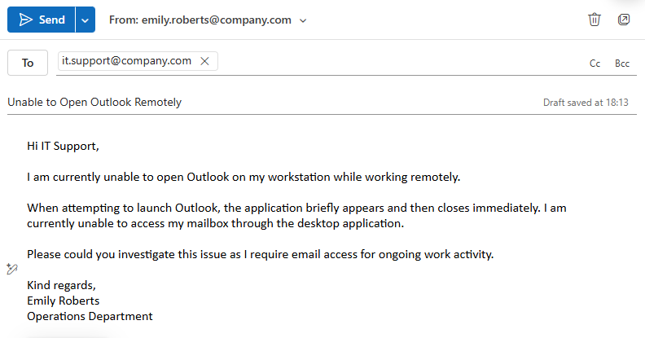
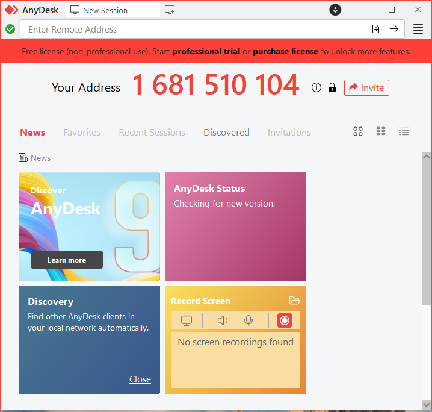
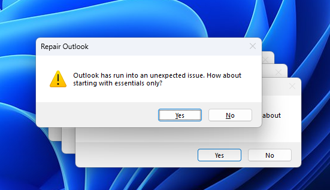
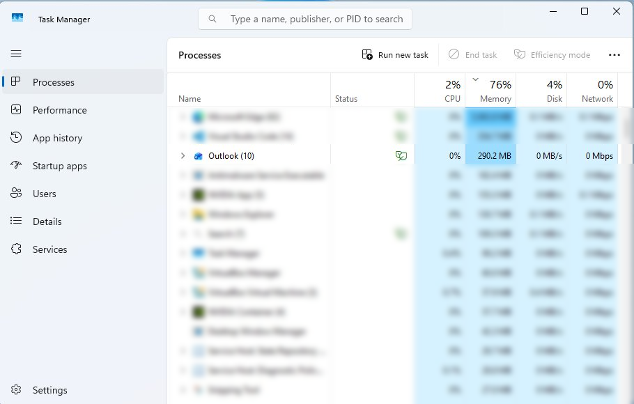
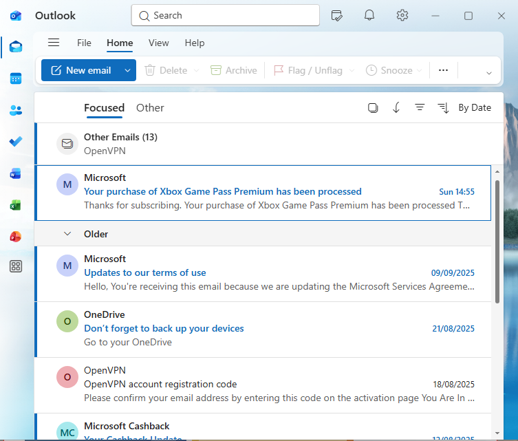

# Ticket 13 – Remote Support – Outlook Not Opening

## Objective

Simulate an operational IT support scenario where a remote user is unable to access Microsoft Outlook and requires remote troubleshooting assistance.

The goal is to demonstrate structured remote support workflow, user communication, remote troubleshooting methodology, and professional session handling within a Windows support environment.

---

## Incident Logging

- **Ticket ID:** 0013-REMOTE-OUTLOOK  
- **Date Reported:** 28-07-2025  
- **Reported by:** Emily Roberts  
- **Department:** Operations  
- **Support Method:** Remote support session via AnyDesk  
- **Channel:** Email to IT Support (simulated)  

---

## SLA & Priority

- **Priority Level:** P2 – High  
- **Impact:** Medium (single remote user unable to access email services)  
- **Urgency:** High (business communication impacted)  

- **Response Time Target:** 30 minutes  
- **Resolution Time Target:** 4 business hours  

(Reference: [SLA & Priority Matrix](../docs/sla-priority-matrix.md))

---

## Initial Assessment

The issue appeared to be isolated to the Microsoft Outlook desktop application rather than a wider Microsoft 365 outage or connectivity issue.

Possible causes considered included:
- Stuck Outlook background process  
- Corrupt Outlook profile  
- Authentication or session issue  
- Office application issue  
- Microsoft 365 licensing issue  

As a temporary workaround, the user was advised to access email through Outlook Web Access (OWA) while the issue was investigated remotely.

---

## Ticket Simulation

A remote user reported being unable to open Microsoft Outlook on their workstation while working from home.

---

### 📧 User Request

**From:** emily.roberts@company.com  
**To:** it.support@company.com  
**Subject:** Unable to Open Outlook Remotely  

Hi IT Support,

I am currently unable to open Outlook on my workstation while working remotely.

When attempting to launch Outlook, the application briefly appears and then closes immediately. I am currently unable to access my mailbox through the desktop application.

Please could you investigate this issue as I require email access for ongoing work activity.

Kind regards,  
Emily Roberts  
Operations Department  

---

### 🧾 Ticket Summary

**User:** Emily Roberts  
**Department:** Operations  

**Reported Issues:**
- Outlook not opening  
- Application closes immediately after launch  
- Unable to access mailbox remotely  
- User working from home  

---

📸 **Screenshot of simulated remote support ticket request:**  

---

## Environment

The issue was reproduced within a controlled Windows support environment to simulate a typical remote support troubleshooting scenario for a remote user.

- Operating System: Windows 11  
- Environment Type: Virtual Machine  
- Virtualisation Platform: Oracle VirtualBox  
- Remote Support Tool: AnyDesk  
- Application: Microsoft Outlook (Microsoft 365)  

📸 **System information (Windows 11):**  

---

## Remote Support Session

### Step 1: Initiate Remote Support Session

A remote support session was prepared using AnyDesk to simulate a standard first-line remote troubleshooting workflow.

Before the remote session was initiated:
- User identity was verified  
- Remote support consent was obtained  
- The user was informed that the support technician would temporarily have visibility of and control over the workstation during troubleshooting activities  

The session was initiated only after confirmation and approval were received from the user.

📸 **AnyDesk remote support session prepared for troubleshooting:**  

---

### Step 2: Reproduce the Issue

The issue was reproduced by attempting to launch Microsoft Outlook remotely.

Outlook failed to launch correctly and displayed a startup/repair error message during the remote session, preventing the user from accessing the mailbox through the desktop application.

📸 **Outlook startup/repair error displayed during remote session:**  

---

### Step 3: Investigate Application Behaviour

Task Manager was reviewed remotely to investigate whether Outlook processes remained active in the background.

An existing Outlook background process was identified, indicating the application had not closed correctly and was preventing successful relaunch.

Potential causes such as Outlook profile corruption and Microsoft 365 licensing issues were considered during investigation but were not indicated by the observed behaviour.

📸 **Task Manager showing Outlook process remaining active:**  

---

### Step 4: Restore Outlook Functionality

The existing Outlook background process was ended through Task Manager.

Outlook was then relaunched successfully, restoring normal application behaviour and mailbox access.

📸 **Outlook successfully launched following process termination:**  
