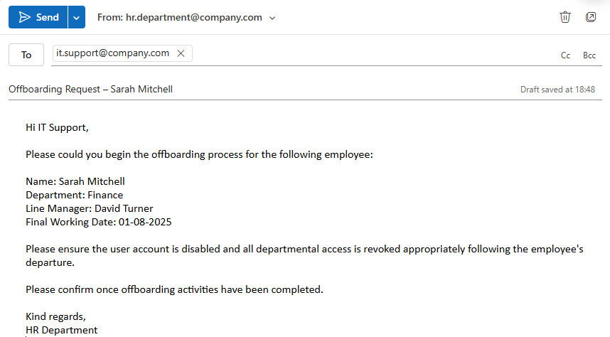

# Ticket 15 – User Offboarding & Access Revocation

## Objective

Simulate an operational IT support offboarding scenario where a departing employee requires account disablement, access revocation, and security-focused offboarding procedures.

The goal is to demonstrate structured offboarding workflow, permissions removal, lifecycle management awareness, operational communication, and security-conscious access control within a Windows support environment.

---

## Incident Logging

- **Ticket ID:** 0015-OFFBOARDING-ACCESS  
- **Date Reported:** 31-07-2025  
- **Requested by:** HR Department  
- **Employee:** Sarah Mitchell  
- **Department:** Finance  
- **Line Manager:** David Turner  
- **Final Working Date:** 01-08-2025  
- **Channel:** Email to IT Support (simulated)  

---

## Pre-Offboarding Access Audit

Before offboarding activities were started, the following existing access and resource assignments were reviewed:

- User account status  
- Finance department shared folder access  
- Mapped departmental drive access  
- Previously assigned permissions  
- Workstation assignment status  

This helps ensure all assigned access is identified systematically before revocation activities begin.

The offboarding process follows the onboarding activities previously completed for the same user in Ticket 12.

---

## SLA & Priority

- **Priority Level:** P2 – High  
- **Impact:** Medium (single user account requiring secure offboarding)  
- **Urgency:** High (active accounts remaining enabled after departure represent a security risk)  

- **Response Time Target:** 30 minutes  
- **Resolution Time Target:** Same business day  

(Reference: [SLA & Priority Matrix](../docs/sla-priority-matrix.md))

---

## Initial Assessment

The request involved securely offboarding a Finance department employee leaving the organisation.

The offboarding process required:
- User account disablement  
- Department access revocation  
- Shared resource permission removal  
- Verification that access no longer remained active  
- Documentation of completed offboarding activities  

Operational timing considerations were also reviewed to ensure access would be revoked appropriately in line with the employee's final working date.

---

## Ticket Simulation

A request was received from HR to securely offboard a departing Finance department employee and revoke all assigned access.

---

### 📧 User Request

**From:** hr.department@company.com  
**To:** it.support@company.com  
**Subject:** Offboarding Request – Sarah Mitchell  

Hi IT Support,

Please could you begin the offboarding process for the following employee:

**Name:** Sarah Mitchell  
**Department:** Finance  
**Line Manager:** David Turner  
**Final Working Date:** 01-08-2025  

Please ensure the user account is disabled and all departmental access is revoked appropriately following the employee's departure.

Please confirm once offboarding activities have been completed.

Kind regards,  
HR Department  

---

### 🧾 Ticket Summary

**Employee:** Sarah Mitchell  
**Department:** Finance  

**Requested Actions:**
- Disable user account  
- Revoke Finance department access  
- Remove shared resource permissions  
- Verify access no longer active  
- Complete offboarding documentation  

---

📸 **Screenshot of simulated offboarding request:**  
