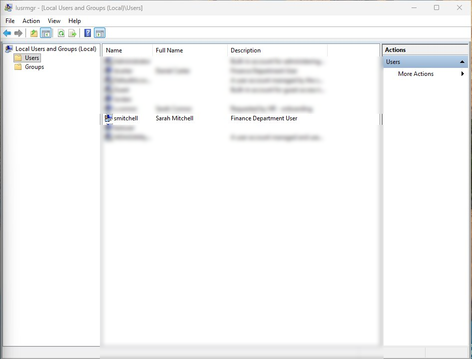
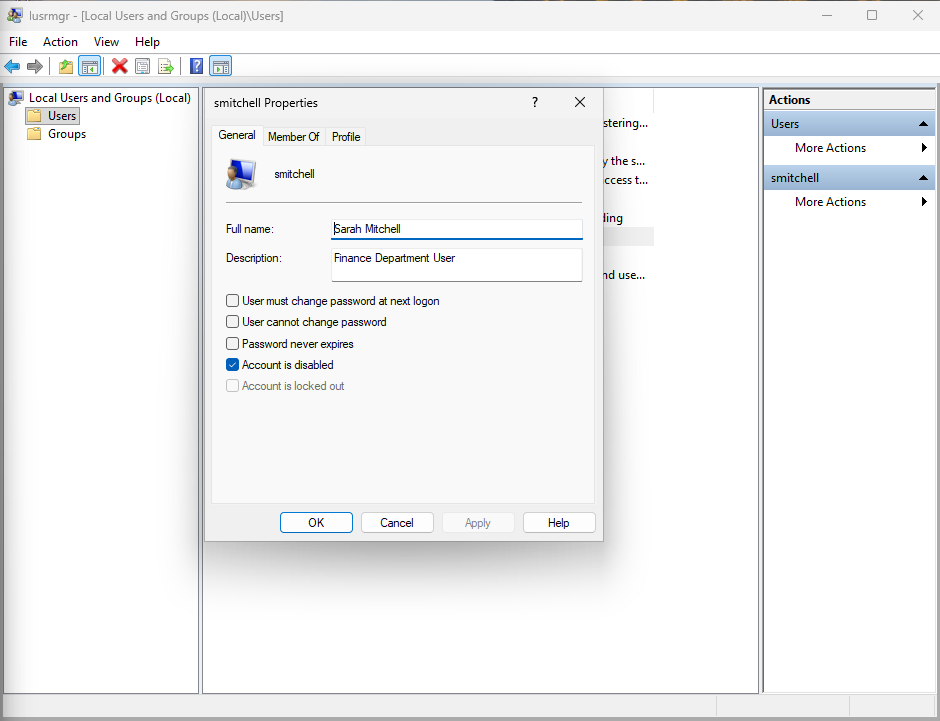
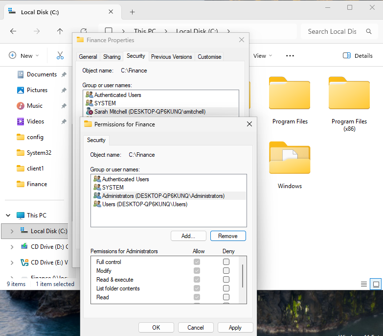

# Ticket 15 – User Offboarding & Access Revocation

## Objective

Simulate an operational IT support offboarding scenario where a departing employee requires account disablement, access revocation, and security-focused offboarding procedures.

The goal is to demonstrate structured offboarding workflow, permissions removal, lifecycle management awareness, operational communication, and security-conscious access control within a Windows support environment.

---

## Incident Logging

- **Ticket ID:** 0015-OFFBOARDING-ACCESS  
- **Date Reported:** 31-07-2025  
- **Requested by:** HR Department  
- **Employee:** Sarah Mitchell  
- **Department:** Finance  
- **Line Manager:** David Turner  
- **Final Working Date:** 01-08-2025  
- **Channel:** Email to IT Support (simulated)  

---

## Pre-Offboarding Access Audit

Before offboarding activities were started, the following existing access and resource assignments were reviewed:

- User account status  
- Finance department shared folder access  
- Mapped departmental drive access  
- Previously assigned permissions  
- Workstation assignment status  

This helps ensure all assigned access is identified systematically before revocation activities begin.

The offboarding process follows the onboarding activities previously completed for the same user in Ticket 12.

---

## SLA & Priority

- **Priority Level:** P2 – High  
- **Impact:** Medium (single user account requiring secure offboarding)  
- **Urgency:** High (active accounts remaining enabled after departure represent a security risk)  

- **Response Time Target:** 30 minutes  
- **Resolution Time Target:** Same business day  

(Reference: [SLA & Priority Matrix](../docs/sla-priority-matrix.md))

---

## Initial Assessment

The request involved securely offboarding a Finance department employee leaving the organisation.

The offboarding process required:
- User account disablement  
- Department access revocation  
- Shared resource permission removal  
- Verification that access no longer remained active  
- Documentation of completed offboarding activities  

Operational timing considerations were also reviewed to ensure access would be revoked appropriately in line with the employee's final working date.

---

## Ticket Simulation

A request was received from HR to securely offboard a departing Finance department employee and revoke all assigned access.

---

### 📧 User Request

**From:** hr.department@company.com  
**To:** it.support@company.com  
**Subject:** Offboarding Request – Sarah Mitchell  

Hi IT Support,

Please could you begin the offboarding process for the following employee:

**Name:** Sarah Mitchell  
**Department:** Finance  
**Line Manager:** David Turner  
**Final Working Date:** 01-08-2025  

Please ensure the user account is disabled and all departmental access is revoked appropriately following the employee's departure.

Please confirm once offboarding activities have been completed.

Kind regards,  
HR Department  

---

### 🧾 Ticket Summary

**Employee:** Sarah Mitchell  
**Department:** Finance  

**Requested Actions:**
- Disable user account  
- Revoke Finance department access  
- Remove shared resource permissions  
- Verify access no longer active  
- Complete offboarding documentation  

---

📸 **Screenshot of simulated offboarding request:**  

---

## Environment

The offboarding activities were completed within a controlled Windows support environment to simulate a typical first-line user access revocation workflow.

- Operating System: Windows 11  
- Environment Type: Virtual Machine  
- Virtualisation Platform: Oracle VirtualBox  
- User Management Tool: Local Users and Groups (`lusrmgr.msc`)  
- Access Management: NTFS permissions and mapped departmental drive simulation  

📸 **System information (Windows 11):**  

---

## Offboarding Actions

### Step 1: Review Existing User Access

Before revoking access, the existing user account and previously assigned departmental access were reviewed.

This included:
- Local user account status  
- Finance department shared folder access  
- Previously assigned NTFS permissions  
- Mapped departmental drive access  

This review helps ensure all assigned access is identified systematically before removal activities begin.

📸 **User account reviewed prior to offboarding activities:**  

---

### Step 2: Disable User Account

The user account was disabled using Local Users and Groups (`lusrmgr.msc`).

The account was disabled rather than deleted to:
- Preserve audit history  
- Support potential data retention review  
- Allow recovery if required  
- Prevent accidental permanent deletion  

This reflects standard operational offboarding practice where accounts are normally disabled before any long-term retention or deletion decisions are made.

📸 **User account disabled following offboarding approval:**  

---

### Step 3: Remove Department Access

Previously assigned Finance department permissions were reviewed and removed as part of the offboarding process.

This included:
- Shared folder access removal  
- NTFS permission revocation  
- Removal of mapped departmental resource access  

Access revocation activities were completed using least privilege principles to ensure no unnecessary access remained active following the employee's departure.

📸 **Finance department permissions removed during offboarding:**  

---

### Step 4: Review Offboarding Timing & Security Considerations

Operational timing considerations were reviewed as part of the offboarding workflow.

Key considerations included:
- Access should normally be revoked at the end of the employee's final working day  
- Active accounts should not remain enabled after departure  
- Immediate access revocation may be required in involuntary departure scenarios  

These considerations help reduce the risk of unauthorised access following employee departure and support secure offboarding procedures.

---

### Step 5: Review Data Handling & Asset Status

As part of the offboarding workflow, operational data handling and asset management considerations were reviewed.

This included:
- Mailbox retention or forwarding considerations  
- Shared departmental file ownership review  
- OneDrive or personal work data retention awareness  
- Company equipment return status review  

These activities are typically managed in line with organisational offboarding and data retention procedures.