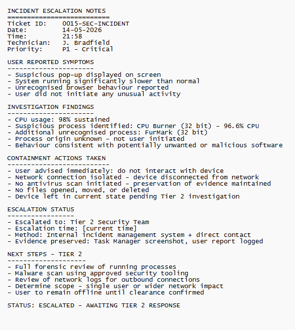

# Ticket 15 – Suspected Malware / Security Incident

## Objective

Simulate an operational IT support security scenario where a user reports suspicious workstation behaviour potentially indicating malware or unauthorised software activity.

The goal is to demonstrate structured incident response workflow, containment awareness, escalation procedures, operational communication, and security-conscious first-line support practices within a Windows support environment.

---

## Incident Logging

- **Ticket ID:** 0015-SECURITY-INCIDENT  
- **Date Reported:** 02-08-2025  
- **Reported by:** Michael Evans  
- **Department:** Operations  
- **Channel:** Email to IT Support (simulated)  

---

## SLA & Priority

- **Priority Level:** P1 – Critical  
- **Impact:** High (potential workstation compromise and security risk)  
- **Urgency:** High (possible malicious activity requiring immediate containment)  

- **Response Time Target:** Immediate  
- **Resolution Time Target:** Escalation initiated within 30 minutes  

(Reference: [SLA & Priority Matrix](../docs/sla-priority-matrix.md))

---

## Initial Assessment

The issue appeared to involve suspicious workstation behaviour potentially consistent with malware infection or unauthorised software activity.

Reported symptoms included:
- Unexpected pop-ups
- Browser redirects
- Significant system slowdown
- Unusual workstation behaviour

Possible causes considered included:
- Malware infection
- Malicious browser extensions
- Unwanted software installation
- Phishing-related compromise
- Suspicious background processes

Due to the potential security implications, the issue required immediate containment and escalation awareness rather than standard troubleshooting alone.

No fix or investigation activities were initiated at first-line level prior to containment and escalation.

---

## Ticket Simulation

A user reported suspicious workstation behaviour including pop-ups, browser redirects, and significant system slowdown during normal work activity.

---

### 📧 User Request

**From:** michael.evans@company.com  
**To:** it.support@company.com  
**Subject:** Strange Pop-ups & System Running Very Slowly  

Hi IT Support,

My workstation has started behaving strangely this morning.

I am getting random pop-ups appearing in the browser, some websites are redirecting unexpectedly, and the system has become noticeably slow.

I do not remember installing anything recently but I am concerned something may be wrong with the computer.

Please could you investigate this issue as soon as possible.

Kind regards,  
Michael Evans  
Operations Department  

---

### 🧾 Ticket Summary

**User:** Michael Evans  
**Department:** Operations  

**Reported Issues:**
- Unexpected browser pop-ups
- Browser redirects
- Significant workstation slowdown
- Suspicious workstation behaviour

---

📸 **Screenshot of simulated malware/security incident request:**  

---

## Environment

The incident was reproduced within a controlled Windows support environment to simulate a potential workstation security incident requiring first-line containment and escalation procedures.

- Operating System: Windows 11
- Environment Type: Virtual Machine
- Virtualisation Platform: Oracle VirtualBox
- Investigation Tools: Task Manager, Network Adapter Management
- Browser Environment: Microsoft Edge

📸 **System information (Windows 11):**  

---

## Incident Response & Escalation Workflow

### Step 1: Review Suspicious Behaviour

Initial review of the workstation identified suspicious browser behaviour and unexpected pop-up activity consistent with potential unwanted software or malicious activity.

The user also reported significant system slowdown during normal workstation usage.

At this stage, no interaction with suspicious files, pop-ups, or processes was performed. The workstation was observed only to assess the nature and extent of the reported behaviour before any containment actions were initiated.

📸 **Suspicious browser pop-up and unusual workstation behaviour observed:**  

---

### Step 2: Contain the Potential Security Threat

Due to the potential security risk, the workstation was isolated from the network immediately to reduce the possibility of further communication, data exfiltration, or spread to other systems.

The network adapter was disabled as part of initial containment activities.

The user was advised:
- To stop using the workstation immediately
- Not to interact further with suspicious pop-ups, files, or browser windows
- To avoid restarting the system until further investigation guidance was received

**Important:** No antivirus or malware removal tools were run at this stage. Initiating a scan prior to forensic review risks altering or destroying evidence that may be required for incident investigation by the security team. Preserving the current system state is a critical first-line responsibility during potential security incidents.

This containment approach helps preserve the current system state and reduces the risk of additional compromise activity before specialist investigation begins.

📸 **Workstation network connectivity disabled during containment:**  

---

### Step 3: Perform Initial Observation

Basic visual inspection of the workstation was performed to document observable behaviour before escalation.

Task Manager was reviewed to identify suspicious or unusually active processes contributing to abnormal system behaviour.

CPU usage was observed at approximately 98%, with an unfamiliar process identified as `CPU Burner (32 bit)` consuming the majority of available processing resources at 96.6% CPU utilisation.

The process was not recognised by the user and had not been intentionally launched during normal workstation activity.

Combined with the reported browser pop-ups, redirects, and significant performance degradation, the observed behaviour was considered potentially consistent with unwanted or malicious software activity requiring escalation.

No process termination, file interaction, or removal activities were performed at this stage to avoid altering the current system state before escalation.

📸 **Task Manager reviewed during initial incident observation — CPU Burner (32 bit) identified consuming 96.6% CPU:**  

---

### Step 4: Document Incident & Prepare Escalation

Following initial containment and observation, the incident details were fully documented to support structured escalation and further investigation by second-line or security personnel.

The documented information included:
- User-reported symptoms
- Suspicious browser behaviour observed
- CPU usage at 98% with unrecognised process activity
- Unknown `CPU Burner (32 bit)` process identified
- Network isolation status confirmed
- Containment actions completed
- Confirmation that no removal or scan activities had been performed

Accurate and complete documentation ensures security personnel receive clear, consistent incident information and can begin deeper investigation without delay.

📸 **Incident escalation notes prepared for security team review:**  

---

### Step 5: Escalate Security Incident

Due to the suspicious workstation behaviour and potential security implications, the incident was formally escalated to second-line or security personnel for deeper investigation and remediation.

The escalation included:
- Full incident summary
- User-reported behaviour
- Initial observations including CPU anomaly
- Containment confirmation
- Screenshot evidence
- Confirmation that no first-line removal or scan activities had been performed

No malware removal, antivirus scanning, or advanced investigation activities were performed at first-line level prior to escalation.

This preserves evidence integrity and supports controlled incident investigation procedures.

---

## User Communication Log

### 📧 Acknowledgement – Sent upon ticket receipt

**From:** it.support@company.com  
**To:** michael.evans@company.com  
**Subject:** RE: Strange Pop-ups & System Running Very Slowly [Ticket ID: 0015-SECURITY-INCIDENT]  

Hi Michael,

Thank you for reporting this issue promptly.

Your workstation behaviour may indicate a potential security-related issue and the incident is now being investigated as a priority.

Please stop using the workstation immediately and avoid interacting with any unexpected pop-ups, files, or browser windows until further notice.

I will provide further updates shortly.

Kind regards,  
IT Support

---

### 📧 Containment Update – Sent following network isolation

**From:** it.support@company.com  
**To:** michael.evans@company.com  
**Subject:** RE: Strange Pop-ups & System Running Very Slowly [Ticket ID: 0015-SECURITY-INCIDENT] – Containment Update  

Hi Michael,

Initial containment actions have now been completed.

Your workstation has been temporarily isolated from the network while the issue is reviewed further. This has been done to reduce the risk of additional suspicious activity while investigation procedures continue.

The incident has now been escalated to our security team for further review. Please continue to avoid using the workstation until you receive further guidance.

If you notice any additional unusual behaviour or have any concerns in the meantime, please contact IT Support immediately.

Kind regards,  
IT Support

---

### 📧 Escalation – Sent to security team

**From:** it.support@company.com  
**To:** security.team@company.com  
**Subject:** Security Incident Escalation [Ticket ID: 0015-SECURITY-INCIDENT] – Potential Malware Activity  

Hi Security Team,

Please review the following potential workstation security incident requiring further investigation.

**Ticket ID:** 0015-SECURITY-INCIDENT  
**User:** Michael Evans  
**Department:** Operations  
**Date:** 02-08-2025  

**Reported Symptoms:**
- Unexpected browser pop-ups
- Browser redirects
- Significant workstation slowdown

**Observed Behaviour:**
- CPU usage approximately 98% sustained
- Unrecognised process identified: `CPU Burner (32 bit)` — 96.6% CPU utilisation
- Suspicious browser behaviour consistent with user report
- Process origin unknown — not user initiated

**Containment Actions Completed:**
- Workstation isolated from network — network adapter disabled
- User instructed to stop using workstation immediately
- User advised not to restart system
- Initial observations documented
- No antivirus scan or malware removal performed — evidence preserved
- No files opened, moved, or deleted

**Evidence Available:**
- Task Manager screenshot showing CPU anomaly
- Escalation notes documenting observed behaviour
- User incident report

Please advise on next steps and further investigation requirements.

Kind regards,  
J. Bradfield  
IT Support — First Line

---

## Root Cause

The workstation displayed suspicious behaviour potentially consistent with unwanted software or malicious activity.

Observed symptoms included unexpected browser pop-ups, browser redirects, significant system slowdown, and an unrecognised process consuming 96.6% of available CPU resources.

As the root cause could not be confirmed at first-line level without deeper forensic investigation, the incident was escalated in line with security incident handling procedures.

Definitive root cause determination was deferred to the Tier 2 security team to ensure evidence integrity was maintained throughout the investigation process.

---

## Resolution

The incident was managed through structured first-line containment and escalation procedures in line with security incident handling best practice.

The following actions were completed:
- Suspicious behaviour reviewed and documented
- Workstation isolated from the network
- User instructed to stop using the device
- System state preserved — no scan or removal activities performed
- Initial observations documented fully
- Incident escalated to second-line security personnel with complete incident summary

No advanced malware investigation or removal activities were performed at first-line level.

Application of fix and full system verification deferred to Tier 2 in line with incident response procedures.

---

## Verification

Following containment activities, the following was confirmed:

- [ ] Workstation isolated from network successfully
- [ ] Network connectivity disabled and confirmed
- [ ] User informed of containment actions and advised to stop using device
- [ ] System state preserved — no scan, removal, or restart performed
- [ ] Incident documentation completed and escalation notes prepared
- [ ] Escalation submitted to security team with full incident summary

Application of fix and full system verification deferred to Tier 2 — no resolution actions taken at first-line level in line with incident response procedures.

---

## Security Considerations

Potential malware or suspicious workstation behaviour should be treated as a possible security incident until confirmed otherwise by specialist investigation.

Key first-line incident handling considerations include:

- **Isolate immediately** — disconnect the affected system from the network at the earliest opportunity to prevent further spread or communication
- **Do not scan or remove** — running antivirus tools before forensic review risks altering or destroying evidence critical to investigation
- **Preserve system state** — avoid restarting, opening files, or interacting with suspicious processes before escalation
- **Document accurately** — complete and accurate incident documentation supports effective handover to security personnel
- **Escalate appropriately** — security incidents exceed first-line resolution scope and must be escalated promptly
- **Communicate clearly** — affected users must be kept informed throughout containment to prevent unauthorised interaction with the device

These activities help reduce risk while supporting structured incident response procedures and maintaining evidence integrity for further investigation.

---

## Related Knowledge Base Article

See: [Suspected Malware – First Response Procedure](../knowledge-base/suspected-malware-first-response.md)