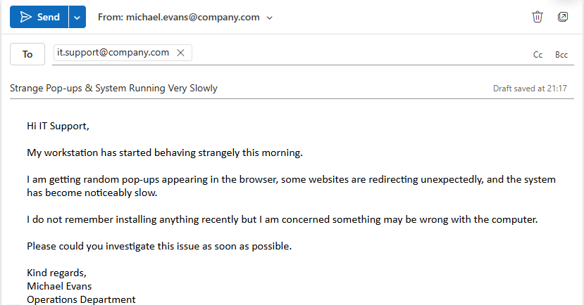

# Ticket 15 – Suspected Malware / Security Incident

## Objective

Simulate an operational IT support security scenario where a user reports suspicious workstation behaviour potentially indicating malware or unauthorised software activity.

The goal is to demonstrate structured incident response workflow, containment awareness, escalation procedures, operational communication, and security-conscious first-line support practices within a Windows support environment.

---

## Incident Logging

- **Ticket ID:** 0015-SECURITY-INCIDENT  
- **Date Reported:** 02-08-2025  
- **Reported by:** Michael Evans  
- **Department:** Operations  
- **Channel:** Email to IT Support (simulated)  

---

## SLA & Priority

- **Priority Level:** P1 – Critical  
- **Impact:** High (potential workstation compromise and security risk)  
- **Urgency:** High (possible malicious activity requiring immediate containment)  

- **Response Time Target:** Immediate  
- **Resolution Time Target:** Escalation initiated within 30 minutes  

(Reference: [SLA & Priority Matrix](../docs/sla-priority-matrix.md))

---

## Initial Assessment

The issue appeared to involve suspicious workstation behaviour potentially consistent with malware infection or unauthorised software activity.

Reported symptoms included:
- Unexpected pop-ups  
- Browser redirects  
- System slowdown  
- Unusual workstation behaviour  

Possible causes considered included:
- Malware infection  
- Malicious browser extensions  
- Unwanted software installation  
- Phishing-related compromise  
- Suspicious background processes  

Due to the potential security implications, the issue required immediate containment and escalation awareness rather than standard troubleshooting alone.

---

## Ticket Simulation

A user reported suspicious workstation behaviour including pop-ups, browser redirects, and significant system slowdown during normal work activity.

---

### 📧 User Request

**From:** michael.evans@company.com  
**To:** it.support@company.com  
**Subject:** Strange Pop-ups & System Running Very Slowly  

Hi IT Support,

My workstation has started behaving strangely this morning.

I am getting random pop-ups appearing in the browser, some websites are redirecting unexpectedly, and the system has become noticeably slow.

I do not remember installing anything recently but I am concerned something may be wrong with the computer.

Please could you investigate this issue as soon as possible.

Kind regards,  
Michael Evans  
Operations Department  

---

### 🧾 Ticket Summary

**User:** Michael Evans  
**Department:** Operations  

**Reported Issues:**
- Unexpected browser pop-ups  
- Browser redirects  
- Significant workstation slowdown  
- Suspicious workstation behaviour  

---

📸 **Screenshot of simulated malware/security incident request:**  
