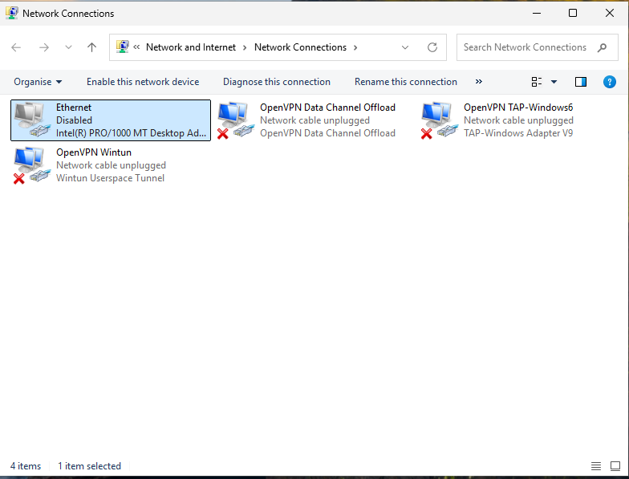
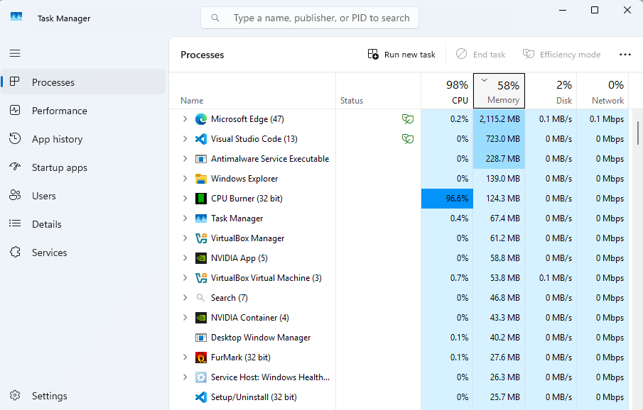

# Ticket 15 – Suspected Malware / Security Incident

## Objective

Simulate an operational IT support security scenario where a user reports suspicious workstation behaviour potentially indicating malware or unauthorised software activity.

The goal is to demonstrate structured incident response workflow, containment awareness, escalation procedures, operational communication, and security-conscious first-line support practices within a Windows support environment.

---

## Incident Logging

- **Ticket ID:** 0015-SECURITY-INCIDENT  
- **Date Reported:** 02-08-2025  
- **Reported by:** Michael Evans  
- **Department:** Operations  
- **Channel:** Email to IT Support (simulated)  

---

## SLA & Priority

- **Priority Level:** P1 – Critical  
- **Impact:** High (potential workstation compromise and security risk)  
- **Urgency:** High (possible malicious activity requiring immediate containment)  

- **Response Time Target:** Immediate  
- **Resolution Time Target:** Escalation initiated within 30 minutes  

(Reference: [SLA & Priority Matrix](../docs/sla-priority-matrix.md))

---

## Initial Assessment

The issue appeared to involve suspicious workstation behaviour potentially consistent with malware infection or unauthorised software activity.

Reported symptoms included:
- Unexpected pop-ups  
- Browser redirects  
- System slowdown  
- Unusual workstation behaviour  

Possible causes considered included:
- Malware infection  
- Malicious browser extensions  
- Unwanted software installation  
- Phishing-related compromise  
- Suspicious background processes  

Due to the potential security implications, the issue required immediate containment and escalation awareness rather than standard troubleshooting alone.

---

## Ticket Simulation

A user reported suspicious workstation behaviour including pop-ups, browser redirects, and significant system slowdown during normal work activity.

---

### 📧 User Request

**From:** michael.evans@company.com  
**To:** it.support@company.com  
**Subject:** Strange Pop-ups & System Running Very Slowly  

Hi IT Support,

My workstation has started behaving strangely this morning.

I am getting random pop-ups appearing in the browser, some websites are redirecting unexpectedly, and the system has become noticeably slow.

I do not remember installing anything recently but I am concerned something may be wrong with the computer.

Please could you investigate this issue as soon as possible.

Kind regards,  
Michael Evans  
Operations Department  

---

### 🧾 Ticket Summary

**User:** Michael Evans  
**Department:** Operations  

**Reported Issues:**
- Unexpected browser pop-ups  
- Browser redirects  
- Significant workstation slowdown  
- Suspicious workstation behaviour  

---

📸 **Screenshot of simulated malware/security incident request:**  

---

## Environment

The incident was reproduced within a controlled Windows support environment to simulate a potential workstation security incident requiring first-line containment and escalation procedures.

- Operating System: Windows 11  
- Environment Type: Virtual Machine  
- Virtualisation Platform: Oracle VirtualBox  
- Investigation Tools: Task Manager, Network Adapter Management  
- Browser Environment: Microsoft Edge  

📸 **System information (Windows 11):**  

---

## Incident Response Actions

### Step 1: Review Suspicious Behaviour

Initial review of the workstation identified suspicious browser behaviour and unexpected pop-up activity consistent with potential unwanted software or malicious activity.

The user also reported significant system slowdown during normal workstation usage.

📸 **Suspicious browser pop-up and unusual workstation behaviour observed:**  

---

### Step 2: Contain Potential Security Threat

Due to the potential security risk, the workstation was isolated from the network immediately to reduce the possibility of further communication or spread.

The network adapter was disabled as part of initial containment activities.

The user was advised:
- To stop using the workstation  
- Not to interact further with suspicious pop-ups or files  
- To avoid restarting the system until further investigation guidance was received  

This helps preserve the current system state and reduces the risk of additional compromise activity.

📸 **Workstation network connectivity disabled during containment:**  

---

### Step 3: Perform Initial Observation

Basic visual inspection of the workstation was performed to document observable behaviour before escalation.

Task Manager was reviewed to identify suspicious or unusually active processes contributing to abnormal system behaviour.

CPU usage was observed at approximately 98%, with an unfamiliar process identified as `CPU Burner (32 bit)` consuming the majority of available processing resources.

The process was not recognised by the user and had not been intentionally launched during normal workstation activity.

Combined with the reported browser pop-ups, redirects, and significant performance degradation, the observed behaviour was considered potentially consistent with unwanted or malicious software activity.

No advanced malware investigation or removal activities were performed at this stage to avoid altering the current system state before escalation.

📸 **Task Manager reviewed during initial incident observation:**  

---

### Step 4: Prepare Incident Escalation

Due to the potential security implications, the incident was prepared for escalation to second-line or security personnel for deeper investigation.

The following information was documented:
- User-reported symptoms  
- Observed workstation behaviour  
- Containment actions completed  
- Network isolation status  
- Initial workstation observations  

This helps support structured incident handling and ensures appropriate escalation information is available for further investigation.